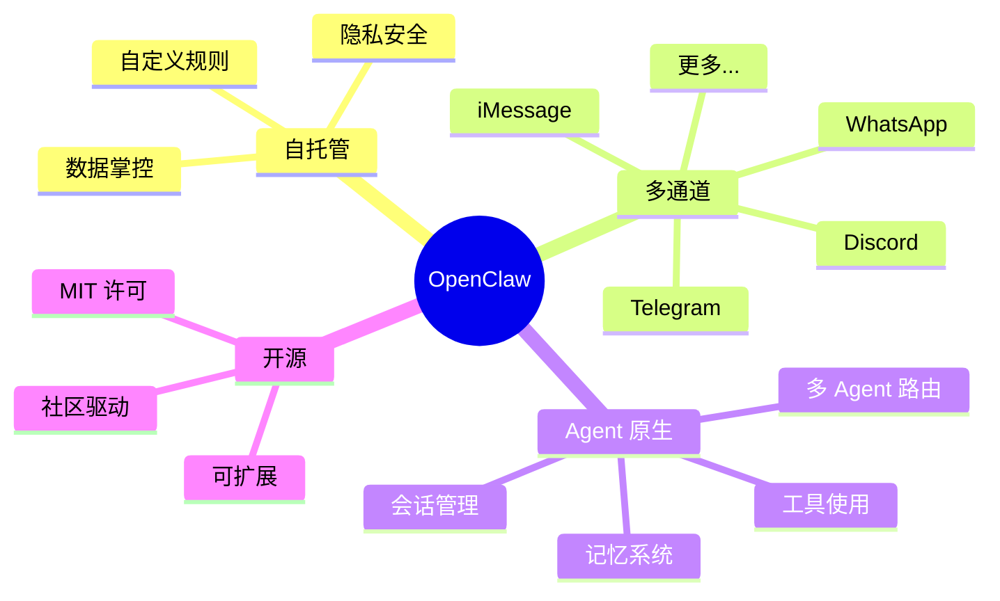
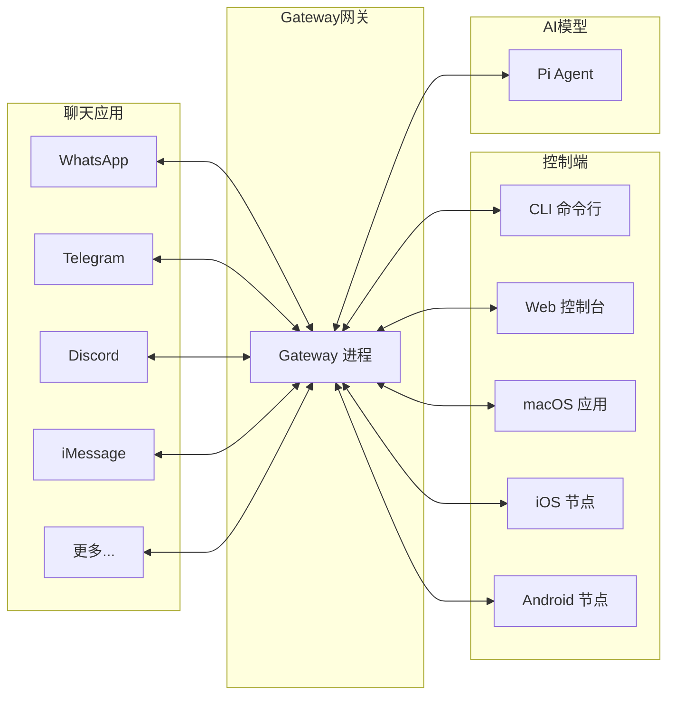
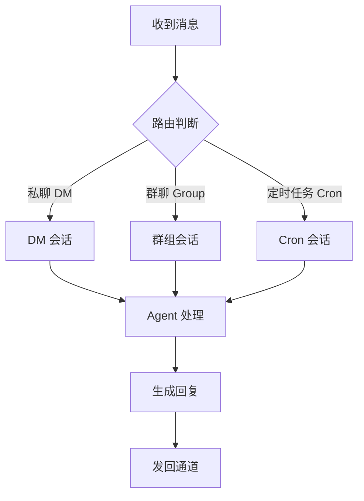
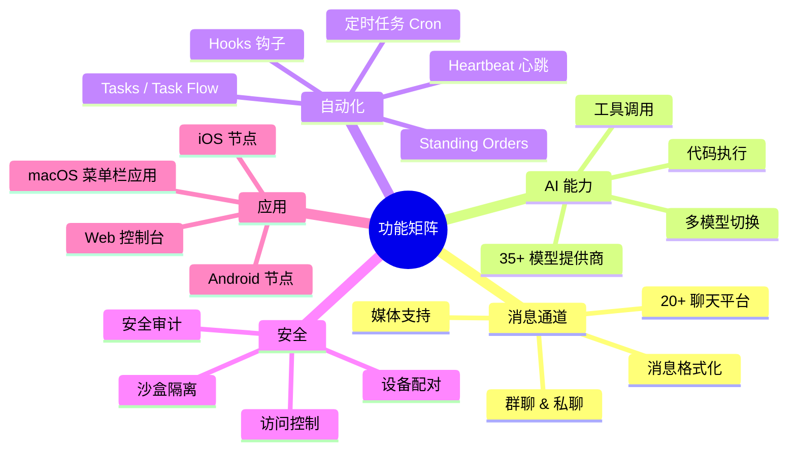

# 第一章：OpenClaw 简介与核心概念

[← 返回目录](./README.md) | [下一章：安装与环境配置 →](./02-installation.md)

---

## 1.1 什么是 OpenClaw？

**OpenClaw** 是一个开源的、自托管（self-hosted）的**个人 AI 助手网关**。简单来说，它是一个“中间层”——连接你日常使用的聊天软件（WhatsApp、Telegram、Discord、QQ Bot、WebChat 等）和 AI 模型（如 Claude、GPT、Gemini 等），让你可以在任何聊天应用中与 AI 助手对话。

> 🦞 OpenClaw 的口号是 "EXFOLIATE! EXFOLIATE!"（一只太空龙虾的名言）

### 用一句话概括

> **你运行一个 Gateway（网关）进程，它就成了你的聊天应用和 AI 助手之间的桥梁。**

### 为什么选择 OpenClaw？



| 特性 | 说明 |
|------|------|
| **自托管 (Self-hosted)** | 运行在你自己的设备上，数据完全由你掌控 |
| **多通道 (Multi-channel)** | 一个 Gateway 同时服务 WhatsApp、Telegram、Discord、Slack、QQ Bot 等 20+ 个聊天平台 |
| **Agent 原生** | 专为 AI Agent（智能体）设计，支持工具调用、会话隔离、多 Agent 路由 |
| **开源** | MIT 许可证，社区驱动开发 |

## 1.2 核心概念

在深入学习之前，先了解几个关键概念：

### 1.2.1 Gateway（网关）

Gateway 是 OpenClaw 的核心进程，可以理解为一个"总控中心"：



**Gateway 的职责：**
- 接收来自各个聊天通道的消息
- 将消息路由到对应的 AI Agent
- 管理会话（Session）状态
- 控制设备配对和认证
- 提供 Web 控制台和 API

### 1.2.2 Channel（通道）

Channel 是指具体的聊天平台连接。OpenClaw 支持两类通道：

**内置通道（Built-in）：**
- WhatsApp（通过 Baileys 库）
- Telegram（通过 grammY 库）
- Discord（通过官方 Discord Gateway）
- Signal、iMessage、Slack、Google Chat、IRC、WebChat 等

**插件通道（Plugin）：**
- Microsoft Teams、Matrix、Mattermost、Nostr、QQ Bot 等
- 可以自行开发新的通道插件

### 1.2.3 Agent（智能体）

Agent 是 OpenClaw 中的"大脑"，每个 Agent 包含：

| 组成部分 | 说明 |
|----------|------|
| **Workspace（工作区）** | Agent 的工作目录，包含引导文件、技能、记忆等 |
| **State Directory（状态目录）** | 认证配置、模型注册、Agent 级别的设置 |
| **Session Store（会话存储）** | 对话记录和会话状态 |

### 1.2.4 Session（会话）

Session 是一次连续的对话上下文。OpenClaw 的会话管理非常灵活：



### 1.2.5 Node（节点）

Node 是连接到 Gateway 的设备（如 iOS、Android、macOS），提供额外的能力：
- **Canvas（画布）**：实时渲染 UI
- **Camera（相机）**：拍照和屏幕录制
- **Voice（语音）**：语音输入/输出
- **Location（位置）**：地理位置信息

## 1.3 OpenClaw 能做什么？

### 功能总览



### 具体能力

| 类别 | 功能 | 说明 |
|------|------|------|
| **通道** | 20+ 聊天平台 | WhatsApp、Telegram、Discord、iMessage 等 |
| **模型** | 35+ 提供商 | Anthropic、OpenAI、Google、DeepSeek、Ollama 等 |
| **媒体** | 图片/音频/视频 | 发送和接收多媒体消息 |
| **工具** | 浏览器自动化 | 网页操作、截图、爬取 |
| **工具** | Shell 执行 | 在沙盒中运行命令 |
| **工具** | Web 搜索 | Brave、Perplexity、Gemini 等多个搜索引擎 |
| **自动化** | 定时任务 | Cron 表达式驱动的精确定时任务 |
| **自动化** | Heartbeat | 近实时、上下文感知的周期性主会话检查 |
| **自动化** | Hooks | 事件驱动自动化，响应 `/new`、`/reset`、工具调用等 |
| **自动化** | Tasks / Task Flow | 后台任务台账与多步骤持久工作流 |
| **记忆** | 向量搜索 | 基于 embedding 的语义记忆检索 |
| **记忆** | 日志记忆 | 每日/长期记忆文件自动管理 |
| **语音** | TTS/STT | 文字转语音、语音转文字 |

## 1.4 技术栈概览

OpenClaw 的主要技术栈：

| 技术 | 用途 |
|------|------|
| **TypeScript (ESM)** | 主要编程语言 |
| **Node.js 22+** | 运行时环境 |
| **pnpm** | 包管理器 |
| **Vitest** | 测试框架 |
| **Commander + clack** | CLI 框架 |
| **tsdown** | 构建工具（输出到 `dist/`） |
| **Oxlint + Oxfmt** | 代码检查和格式化 |
| **WebSocket** | Gateway 通信协议 |
| **JSON5** | 配置文件格式 |
| **JSONL** | 会话记录格式 |

## 1.5 项目演进历史

OpenClaw 经历了多次更名和重构：

```
Warelay → Clawdbot → Moltbot → OpenClaw
```

项目最初是作者学习 AI 和构建有用工具的个人实验，逐步演化为一个功能完备的开源项目。

## 1.6 本章小结

| 概念 | 一句话解释 |
|------|------------|
| **OpenClaw** | 运行在你设备上的个人 AI 助手网关 |
| **Gateway** | 核心进程，连接聊天应用和 AI 模型 |
| **Channel** | 聊天平台的连接（WhatsApp、Telegram 等） |
| **Agent** | AI 智能体，包含工作区、状态、会话 |
| **Session** | 一次连续的对话上下文 |
| **Node** | 连接的移动设备（iOS/Android） |

---

[← 返回目录](./README.md) | [下一章：安装与环境配置 →](./02-installation.md)
