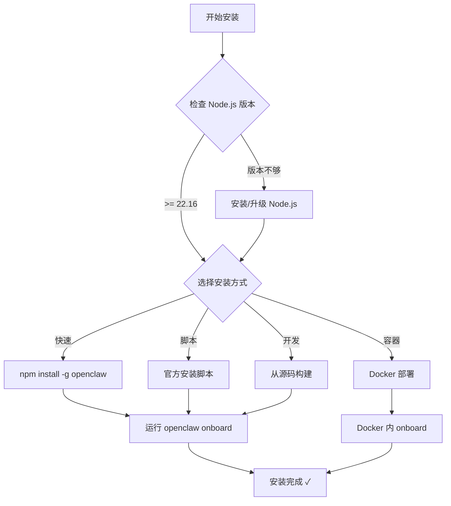

# 第二章：安装与环境配置

[← 上一章：OpenClaw 简介](./01-introduction.md) | [返回目录](./README.md) | [下一章：快速上手 →](./03-quickstart.md)

---

## 2.1 环境要求

在安装 OpenClaw 之前，确保你的系统满足以下条件：

| 要求 | 说明 |
|------|------|
| **Node.js** | 24（推荐）或 22.16+（LTS 兼容） |
| **操作系统** | macOS、Linux、Windows（原生 Windows 与 WSL2 都支持，WSL2 体验通常更稳定） |
| **包管理器** | npm、pnpm 或 bun 均可 |
| **AI 模型 API Key** | 至少一个模型提供商的 API 密钥 |
| **约 5 分钟** | 完成基本安装和配置 |

### 检查 Node.js 版本

```bash
node --version
# 应输出 v24.x.x 或 v22.16+
```

如果没有安装 Node.js 或版本过低，可以使用以下方式安装：

```bash
# 使用 nvm（推荐）
curl -o- https://raw.githubusercontent.com/nvm-sh/nvm/v0.40.3/install.sh | bash
nvm install 24
nvm use 24

# 或使用 fnm
curl -fsSL https://fnm.vercel.app/install | bash
fnm install 24
fnm use 24
```

## 2.2 安装方式

### 方式一：npm 全局安装（推荐）

这是最简单的安装方式，适合大多数用户：

```bash
# 使用 npm
npm install -g openclaw@latest

# 或使用 pnpm
pnpm add -g openclaw@latest

# 验证安装
openclaw --version
```

### 方式二：官方安装脚本

**macOS / Linux：**

```bash
curl -fsSL https://openclaw.ai/install.sh | bash
```

**Windows（PowerShell）：**

```powershell
irm https://openclaw.ai/install.ps1 | iex
```

### 方式三：从源码安装（开发者）

适合想要参与开发或需要最新特性的用户：

```bash
# 克隆仓库
git clone https://github.com/openclaw/openclaw.git
cd openclaw

# 安装依赖（推荐 pnpm）
pnpm install

# 构建前端与主程序
pnpm ui:build
pnpm build

# 以开发模式运行
pnpm openclaw --help

# 常用热重载开发循环
pnpm gateway:watch
```

补充说明：

- `pnpm openclaw ...` 适合直接运行 TypeScript 源码
- `pnpm build` 会产出 `dist/`，更接近发布包运行方式
- `bun` 仍可用于直接执行部分 TypeScript 脚本，但从源码完整开发时优先推荐 `pnpm`

### 方式四：Docker 安装

适合需要隔离环境的用户：

```bash
# 使用官方脚本
./scripts/docker/setup.sh

# 或使用预构建镜像
export OPENCLAW_IMAGE="ghcr.io/openclaw/openclaw:latest"
./scripts/docker/setup.sh
```

> 💡 Docker 部署详情见 [第 13 章：部署方案](./13-deployment.md)

### 方式五：Nix 安装

```bash
# 使用 nix-openclaw
nix profile install github:openclaw/nix-openclaw
```

## 2.3 安装流程图



## 2.4 环境变量

OpenClaw 支持多个环境变量来自定义运行行为：

| 环境变量 | 说明 | 默认值 |
|----------|------|--------|
| `OPENCLAW_HOME` | OpenClaw 主目录 | `~/.openclaw` |
| `OPENCLAW_STATE_DIR` | 状态数据目录 | `~/.openclaw` |
| `OPENCLAW_CONFIG_PATH` | 配置文件路径 | `~/.openclaw/openclaw.json` |

### 设置环境变量（可选）

```bash
# 在 ~/.bashrc 或 ~/.zshrc 中添加
export OPENCLAW_HOME="$HOME/.openclaw"
```

## 2.5 目录结构

安装完成后，OpenClaw 的默认目录结构如下：

```
~/.openclaw/
├── openclaw.json              # 主配置文件
├── workspace/                 # Agent 工作区（默认）
│   ├── AGENTS.md              # 操作指令 + 记忆
│   ├── SOUL.md                # 人格、边界、语气
│   ├── TOOLS.md               # 工具备注
│   ├── IDENTITY.md            # Agent 名称/风格
│   ├── USER.md                # 用户档案
│   ├── MEMORY.md              # 长期记忆（可选）
│   ├── memory/                # 每日记忆日志
│   │   └── YYYY-MM-DD.md
│   └── skills/                # 工作区级技能
├── credentials/               # 通道凭证
│   ├── whatsapp/
│   ├── telegram/
│   └── ...
├── agents/                    # Agent 状态
│   └── main/
│       ├── agent/             # Agent 配置
│       │   ├── auth-profiles.json
│       │   └── models.json
│       └── sessions/          # 会话数据
│           ├── sessions.json
│           └── *.jsonl        # 会话记录
├── skills/                    # 托管/本地技能
└── plugins/                   # 已安装的插件
```

## 2.6 更新开发通道

OpenClaw 提供三个发布通道：

| 通道 | 说明 | npm 标签 |
|------|------|----------|
| **stable** | 正式版本 (`vYYYY.M.D`) | `latest` |
| **beta** | 预发布 (`vYYYY.M.D-beta.N`) | `beta` |
| **dev** | 开发版（`main` 分支最新） | `dev` |

```bash
# 切换通道
openclaw update --channel stable
openclaw update --channel beta
openclaw update --channel dev

# 更新到最新版
npm update -g openclaw@latest
```

## 2.7 更新 OpenClaw

```bash
# 更新到最新稳定版
npm install -g openclaw@latest

# 更新后运行诊断
openclaw doctor
```

`openclaw doctor` 会检查：
- 配置文件完整性
- 依赖版本兼容性
- 通道连接状态
- 已知的迁移问题

## 2.8 卸载

```bash
# npm 全局卸载
npm uninstall -g openclaw

# 清理配置（可选 - 注意这会删除所有数据）
rm -rf ~/.openclaw
```

## 2.9 常见问题

### Q: 安装时出现权限错误？

```bash
# 使用 sudo（不推荐长期使用）
sudo npm install -g openclaw@latest

# 更好的方案：修改 npm 全局目录
mkdir ~/.npm-global
npm config set prefix '~/.npm-global'
echo 'export PATH=~/.npm-global/bin:$PATH' >> ~/.bashrc
source ~/.bashrc
```

### Q: Windows 上如何安装？

现在 **原生 Windows 和 WSL2 都支持**，但如果你要跑更完整的开发流、脚本和部分周边工具，WSL2 通常更稳：

```powershell
# 安装 WSL2
wsl --install

# 在 WSL2 中按照 Linux 方式安装
```

### Q: 可以同时使用 npm 和 pnpm 吗？

可以。OpenClaw 同时支持 npm、pnpm 和 bun。推荐在项目开发中使用 pnpm，在全局安装时使用 npm。

## 2.10 本章小结

| 步骤 | 命令 |
|------|------|
| 安装 OpenClaw | `npm install -g openclaw@latest` |
| 验证安装 | `openclaw --version` |
| 运行配置向导 | `openclaw onboard --install-daemon` |
| 检查健康状态 | `openclaw doctor` |
| 更新版本 | `npm install -g openclaw@latest` |

---

[← 上一章：OpenClaw 简介](./01-introduction.md) | [返回目录](./README.md) | [下一章：快速上手 →](./03-quickstart.md)
