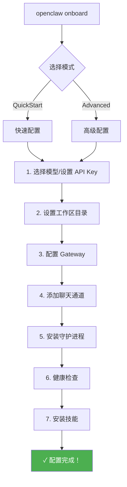
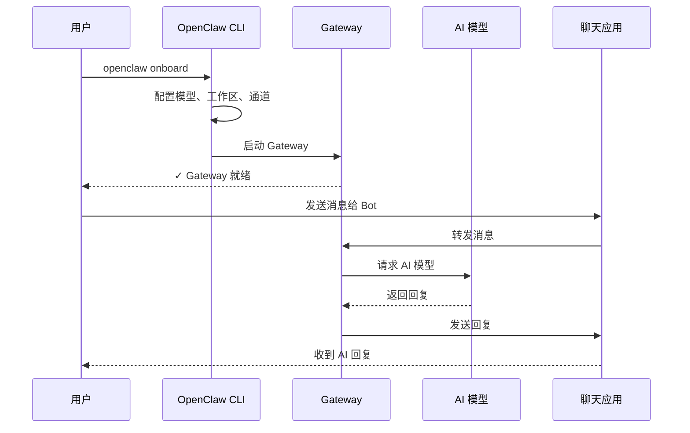

# 第三章：快速上手指南

[← 上一章：安装与环境配置](./02-installation.md) | [返回目录](./README.md) | [下一章：系统架构详解 →](./04-architecture.md)

---

## 3.1 五分钟上手

本章将带你在 5 分钟内完成 OpenClaw 的基本配置并发送第一条消息。

### 前置条件

- ✅ 已安装 OpenClaw（参见 [第二章](./02-installation.md)）
- ✅ 准备好至少一个 AI 模型的 API Key（如 Anthropic、OpenAI、Google 等）

## 3.2 运行 Onboard 向导

OpenClaw 提供了一个交互式的 Onboard（引导）向导，它会一步步引导你完成配置：

```bash
openclaw onboard --install-daemon
```

> `--install-daemon` 参数会同时安装守护进程（Daemon），让 Gateway 在后台持续运行。

### Onboard 流程图



### QuickStart 模式 vs Advanced 模式

| 选项 | QuickStart（推荐新手） | Advanced |
|------|------------------------|----------|
| Gateway 模式 | 本地回环（loopback） | 可自定义 |
| 端口 | 18789 | 可自定义 |
| 认证 | Token 认证 | 可选多种模式 |
| DM 策略 | pairing（配对） | 可自定义 |
| Tailscale | 关闭 | 可开启 |

### Onboard 各步骤详解

#### 步骤 1：选择 AI 模型提供商

```
? 选择模型提供商
❯ Anthropic (Claude)
  OpenAI (GPT)
  Google (Gemini)
  Custom / Self-hosted
```

输入你的 API Key：

```
? Enter your Anthropic API key: sk-ant-xxxxx
```

#### 步骤 2：设置工作区

```
? Workspace location (default: ~/.openclaw/workspace)
```

工作区是 Agent 的"家目录"，引导文件（AGENTS.md、SOUL.md 等）会在这里创建。

#### 步骤 3：配置 Gateway

```
? Gateway port: 18789
? Bind address: loopback (127.0.0.1)
? Auth mode: token
? Generated token: xxxxxxxx (已自动保存)
```

#### 步骤 4：添加聊天通道

```
? 选择要配置的通道（可多选）
❯ ☐ WhatsApp
  ☐ Telegram
  ☐ Discord
  ☐ Signal
  ☐ Google Chat
```

> 💡 Telegram 是最快的接入方式，只需要一个 Bot Token。

#### 步骤 5：安装守护进程

Onboard 会根据你的操作系统自动安装对应的守护进程：

| 操作系统 | 守护进程类型 | 说明 |
|----------|-------------|------|
| macOS | LaunchAgent | 用户级别的 launchd 服务 |
| Linux/WSL2 | systemd user unit | 用户级别的 systemd 服务 |
| Windows（原生） | 视安装方式而定 | 推荐先用 Onboard 完成基础配置 |

## 3.3 启动 Gateway

如果你在 Onboard 时没有安装守护进程，可以手动启动：

```bash
# 前台运行（适合调试）
openclaw gateway --port 18789 --verbose

# 或者安装并启动守护进程
openclaw daemon install
openclaw daemon start
```

### 验证 Gateway 状态

```bash
# 查看 Gateway 状态
openclaw gateway status

# 查看通道状态
openclaw channels status --probe

# 打开 Web 控制台
openclaw dashboard
```

Web 控制台默认地址：http://127.0.0.1:18789/

### 默认安全行为（新手非常重要）

OpenClaw 连接的是真实聊天平台，所以默认会把很多入站私聊视为“不完全可信输入”：

- Telegram / WhatsApp / Signal / iMessage / Discord / Slack / Google Chat / Microsoft Teams 等通道，默认更推荐使用 **`dmPolicy: "pairing"`**
- 未配对的新发送者会先收到一个短配对码
- 只有你执行 `openclaw pairing approve <channel> <code>` 之后，消息才会正式进入助手上下文

这套机制的意义非常大：**它能防止任何陌生人直接把你的 AI 助手“当成公开机器人来用”**。

## 3.4 发送第一条消息

### 方式一：通过 CLI

```bash
# 直接和 Agent 对话
openclaw agent --message "你好，请介绍一下你自己" --thinking high

# 发送消息到特定通道
openclaw message send --to +1234567890 --message "Hello from OpenClaw"
```

### 方式二：通过 Web 控制台

1. 打开浏览器访问 http://127.0.0.1:18789/
2. 在设置中输入 Gateway Token
3. 在聊天界面发送消息

### 方式三：通过聊天应用

如果你已经配置了通道（如 Telegram），直接在聊天应用中给 Bot 发消息即可。

## 3.5 常用 CLI 命令速查

```bash
# === 系统管理 ===
openclaw --version                     # 查看版本
openclaw doctor                        # 运行诊断
openclaw dashboard                     # 打开 Web 控制台
openclaw docs                          # 打开文档入口

# === Gateway 管理 ===
openclaw gateway status                # 查看 Gateway 状态
openclaw gateway --port 18789          # 启动 Gateway

# === 通道管理 ===
openclaw channels status               # 查看所有通道状态
openclaw channels status --probe       # 深度探测
openclaw channels add --channel telegram  # 添加通道
openclaw channels login --channel whatsapp  # 登录通道

# === 配对管理 ===
openclaw pairing list                  # 查看配对请求
openclaw pairing approve <channel> <code>  # 批准配对

# === 配置管理 ===
openclaw config get <key>              # 获取配置
openclaw config set <key> <value>      # 设置配置
openclaw configure                     # 交互式配置

# === 模型管理 ===
openclaw models list                   # 列出可用模型
openclaw models status                 # 查看模型状态
openclaw models set <provider/model>   # 设置默认模型

# === Agent 管理 ===
openclaw agent --message "你好"        # 发送消息给 Agent
openclaw agents list                   # 列出所有 Agent
openclaw agents add <name>             # 添加新 Agent

# === 会话管理 ===
openclaw status                        # 查看会话状态
openclaw sessions --json               # 导出会话数据
openclaw memory status                 # 查看记忆索引状态

# === 自动化与扩展 ===
openclaw hooks list                    # 查看可用 hooks
openclaw cron list                     # 查看定时任务
openclaw plugins list                  # 查看插件
openclaw skills list                   # 查看技能

# === 守护进程管理 ===
openclaw daemon install                # 安装守护进程
openclaw daemon start                  # 启动守护进程
openclaw daemon stop                   # 停止守护进程
openclaw daemon status                 # 查看守护进程状态
```

## 3.6 配置通道示例：Telegram

Telegram 是最容易上手的通道，这里给出完整示例：

### 步骤 1：创建 Telegram Bot

1. 在 Telegram 中搜索 `@BotFather`
2. 发送 `/newbot` 命令
3. 按提示输入 Bot 名称
4. 获得 Bot Token（格式如 `123456:ABC-DEF1234ghIkl-zyx57W2v1u123ew11`）

### 步骤 2：配置 OpenClaw

```bash
# 设置 Bot Token
openclaw config set channels.telegram.botToken "你的_BOT_TOKEN"

# 设置 DM 策略为配对模式
openclaw config set channels.telegram.dmPolicy "pairing"

# 设置群聊需要 @ 提及
openclaw config set channels.telegram.groups '{"*": {"requireMention": true}}' --strict-json
```

### 步骤 3：启动并配对

```bash
# 重启 Gateway 或等待热重载
openclaw gateway

# 在 Telegram 中给你的 Bot 发一条消息
# 然后查看配对请求
openclaw pairing list telegram

# 批准配对
openclaw pairing approve telegram <配对码>
```

### 步骤 4：开始对话

现在你可以直接在 Telegram 中和你的 AI 助手对话了！

## 3.7 快速上手流程总结



## 3.8 本章小结

| 步骤 | 操作 | 耗时 |
|------|------|------|
| 1. 运行 Onboard | `openclaw onboard --install-daemon` | ~2 分钟 |
| 2. 验证 Gateway | `openclaw gateway status` | ~10 秒 |
| 3. 打开控制台 | `openclaw dashboard` | ~10 秒 |
| 4. 发送消息 | 通过 CLI/Web/聊天应用 | ~30 秒 |

---

[← 上一章：安装与环境配置](./02-installation.md) | [返回目录](./README.md) | [下一章：系统架构详解 →](./04-architecture.md)
