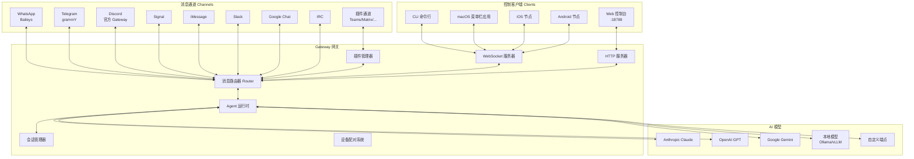
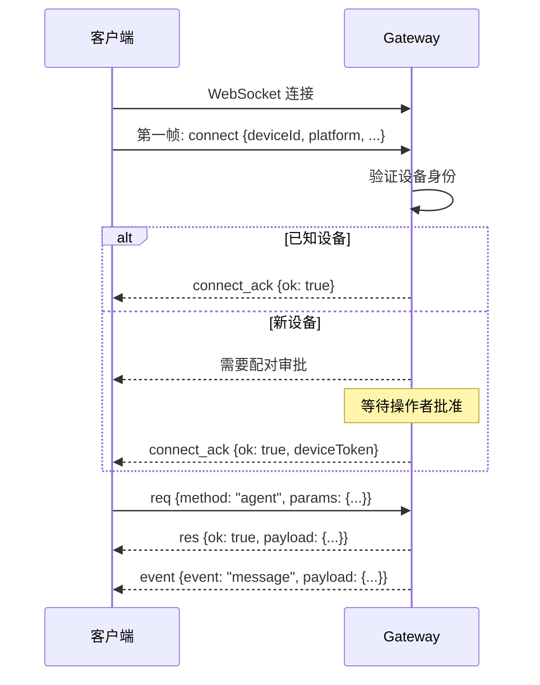
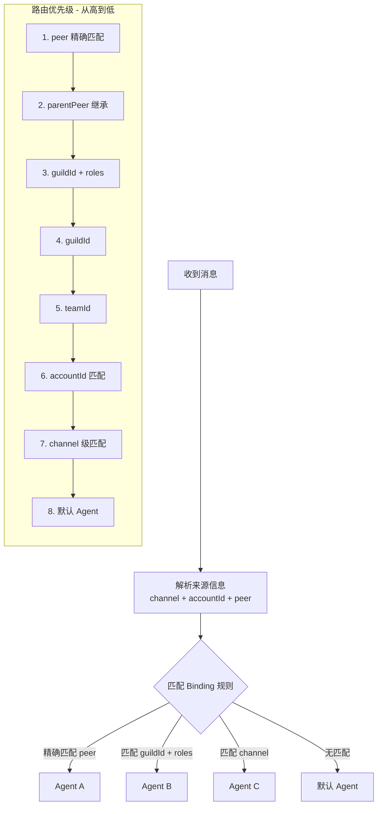
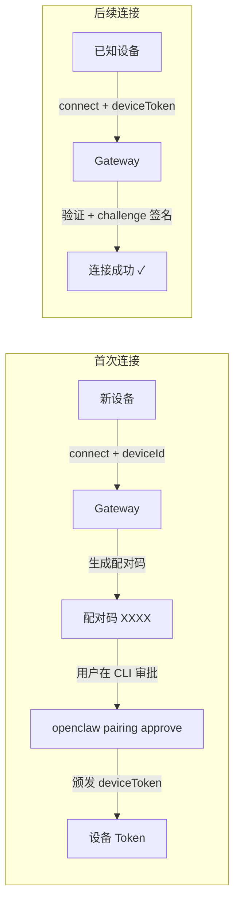
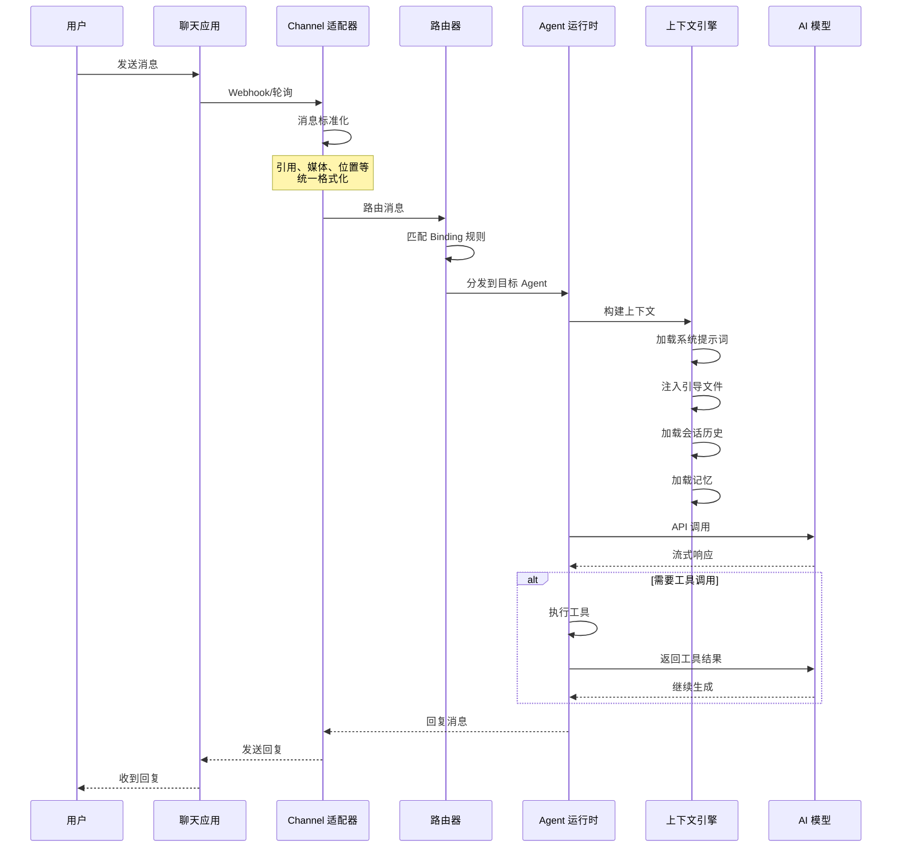
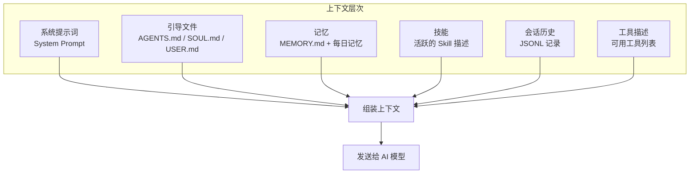

# 第四章：系统架构详解

[← 上一章：快速上手指南](./03-quickstart.md) | [返回目录](./README.md) | [下一章：配置文件详解 →](./05-configuration.md)

---

## 4.1 总体架构

OpenClaw 采用以 **Gateway 为中心的星型架构**，所有的消息流、控制流都经过 Gateway：



## 4.2 Gateway 核心组件

Gateway 是 OpenClaw 的"心脏"，它包含以下核心组件：

### 4.2.1 WebSocket 服务器

所有客户端（CLI、macOS 应用、移动节点）都通过 WebSocket 连接到 Gateway。

**协议格式：**

```
传输协议: WebSocket + JSON 文本帧
默认地址: ws://127.0.0.1:18789
```

**消息类型：**

| 类型 | 格式 | 说明 |
|------|------|------|
| **Connect** | 第一帧必须 | 包含设备身份和可选的挑战签名 |
| **Request** | `{type:"req", id, method, params}` | 请求（如发送消息） |
| **Response** | `{type:"res", id, ok, payload\|error}` | 响应 |
| **Event** | `{type:"event", event, payload, seq?}` | 事件推送 |

**连接流程：**



### 4.2.2 消息路由器 (Router)

路由器决定消息应该被哪个 Agent 处理：



### 4.2.3 HTTP 服务器

Gateway 同时提供 HTTP 服务，用于：

| 端点 | 用途 |
|------|------|
| `/` | Web 控制台（Control UI） |
| `/healthz` | 存活探测（Liveness） |
| `/readyz` | 就绪探测（Readiness） |
| `/__openclaw__/canvas/` | Canvas 画布渲染 |
| `/__openclaw__/a2ui/` | A2UI 界面 |

## 4.3 设备配对与信任模型

OpenClaw 的安全模型基于**设备配对（Device Pairing）**：



**配对规则：**

- 所有客户端在连接时必须提供设备身份（deviceId）
- 新设备需要操作者批准
- 本地回环连接（loopback）可以自动批准
- 非本地连接必须显式批准
- 所有连接必须用 `v3` 签名方式签署挑战随机数（challenge nonce）

## 4.4 数据流详解

### 4.4.1 消息处理流程

一条消息从聊天应用到达 AI 模型再返回的完整流程：



### 4.4.2 会话上下文构建



## 4.5 源码目录结构

以下是 OpenClaw 源码的主要目录及其职责：

```
src/
├── gateway/        # Gateway 主进程、WS 服务、协议实现
├── channels/       # 各通道适配器（WhatsApp/Telegram/Discord...）
├── agents/         # Agent 运行时、管理、身份
├── sessions/       # 会话存储、JSONL 记录、会话生命周期
├── routing/        # 消息路由逻辑
├── bindings/       # 消息路由绑定规则
├── config/         # 配置加载、校验、管理
├── context-engine/ # 上下文/提示词构建
├── memory/         # 记忆管理、向量搜索
├── plugins/        # 插件管理、加载、注册
├── plugin-sdk/     # 插件 SDK（公共契约）
├── cli/            # CLI 命令行接口
├── commands/       # 内置命令（/status, /model 等）
├── tools/          # 工具系统（标注在 docs/tools/）
├── security/       # 安全工具（审计、权限检查）
├── pairing/        # 设备配对流程
├── media/          # 媒体处理（图片/音频/视频）
├── tts/            # TTS 文字转语音
├── web-search/     # 网页搜索（Brave/Perplexity/Gemini...）
├── browser/        # 浏览器自动化 + CDP
├── cron/           # 定时任务调度
├── daemon/         # 守护进程管理（launchd/systemd）
├── hooks/          # 事件钩子系统
├── wizard/         # Onboard 向导逻辑
├── infra/          # 基础设施（日志、遥测、文件系统）
├── terminal/       # 终端 UI 组件
├── shared/         # 跨包共享类型 + 工具
├── types/          # TypeScript 类型定义
└── extensions/     # 内置扩展/插件
```

## 4.6 关键设计原则

### 单 Gateway 原则

> **一个主机上只运行一个 Gateway 实例。**

这简化了状态管理，避免了会话冲突。如果你需要多个助手，使用 **多 Agent 路由**（而非多 Gateway）。

### 事件不重放原则

> **Gateway 不会重放历史事件。**

如果客户端断线，需要自行刷新状态，而非依赖事件回放。

### 单用户信任模型

> **每个 Gateway 的信任边界是一个用户。**

OpenClaw 不是多租户系统。如果需要为多个不信任的用户提供服务，应部署多个独立的 Gateway。

### 配置即代码

> **配置文件是 Gateway 行为的唯一真实来源（Single Source of Truth）。**

所有的路由规则、访问控制、模型选择等，都通过 `~/.openclaw/openclaw.json` 控制。

## 4.7 与其他项目的对比

| 特性 | OpenClaw | 传统 ChatBot 框架 | SaaS AI 助手 |
|------|----------|-------------------|-------------|
| 部署方式 | 自托管 | 自托管/云端 | 云端 |
| 数据控制 | 完全自主 | 部分自主 | 服务商控制 |
| 多通道 | ✅ 20+ 通道 | 通常 1-3 个 | 平台限定 |
| 多模型 | ✅ 35+ 提供商 | 通常 1-2 个 | 平台限定 |
| 工具调用 | ✅ 原生支持 | 需要集成 | 有限支持 |
| 会话管理 | ✅ 精细控制 | 基本 | 平台控制 |
| 插件系统 | ✅ 完整 SDK | 各有不同 | 有限 |

## 4.8 本章小结

| 组件 | 职责 | 关键技术 |
|------|------|----------|
| **Gateway** | 核心进程，消息枢纽 | WebSocket + HTTP |
| **Router** | 消息路由到 Agent | Binding 规则匹配 |
| **Agent Runtime** | AI 推理和工具调用 | 流式 API + 工具链 |
| **Session Manager** | 会话状态管理 | JSONL + 上下文窗口 |
| **Plugin Manager** | 插件加载和注册 | SDK + 运行时注入 |
| **Pairing System** | 设备信任管理 | Challenge-Response |

---

[← 上一章：快速上手指南](./03-quickstart.md) | [返回目录](./README.md) | [下一章：配置文件详解 →](./05-configuration.md)
