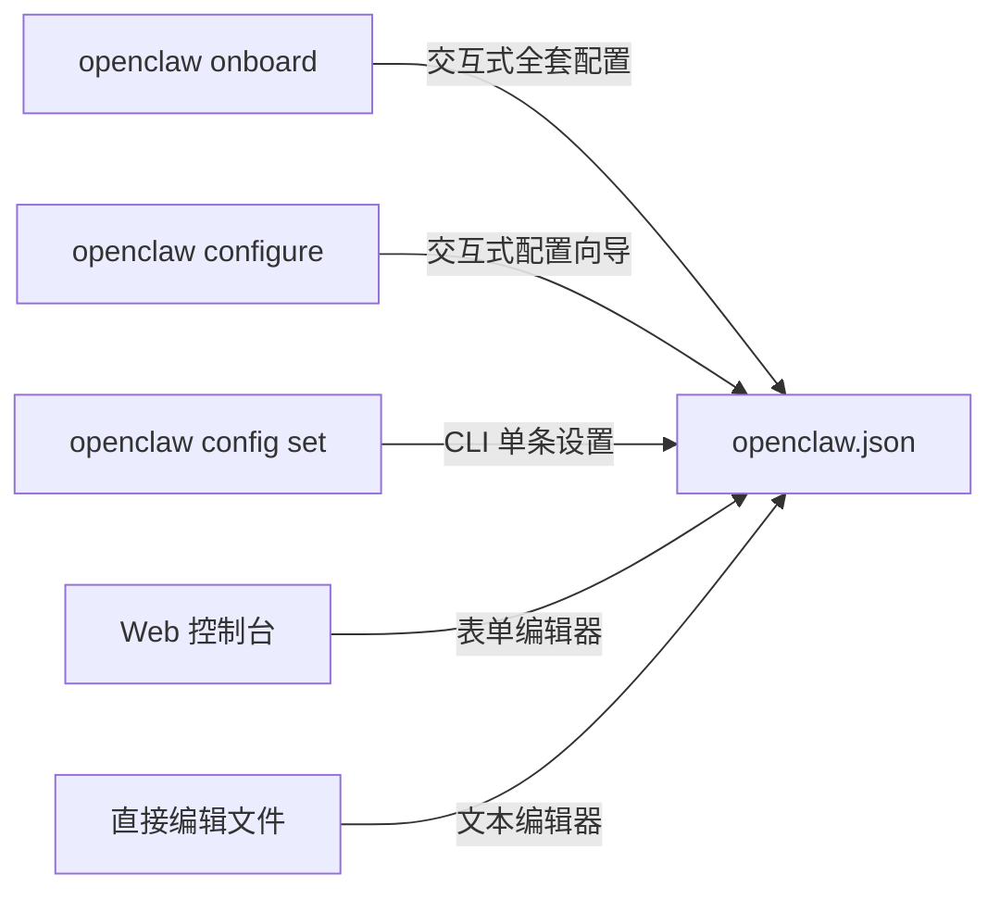
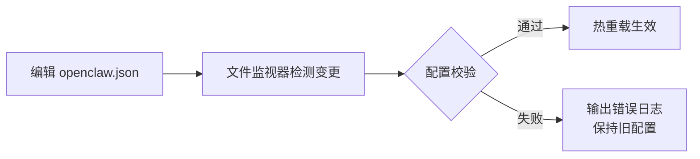

# 第五章：配置文件详解

[← 上一章：系统架构详解](./04-architecture.md) | [返回目录](./README.md) | [下一章：消息通道配置 →](./06-channels.md)

---

## 5.1 配置文件概述

OpenClaw 的配置文件是一个 **JSON5** 格式的文件，位于：

```
~/.openclaw/openclaw.json
```

> **JSON5** 是 JSON 的超集，支持注释、尾逗号、单引号等，写起来更友好。

### 核心原则

- **可选文件**：配置文件不存在时，OpenClaw 使用安全的默认值
- **严格校验**：未知的键或错误的类型会**阻止 Gateway 启动**
- **热重载**：修改配置文件后，Gateway 会自动重新加载（部分配置需重启）

## 5.2 配置方式

OpenClaw 提供多种配置方式，按便利程度排序：



### 方式一：交互式 Onboard

```bash
openclaw onboard  # 完整的初始化引导
```

### 方式二：交互式配置

```bash
openclaw configure  # 配置向导
```

### 方式三：CLI 命令

```bash
# 获取配置值
openclaw config get channels.telegram.botToken

# 设置配置值
openclaw config set channels.telegram.botToken "123:abc"

# 设置 JSON 值
openclaw config set channels.whatsapp.groups '{"*": {"requireMention": true}}' --strict-json

# 删除配置值
openclaw config unset channels.telegram.botToken
```

### 方式四：Web 控制台

打开 http://127.0.0.1:18789/ ，在设置页面使用表单编辑器或原始 JSON 编辑器。

### 方式五：直接编辑文件

```bash
# 用你喜欢的编辑器直接编辑
vim ~/.openclaw/openclaw.json
# 或
code ~/.openclaw/openclaw.json
```

## 5.3 配置文件结构

完整的配置文件结构如下：

```json5
{
  // === Gateway 网关设置 ===
  gateway: {
    mode: "local",           // "local" | "lan" | "remote"
    bind: "loopback",        // "loopback" | "lan" | "0.0.0.0"
    port: 18789,             // 端口号
    auth: {
      mode: "token",         // "token" | "none"
      token: "your-token"    // 认证 Token
    }
  },

  // === Agent 智能体设置 ===
  agents: {
    defaults: {
      workspace: "~/.openclaw/workspace",  // 工作区目录

      // 模型配置
      model: {
        primary: "anthropic/claude-sonnet-4-6",
        fallbacks: ["openai/gpt-5.4", "google/gemini-2.5-pro"]
      },
      imageModel: {
        primary: "anthropic/claude-sonnet-4-6"
      },

      // 沙盒配置
      sandbox: {
        mode: "off",          // "off" | "non-main" | "all"
        scope: "agent"        // "session" | "agent" | "shared"
      }
    },

    // 多 Agent 配置
    list: [
      { id: "main", workspace: "~/.openclaw/workspace" },
      { id: "work", workspace: "~/.openclaw/workspace-work" }
    ]
  },

  // === 绑定规则 ===
  bindings: [
    {
      agentId: "work",
      match: { channel: "slack", teamId: "T123456" }
    }
  ],

  // === 会话设置 ===
  session: {
    dmScope: "per-channel-peer",  // DM 隔离模式
    maintenance: {
      mode: "warn",               // "warn" | "enforce"
      pruneAfter: "30d",
      maxEntries: 500,
      rotateBytes: "10mb"
    },
    sendPolicy: {
      rules: [],
      default: "allow"
    }
  },

  // === 通道设置 ===
  channels: {
    whatsapp: {
      dmPolicy: "pairing",
      allowFrom: ["+15551234567"],
      groups: { "*": { requireMention: true } }
    },
    telegram: {
      botToken: "123:abc",
      dmPolicy: "pairing",
      groups: { "*": { requireMention: true } }
    },
    discord: {
      enabled: true,
      token: { source: "env", provider: "default", id: "DISCORD_BOT_TOKEN" }
    }
    // ... 更多通道
  },

  // === 消息设置 ===
  messages: {
    groupChat: {
      mentionPatterns: ["@openclaw", "@oc"]
    }
  },

  // === 工具设置 ===
  tools: {
    profile: "coding",         // "coding" | "messaging" | "custom"
    allow: [],                 // 允许的工具列表
    deny: [],                  // 禁止的工具列表
    exec: {
      security: "allowlist",   // "deny" | "allowlist" | "full"
      ask: "on-miss"           // "off" | "on-miss" | "always"
    },
    fs: {
      workspaceOnly: false
    }
  },

  // === 模型提供商 ===
  models: {
    providers: {}              // 自定义模型提供商
  }
}
```

## 5.4 关键配置项详解

### 5.4.1 Gateway 设置

```json5
{
  gateway: {
    mode: "local",       // 网关模式
    bind: "loopback",    // 绑定地址
    port: 18789,         // 端口
    auth: {
      mode: "token",     // 认证模式
      token: "xxx"       // Token 值
    }
  }
}
```

| 配置项 | 可选值 | 说明 |
|--------|--------|------|
| `mode` | `local` / `lan` / `remote` | local = 仅本机访问；lan = 局域网；remote = 远程 |
| `bind` | `loopback` / `lan` / `0.0.0.0` | 网络绑定地址 |
| `port` | 数字 | 默认 18789 |
| `auth.mode` | `token` / `none` | 认证方式 |

### 5.4.2 Agent 默认设置

```json5
{
  agents: {
    defaults: {
      workspace: "~/.openclaw/workspace",

      // 模型配置（最重要的配置之一）
      model: {
        primary: "anthropic/claude-sonnet-4-6",  // 主模型
        fallbacks: ["openai/gpt-5.4"]            // 备选模型
      },

      // 区块流式传输（默认关闭）
      blockStreamingDefault: "off",

      // 跳过引导文件创建
      skipBootstrap: false
    }
  }
}
```

### 5.4.3 通道 DM 策略

每个通道都可以设置 DM（私聊）访问策略：

| 策略 | 说明 | 适用场景 |
|------|------|----------|
| `pairing` | 需要配对审批 | **推荐** - 安全且灵活 |
| `allowlist` | 仅白名单用户 | 已知用户列表 |
| `open` | 任何人都可以 | 公开 Bot |
| `disabled` | 禁用私聊 | 仅群聊 |

```json5
{
  channels: {
    telegram: {
      dmPolicy: "pairing",          // 推荐
      allowFrom: ["tg:123456"]      // 白名单（与 allowlist 策略配合）
    }
  }
}
```

### 5.4.4 群聊策略

```json5
{
  channels: {
    whatsapp: {
      groups: {
        "*": {                         // * 表示所有群
          requireMention: true,        // 需要 @ 提及才回复
          groupPolicy: "open"          // 群策略
        },
        "specific-group-id": {         // 特定群的配置
          requireMention: false,
          allowFrom: ["+15551234567"]  // 群内白名单
        }
      }
    }
  }
}
```

### 5.4.5 工具安全配置

```json5
{
  tools: {
    profile: "coding",      // 预设配置文件

    // 精细控制
    allow: ["read", "web_search"],     // 允许的工具
    deny: ["exec", "write"],           // 禁止的工具

    // Shell 执行控制
    exec: {
      security: "allowlist",  // "deny" | "allowlist" | "full"
      ask: "on-miss"          // "off" | "on-miss" | "always"
    },

    // 文件系统限制
    fs: {
      workspaceOnly: true    // 只能访问工作区内文件
    }
  }
}
```

## 5.5 最小化配置示例

### 最简配置（默认即可运行）

```json5
{
  agents: { defaults: { workspace: "~/.openclaw/workspace" } },
  channels: { whatsapp: { allowFrom: ["+15555550123"] } }
}
```

### 安全加固配置（60 秒基线）

```json5
{
  gateway: {
    mode: "local",
    bind: "loopback",
    auth: { mode: "token", token: "your-long-random-token" }
  },
  session: { dmScope: "per-channel-peer" },
  tools: {
    profile: "messaging",
    deny: ["group:automation", "group:runtime", "group:fs"],
    fs: { workspaceOnly: true },
    exec: { security: "deny", ask: "always" }
  },
  channels: {
    whatsapp: {
      dmPolicy: "pairing",
      groups: { "*": { requireMention: true } }
    }
  }
}
```

### 多 Agent 配置

```json5
{
  agents: {
    list: [
      { id: "home", workspace: "~/.openclaw/workspace-home" },
      { id: "work", workspace: "~/.openclaw/workspace-work" }
    ]
  },
  bindings: [
    { agentId: "home", match: { channel: "whatsapp", accountId: "personal" } },
    { agentId: "work", match: { channel: "slack", teamId: "T123456" } }
  ]
}
```

## 5.6 配置验证与诊断

```bash
# 检查配置是否有效
openclaw doctor

# 查看当前配置
openclaw config get

# 查看特定配置项
openclaw config get agents.defaults.model

# 安全审计
openclaw security audit
openclaw security audit --deep
```

## 5.7 配置热重载机制



**热重载支持的配置项：**
- 通道设置（allowFrom、groups 等）
- 工具策略
- 模型选择

**需要重启才生效的配置项：**
- Gateway bind/port
- 新通道的添加
- 插件的安装/卸载

## 5.8 本章小结

| 要点 | 说明 |
|------|------|
| **配置文件位置** | `~/.openclaw/openclaw.json` |
| **文件格式** | JSON5（支持注释和尾逗号） |
| **最重要的配置** | `agents.defaults.model` + `channels.*` |
| **安全建议** | 使用 `pairing` + `requireMention` + `token` auth |
| **配置方式** | Onboard > configure > CLI > Web > 手动编辑 |

---

[← 上一章：系统架构详解](./04-architecture.md) | [返回目录](./README.md) | [下一章：消息通道配置 →](./06-channels.md)
