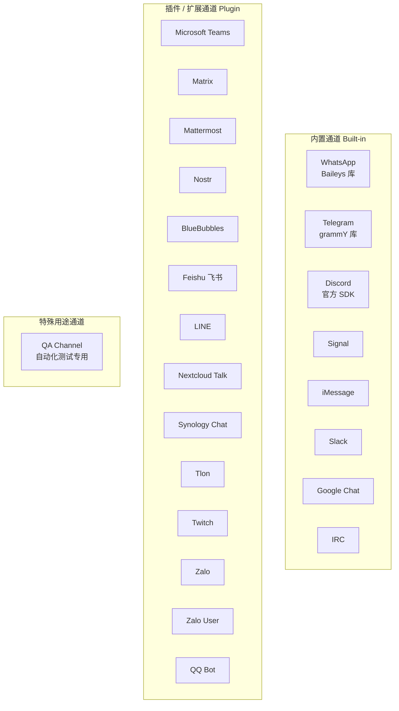
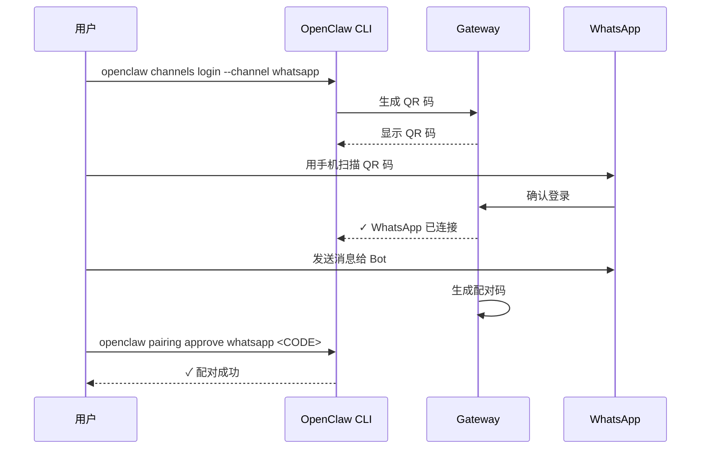
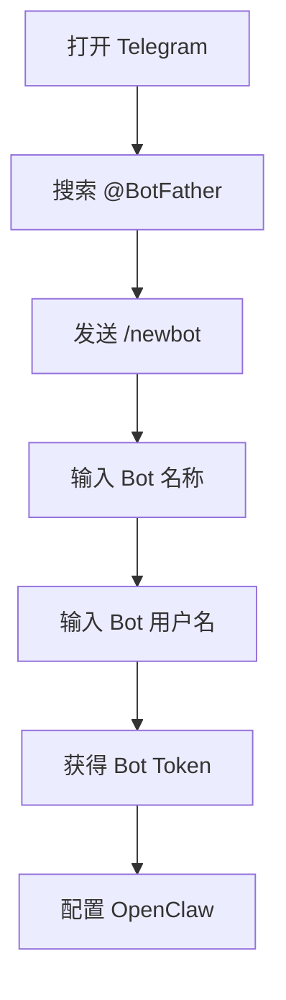
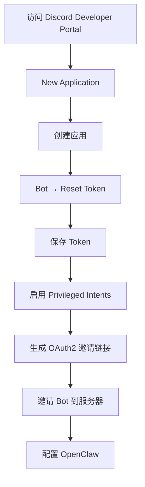
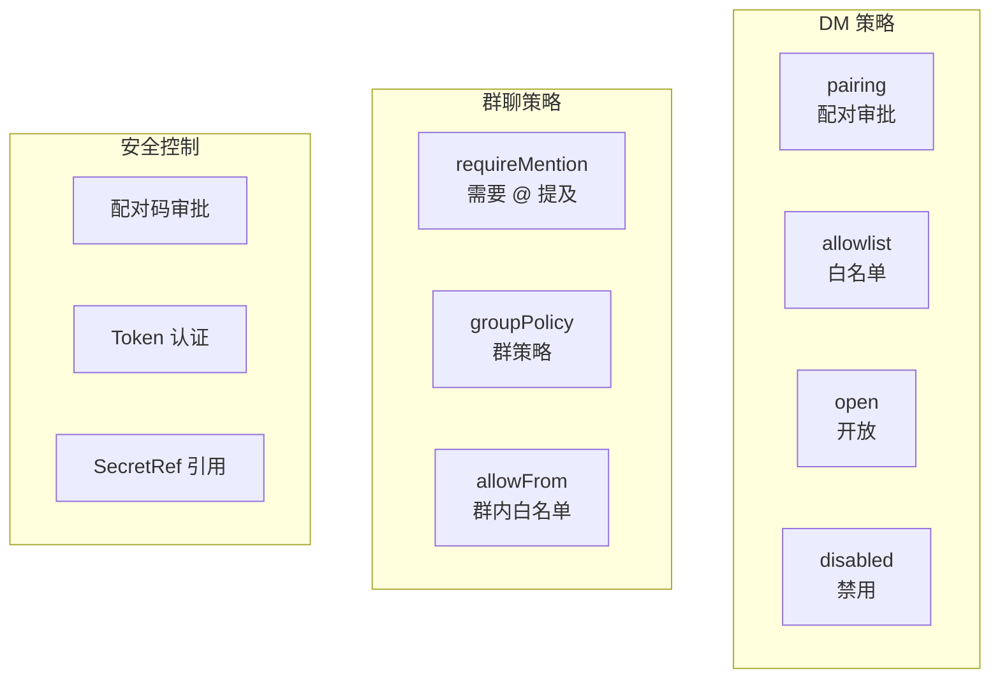

# 第六章：消息通道配置

[← 上一章：配置文件详解](./05-configuration.md) | [返回目录](./README.md) | [下一章：Agent 智能体系统 →](./07-agents.md)

---

## 6.1 通道概述

OpenClaw 支持 20+ 个聊天平台作为消息通道（Channel）。随着上游继续迭代，除了常见 IM 通道，还新增了更偏工程化和区域化的通道页面。通道大致分为三类：



### 新增通道补充

| 通道 | 定位 | 适合谁 |
|------|------|--------|
| **QQ Bot** | 面向 QQ 官方 Bot API 的正式聊天通道 | 需要接入 QQ 生态的用户 |
| **QA Channel** | 合成（synthetic）测试通道，不是生产通道 | 做自动化测试、E2E、场景回放的开发者 |

## 6.2 WhatsApp 配置

WhatsApp 是通过 **Baileys** 库实现的 Web 客户端协议连接。

### 快速配置

```bash
# 方式一：通过 Onboard
openclaw onboard

# 方式二：单独添加
openclaw channels add --channel whatsapp

# 方式三：手动登录
openclaw channels login --channel whatsapp
```

### 配置示例

```json5
{
  channels: {
    whatsapp: {
      // DM 访问控制
      dmPolicy: "pairing",                    // 推荐：配对模式
      allowFrom: ["+15551234567"],             // 白名单（国际格式）
      sendReadReceipts: true,                  // 发送已读回执

      // 确认反应
      ackReaction: {
        emoji: "👀",                           // 收到消息时的 emoji 反应
        direct: true,                          // 私聊中使用
        group: "mentions"                      // 群聊中仅提及时使用
      },

      // 群聊策略
      groups: {
        "*": { requireMention: true },         // 所有群需要 @ 提及
        "120363xxx@g.us": {                    // 特定群配置
          requireMention: false,
          allowFrom: ["+15551234567"]
        }
      },
      groupPolicy: "open",                    // "open" | "allowlist" | "disabled"

      // 媒体设置
      textChunkLimit: 4000,                    // 文本分段长度
      chunkMode: "length",                     // "length" | "newline"
      mediaMaxMb: 50,                          // 最大媒体文件大小（MB）

      // 多账号
      accounts: {
        personal: { authDir: "~/.openclaw/credentials/whatsapp/personal" },
        biz: { authDir: "~/.openclaw/credentials/whatsapp/biz" }
      }
    }
  }
}
```

### WhatsApp 配对流程



### WhatsApp 消息标准化

OpenClaw 会将 WhatsApp 的各种消息类型标准化：

| 消息类型 | 标准化格式 |
|----------|------------|
| 引用回复 | `[Replying to <sender> id:<stanzaId>] ... [/Replying]` |
| 图片 | `<media:image>` |
| 视频 | `<media:video>` |
| 语音 | `<media:audio>` |
| 文档 | `<media:document>` |
| 贴纸 | `<media:sticker>` |
| 位置 | 提取为文本坐标 |
| 联系人 | 提取为文本信息 |

## 6.3 Telegram 配置

Telegram 通过 **Bot API**（grammY 库）连接，是最容易上手的通道。

### 创建 Telegram Bot



### 配置示例

```json5
{
  channels: {
    telegram: {
      botToken: "123456789:ABCdefGHIjklMNOpqrsTUVwxyz",  // Bot Token
      dmPolicy: "pairing",                                // DM 策略
      enabled: true,

      // DM 白名单（使用 Telegram 用户 ID）
      allowFrom: ["tg:123456", "telegram:789012", "345678"],

      // 群聊配置
      groups: {
        "*": {
          requireMention: true,
          groupPolicy: "open"
        },
        "-1001234567890": {                  // 特定群 ID
          groupPolicy: "allowlist",
          requireMention: true,
          allowFrom: ["8734062810"]
        }
      }
    }
  }
}
```

### 获取 Telegram 用户 ID

| 方法 | 说明 |
|------|------|
| DM Bot + 查看日志 | 给 Bot 发消息，`openclaw logs --follow` 看 `from.id` |
| API 查询 | `curl "https://api.telegram.org/bot<token>/getUpdates"` |
| 第三方 Bot | 搜索 `@userinfobot` 或 `@getidsbot` |

### Telegram Bot 侧设置

在 **@BotFather** 中进行以下设置：

```
/setprivacy     → 关闭隐私模式（使 Bot 能看到群内所有消息）
/setjoingroups  → 允许 Bot 被加入群组
```

> ⚠️ 修改隐私模式后，需要将 Bot 从群中移除再重新添加才能生效。

### 轮询 vs Webhook

| 模式 | 优点 | 缺点 |
|------|------|------|
| **长轮询 (Long Polling)** | 无需配置，默认启用 | 有微小延迟 |
| **Webhook** | 实时推送 | 需要 TLS + 公网地址 |

## 6.4 Discord 配置

### 创建 Discord Bot



### 详细步骤

#### 1. 创建应用和 Bot

1. 访问 [Discord Developer Portal](https://discord.com/developers/applications)
2. 点击 **New Application**，输入名称
3. 进入 **Bot** 页面 → 点击 **Reset Token**
4. 保存生成的 Token

#### 2. 启用 Privileged Intents

在 Bot 设置页启用：
- ✅ **Message Content Intent**（必需）
- ✅ **Server Members Intent**（推荐，用于角色白名单）
- ☐ **Presence Intent**（可选）

#### 3. 生成邀请链接

在 **OAuth2** → **URL Generator** 中：
- **Scopes**: `bot`, `applications.commands`
- **Bot Permissions**: View Channels, Send Messages, Read Message History, Embed Links, Attach Files, Add Reactions

#### 4. 配置 OpenClaw

```bash
# 设置 Token（推荐使用环境变量）
export DISCORD_BOT_TOKEN="YOUR_TOKEN"
openclaw config set channels.discord.token \
  --ref-provider default --ref-source env --ref-id DISCORD_BOT_TOKEN
openclaw config set channels.discord.enabled true --strict-json
```

### 配置示例

```json5
{
  channels: {
    discord: {
      enabled: true,
      token: {
        source: "env",
        provider: "default",
        id: "DISCORD_BOT_TOKEN"
      },

      // 群组策略
      groupPolicy: "allowlist",
      guilds: {
        "YOUR_SERVER_ID": {
          channels: {
            "CHANNEL_ID": {
              allow: true,
              requireMention: false
            }
          }
        }
      }
    }
  }
}
```

### 获取 Discord ID

启用 **Developer Mode**（用户设置 → 高级 → 开发者模式），然后：
- 右键服务器图标 → Copy Server ID
- 右键你的头像 → Copy User ID
- 右键频道名 → Copy Channel ID

## 6.5 其他通道速览

### QQ Bot（新补充）

QQ Bot 通过 **官方 QQ Bot API（WebSocket Gateway）** 接入，支持：

- C2C 私聊
- 群聊 @ 消息
- Guild / 频道消息
- 图片、语音、视频、文件等富媒体

最小配置示例：

```json5
{
  channels: {
    qqbot: {
      enabled: true,
      appId: "YOUR_APP_ID",
      clientSecret: "YOUR_APP_SECRET",
    },
  },
}
```

CLI 添加方式：

```bash
openclaw channels add --channel qqbot --token "AppID:AppSecret"
```

多账号示例：

```json5
{
  channels: {
    qqbot: {
      enabled: true,
      appId: "111111111",
      clientSecret: "secret-of-bot-1",
      accounts: {
        bot2: {
          enabled: true,
          appId: "222222222",
          clientSecret: "secret-of-bot-2",
        },
      },
    },
  },
}
```

### QA Channel（测试专用）

`qa-channel` 是一个**合成测试通道**，不是给普通用户接聊天用的，而是给开发者做自动化验收、回归测试和场景调试用的。

它的价值在于：

- 目标地址语法稳定（如 `dm:<user>`、`channel:<room>`、`thread:<room>/<thread>`）
- 可以做入站消息注入、出站消息捕获、reaction / edit / delete / search 等测试
- 可以跑确定性的 QA 套件，而不是依赖真实聊天平台

如果你只是普通使用者，可以把它理解为：**OpenClaw 团队自己给 OpenClaw 做集成测试的专用“假通道”**。

### Signal

```json5
{
  channels: {
    signal: {
      // 需要 signal-cli 或 signal-desktop
      dmPolicy: "pairing",
      allowFrom: ["+15551234567"]
    }
  }
}
```

### iMessage（仅 macOS）

```json5
{
  channels: {
    imessage: {
      dmPolicy: "pairing",
      allowFrom: ["+15551234567"]
    }
  }
}
```

### Slack

```json5
{
  channels: {
    slack: {
      botToken: "xoxb-xxx",
      appToken: "xapp-xxx",
      dmPolicy: "pairing"
    }
  }
}
```

### Google Chat

```json5
{
  channels: {
    googlechat: {
      // 需要 Google Workspace 管理员配置
      enabled: true,
      dmPolicy: "pairing"
    }
  }
}
```

## 6.6 通道通用配置模式

所有通道都支持以下通用配置模式：



### DM 策略对比

| 策略 | 安全性 | 便利性 | 推荐场景 |
|------|--------|--------|----------|
| `pairing` | ⭐⭐⭐ | ⭐⭐ | 个人使用（推荐） |
| `allowlist` | ⭐⭐⭐ | ⭐ | 固定用户列表 |
| `open` | ⭐ | ⭐⭐⭐ | 公开 Bot |
| `disabled` | ⭐⭐⭐⭐ | - | 仅群聊场景 |

## 6.7 多账号支持

部分通道支持多账号配置，例如 WhatsApp：

```json5
{
  channels: {
    whatsapp: {
      accounts: {
        personal: {
          authDir: "~/.openclaw/credentials/whatsapp/personal"
        },
        biz: {
          authDir: "~/.openclaw/credentials/whatsapp/biz"
        }
      }
    }
  },
  bindings: [
    { agentId: "home", match: { channel: "whatsapp", accountId: "personal" } },
    { agentId: "work", match: { channel: "whatsapp", accountId: "biz" } }
  ]
}
```

## 6.8 通道健康监控

```bash
# 查看通道状态
openclaw channels status

# 深度探测（实际发送测试请求）
openclaw channels status --probe

# 查看日志
openclaw logs --follow
```

### 健康检查配置

```json5
{
  gateway: {
    channelHealthCheckMinutes: 5,   // 健康检查间隔（分钟）
    // 当通道长时间无事件时的告警阈值
  }
}
```

## 6.9 本章小结

| 通道 | 接入难度 | 需要的凭证 | 推荐度 |
|------|----------|-----------|--------|
| **Telegram** | ⭐ 简单 | Bot Token | ⭐⭐⭐ 最推荐新手 |
| **Discord** | ⭐⭐ 中等 | Bot Token + OAuth2 | ⭐⭐⭐ |
| **WhatsApp** | ⭐⭐ 中等 | QR 码扫描 | ⭐⭐⭐ |
| **Slack** | ⭐⭐ 中等 | Bot + App Token | ⭐⭐ |
| **Signal** | ⭐⭐⭐ 较复杂 | signal-cli | ⭐⭐ |
| **iMessage** | ⭐⭐⭐ 较复杂 | 仅 macOS | ⭐⭐ |

---

[← 上一章：配置文件详解](./05-configuration.md) | [返回目录](./README.md) | [下一章：Agent 智能体系统 →](./07-agents.md)
