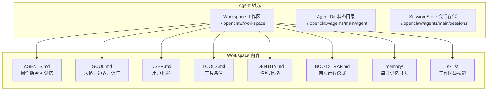
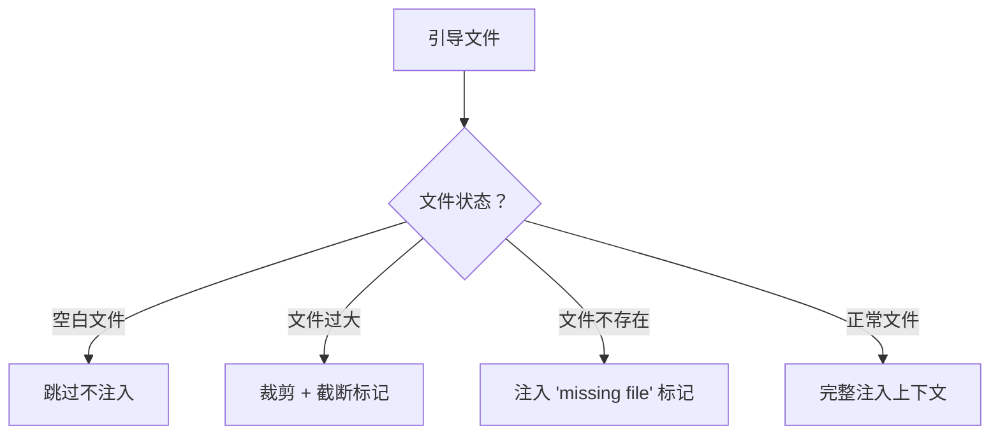
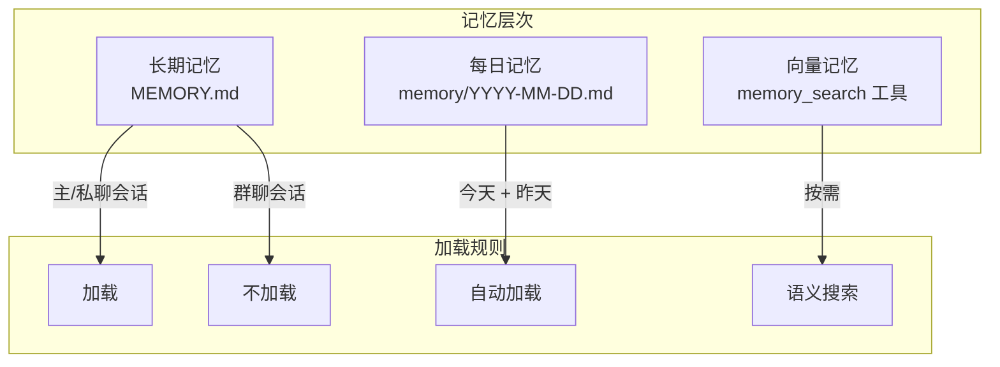
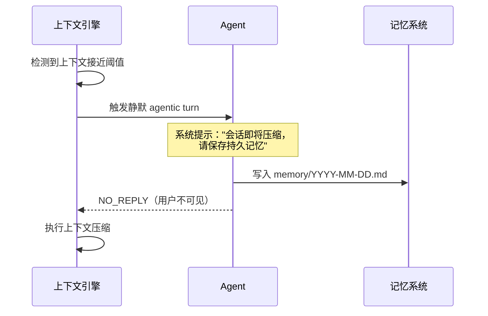
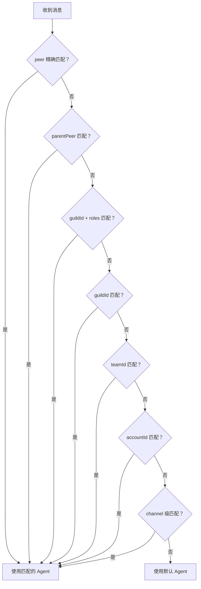

# 第七章：Agent 智能体系统

[← 上一章：消息通道配置](./06-channels.md) | [返回目录](./README.md) | [下一章：模型配置与管理 →](./08-models.md)

---

## 7.1 Agent 概述

Agent（智能体）是 OpenClaw 的核心"大脑"。每个 Agent 就像一个独立的 AI 助手，拥有自己的：

- **工作区（Workspace）**：存放引导文件、记忆、技能
- **状态目录（Agent Dir）**：认证配置、模型注册
- **会话存储（Session Store）**：对话记录和上下文



## 7.2 引导文件（Bootstrap Files）

当 Agent 首次启动会话时，OpenClaw 会注入一系列引导文件到上下文中：

### 引导文件详解

| 文件 | 用途 | 注入时机 |
|------|------|----------|
| `AGENTS.md` | 操作指令和持久记忆 | 每次会话开始 |
| `SOUL.md` | 人格定义、行为边界、语气风格 | 每次会话开始 |
| `TOOLS.md` | 用户维护的工具使用备注 | 每次会话开始 |
| `BOOTSTRAP.md` | 首次运行任务（完成后自动删除） | 仅首次 |
| `IDENTITY.md` | Agent 名称、风格、emoji | 每次会话开始 |
| `USER.md` | 用户档案、称呼偏好 | 每次会话开始 |

### 文件处理规则



### 自定义 SOUL.md 示例

```markdown
# 你是 Pi

## 人格
- 你是一个友善、高效的 AI 编程助手
- 你擅长 TypeScript 和系统架构
- 你的回答简洁明了，注重实用

## 行为边界
- 不讨论政治和宗教话题
- 不生成有害或非法内容
- 对不确定的事情诚实说明

## 语气
- 专业但不生硬
- 适当使用 emoji
- 代码注释使用中文
```

### 自定义 AGENTS.md 示例

```markdown
# 操作指令

## 工作流程
1. 理解用户需求
2. 分析问题
3. 提供解决方案
4. 编写代码（如需要）
5. 解释关键决策

## 记忆
- 用户偏好：使用 pnpm 作为包管理器
- 项目：当前在开发 React + TypeScript 项目
- 风格：喜欢函数式编程风格
```

## 7.3 记忆系统（Memory）

OpenClaw 提供多层次的记忆管理。这里要补充一个新版思路：**记忆文件依然是源数据，但检索、索引和搜索能力现在通常由“记忆插件/记忆引擎”提供**。



### 记忆文件

| 文件 | 类型 | 说明 |
|------|------|------|
| `MEMORY.md` | 长期记忆 | 手动维护的关键信息，仅主私聊主上下文加载 |
| `memory.md` | 长期记忆别名 | 若与 `MEMORY.md` 同时存在，两者都可加载，且会按真实路径去重 |
| `memory/YYYY-MM-DD.md` | 每日记忆 | 追加写入，自动加载今天和昨天 |

### 记忆插件 / 引擎

当前默认思路可以理解成：

- 工作区里的 Markdown 文件负责“存什么”
- 记忆插件 / 记忆引擎负责“怎么索引、怎么搜”

默认通常是：

- **memory slot**：`memory-core`（内置记忆引擎）
- 如果需要基于向量数据库的高级记忆搜索，可切换到 `memory-lancedb`（基于 LanceDB，支持 OpenAI embedding）
- 切换方式：`plugins.slots.memory = "memory-lancedb"`，并在插件配置中提供 embedding API Key
- 如果你想完全关闭记忆插件，可设置 `plugins.slots.memory = "none"`

### 记忆工具

| 工具 | 功能 |
|------|------|
| `memory_search` | 基于向量索引的语义搜索 |
| `memory_get` | 读取特定记忆文件的指定行 |

补充细节：

- `memory_get` 对“不存在的文件”现在会**优雅降级**
- 例如今天的 `memory/YYYY-MM-DD.md` 还没生成时，不会直接抛 `ENOENT` 报错
- 这让 Agent 可以自然处理“今天还没有任何记录”的情况

### 自动记忆刷新（Memory Flush）

当会话上下文接近自动压缩（Compaction）阈值时，OpenClaw 会触发静默记忆刷新：



### 记忆配置

```json5
{
  agents: {
    defaults: {
      compaction: {
        reserveTokensFloor: 20000,
        memoryFlush: {
          enabled: true,
          softThresholdTokens: 4000,
          systemPrompt: "Session nearing compaction. Store durable memories now.",
          prompt: "Write lasting notes to memory/YYYY-MM-DD.md; reply NO_REPLY if nothing to store."
        }
      }
    }
  }
}
```

### 向量记忆搜索

OpenClaw 支持构建本地向量索引用于语义搜索：

```
支持的 Embedding 提供商：
- OpenAI
- Google Gemini
- Voyage
- Mistral
- Ollama
- 本地 GGUF 模型

搜索特性：
- 混合搜索（BM25 + 向量）
- MMR 多样性重排序
- 时间衰减加权
```

### Builtin Memory Engine（新版重点）

当前默认内建记忆引擎可以把它理解为：

- **存储后端**：每个 Agent 一个 SQLite 数据库
- **关键词检索**：FTS5 / BM25
- **向量检索**：Embedding
- **混合检索**：关键词 + 向量并行，再做加权合并
- **CJK 友好**：对中文、日文、韩文有专门的分词支持

常见配置示例：

```json5
{
  agents: {
    defaults: {
      memorySearch: {
        provider: "openai", // 也可以是 gemini / ollama / local / mistral ...
        query: {
          hybrid: {
            mmr: { enabled: true },
            temporalDecay: { enabled: true },
          },
        },
      },
    },
  },
}
```

你可以把它理解成：

> `memory_search` 不只是“搜 Markdown 文件”，而是“先把记忆切片、建索引，再同时做语义匹配和关键词匹配”。

这对中文教程读者尤其重要，因为新版 builtin engine 已经明确考虑了 **CJK 文本检索**，对中文记忆更友好。

## 7.4 技能系统（Skills）

Skills 是预定义的能力模块，让 Agent 具备特定领域的专长。

### 技能加载优先级


**优先级：** 工作区 > 托管/本地 > 捆绑（冲突时工作区技能胜出）

### 技能配置

```json5
{
  agents: {
    defaults: {
      skills: {
        enabled: true,
        // 可以通过配置/环境变量门控特定技能
      }
    }
  }
}
```

### 自定义技能

技能文件通常是 Markdown 格式，包含：
- 技能名称和描述
- 使用条件和触发规则
- 详细的操作指令

```
workspace/skills/
├── my-skill/
│   └── SKILL.md       # 技能定义
├── another-skill/
│   └── SKILL.md
```

## 7.5 多 Agent 系统

OpenClaw 支持在单个 Gateway 下运行多个 Agent：

### 单 Agent 模式（默认）

```json5
{
  // agentId 默认为 "main"
  agents: {
    defaults: {
      workspace: "~/.openclaw/workspace"
    }
  }
}
```

### 多 Agent 模式

```json5
{
  agents: {
    list: [
      {
        id: "home",
        workspace: "~/.openclaw/workspace-home"
      },
      {
        id: "work",
        workspace: "~/.openclaw/workspace-work"
      },
      {
        id: "family",
        workspace: "~/.openclaw/workspace-family",
        // 可以为特定 Agent 设置沙盒和工具限制
        sandbox: {
          mode: "all",
          scope: "agent"
        },
        tools: {
          allow: ["read"],
          deny: ["write", "edit", "exec"]
        }
      }
    ]
  }
}
```

### 路由绑定（Bindings）

通过 Bindings 将不同的消息来源路由到不同的 Agent：

```json5
{
  bindings: [
    // WhatsApp 个人账号 → home Agent
    {
      agentId: "home",
      match: { channel: "whatsapp", accountId: "personal" }
    },
    // WhatsApp 工作账号 → work Agent
    {
      agentId: "work",
      match: { channel: "whatsapp", accountId: "biz" }
    },
    // Slack 特定团队 → work Agent
    {
      agentId: "work",
      match: { channel: "slack", teamId: "T123456" }
    },
    // Discord 特定用户 → 指定 Agent
    {
      agentId: "home",
      match: { channel: "discord", peer: "user:123456789" }
    }
  ]
}
```

### 路由优先级



### Agent 路径快速参考

| 路径 | 说明 |
|------|------|
| `~/.openclaw/openclaw.json` | 全局配置 |
| `~/.openclaw/workspace` | 默认工作区（或 `workspace-<agentId>`） |
| `~/.openclaw/agents/<agentId>/agent` | Agent 状态目录 |
| `~/.openclaw/agents/<agentId>/agent/auth-profiles.json` | Agent 认证配置 |
| `~/.openclaw/agents/<agentId>/agent/models.json` | Agent 模型注册 |
| `~/.openclaw/agents/<agentId>/sessions` | Agent 会话数据 |
| `~/.openclaw/agents/<agentId>/sessions/sessions.json` | 会话索引 |
| `~/.openclaw/agents/<agentId>/sessions/*.jsonl` | 会话记录文件 |

### Agent 管理命令

```bash
# 添加新 Agent
openclaw agents add work

# 列出所有 Agent 及其绑定
openclaw agents list --bindings

# 查看 Agent 状态
openclaw status
```

## 7.6 Agent 工作区初始化

```bash
# 手动初始化工作区
openclaw setup

# 或在 Onboard 时自动完成
openclaw onboard
```

初始化后，工作区中会创建以下引导文件模板：

```
~/.openclaw/workspace/
├── AGENTS.md      # ← 编辑这个文件来定制 Agent 行为
├── SOUL.md        # ← 编辑这个文件来定制 Agent 人格
├── USER.md        # ← 编辑这个文件来设置用户信息
├── TOOLS.md       # ← 编辑这个文件来记录工具使用偏好
├── IDENTITY.md    # ← 编辑这个文件来设置 Agent 名称和风格
└── memory/        # ← 记忆文件会自动创建在这里
```

## 7.7 本章小结

| 概念 | 说明 |
|------|------|
| **Agent** | 独立的 AI 助手，包含工作区、状态、会话 |
| **Workspace** | Agent 的工作目录，存放引导文件和技能 |
| **Bootstrap Files** | 引导文件（AGENTS.md、SOUL.md 等），定义 Agent 行为 |
| **Memory** | 多层记忆系统（长期 + 每日 + 向量搜索） |
| **Skills** | 预定义能力模块，3 级优先级加载 |
| **Multi-Agent** | 单 Gateway 多 Agent，通过 Bindings 路由 |

---

[← 上一章：消息通道配置](./06-channels.md) | [返回目录](./README.md) | [下一章：模型配置与管理 →](./08-models.md)
