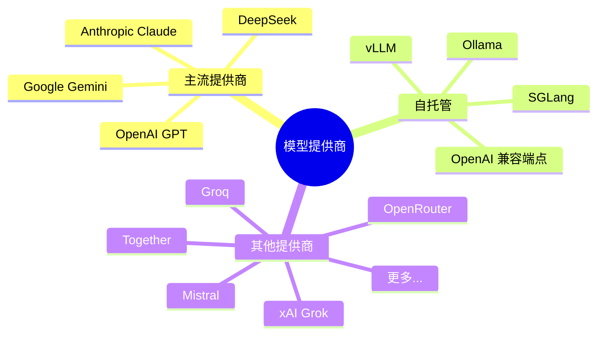
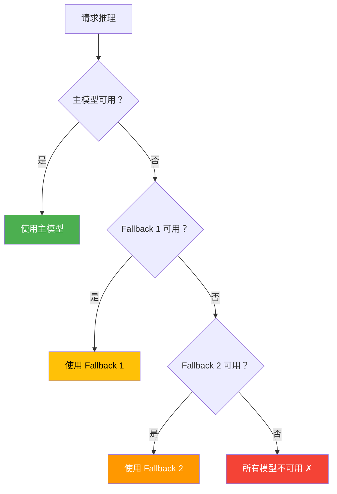
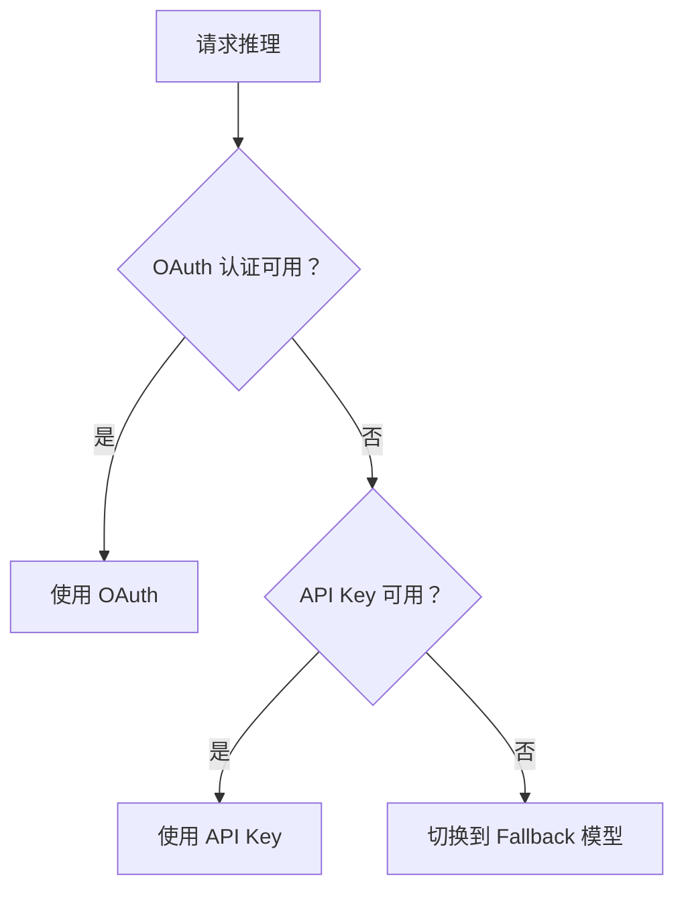

# 第八章：模型配置与管理

[← 上一章：Agent 智能体系统](./07-agents.md) | [返回目录](./README.md) | [下一章：会话管理 →](./09-sessions.md)

---

## 8.1 模型概述

OpenClaw 支持 **35+ 个模型提供商**，让你可以灵活选择和切换 AI 模型：



## 8.2 模型引用格式

OpenClaw 使用 `provider/model` 格式引用模型：

```
格式: <提供商>/<模型名>

示例:
  anthropic/claude-sonnet-4-6      # Anthropic Claude Sonnet
  openai/gpt-5.4                   # OpenAI GPT-5.4
  google/gemini-2.5-pro            # Google Gemini 2.5 Pro
  ollama/llama3.3:70b              # 本地 Ollama 模型
  openrouter/moonshotai/kimi-k2    # OpenRouter 中继
  deepseek/deepseek-chat           # DeepSeek
```

> 💡 规则：以第一个 `/` 分割，左边是提供商，右边是模型名

## 8.3 模型选择与 Fallback

### 选择优先级



### 配置示例

```json5
{
  agents: {
    defaults: {
      // 文本推理模型
      model: {
        primary: "anthropic/claude-sonnet-4-6",    // 主模型
        fallbacks: [
          "openai/gpt-5.4",                        // 备选 1
          "google/gemini-2.5-pro"                   // 备选 2
        ]
      },

      // 图像理解模型（主模型不支持图片时使用）
      imageModel: {
        primary: "anthropic/claude-sonnet-4-6",
        fallbacks: ["openai/gpt-5.4"]
      },

      // 图像生成模型
      imageGenerationModel: {
        primary: "openai/dall-e-3",
        fallbacks: []
      }
    }
  }
}
```

### 模型选择建议

| 场景 | 推荐模型 | 原因 |
|------|----------|------|
| 日常编程 | Claude Sonnet 4.6 | 代码能力强，工具调用稳定 |
| 复杂推理 | Claude Opus / GPT-5.4 | 推理能力最强 |
| 快速回复 | Claude Haiku / GPT-5 Mini | 低延迟 |
| 本地运行 | Ollama + Llama 3.3 | 无需 API Key |
| 成本敏感 | OpenRouter 免费模型 | 可扫描免费模型 |

## 8.4 模型认证

### API Key 方式

```bash
# 通过 CLI 设置
openclaw config set agents.defaults.model.primary "anthropic/claude-sonnet-4-6"

# 设置 API Key（Onboard 会引导完成）
openclaw onboard
```

### OAuth 方式（订阅认证）

部分提供商支持 OAuth 认证：

```
支持 OAuth 的提供商:
- OpenAI (ChatGPT/Codex 订阅)
```

### 认证配置存储

每个 Agent 有独立的认证配置：

```
~/.openclaw/agents/<agentId>/agent/auth-profiles.json
```

### 模型 Failover（故障转移）

OpenClaw 支持在同一提供商内的多种认证方式之间自动切换：



## 8.5 CLI 模型管理

### 查看模型

```bash
# 列出所有可用模型
openclaw models list

# 仅列出本地模型
openclaw models list --local

# 列出特定提供商的模型
openclaw models list --provider anthropic

# JSON 输出
openclaw models list --json

# 纯文本输出
openclaw models list --plain

# 查看当前模型状态
openclaw models status
openclaw models status --check  # 带连接检查
```

### 设置模型

```bash
# 设置主模型
openclaw models set anthropic/claude-sonnet-4-6

# 设置图像模型
openclaw models set-image anthropic/claude-sonnet-4-6
```

### 管理别名

```bash
# 列出别名
openclaw models aliases list

# 添加别名
openclaw models aliases add "fast" "anthropic/claude-haiku-4-5"
openclaw models aliases add "smart" "anthropic/claude-opus-4-6"

# 使用别名
openclaw models set fast

# 删除别名
openclaw models aliases remove fast
```

### 管理 Fallback

```bash
# 列出 Fallback 链
openclaw models fallbacks list

# 添加 Fallback
openclaw models fallbacks add "openai/gpt-5.4"
openclaw models fallbacks add "google/gemini-2.5-pro"

# 移除 Fallback
openclaw models fallbacks remove "openai/gpt-5.4"

# 清空所有 Fallback
openclaw models fallbacks clear
```

### 扫描免费模型（OpenRouter）

```bash
# 扫描 OpenRouter 上的免费模型
openclaw models scan

# 带参数扫描
openclaw models scan \
  --no-probe \            # 不实际测试
  --min-params 7 \        # 最小参数量（十亿）
  --max-age-days 90 \     # 最大模型年龄
  --max-candidates 20 \   # 最大候选数
  --set-default           # 自动设为默认

# 扫描排名依据（从高到低）：
# 1. 图像支持
# 2. 工具调用延迟
# 3. 上下文窗口大小
# 4. 参数量
```

## 8.6 聊天中切换模型

在对话中可以使用 `/model` 命令实时切换模型：

```
/model                    # 显示紧凑选择器
/model list               # 显示完整选择器
/model 3                  # 按编号选择
/model openai/gpt-5.4     # 按引用选择
/model status             # 查看当前模型详情
```

### 使用示例

```
用户: /model
Bot: 当前模型: anthropic/claude-sonnet-4-6
     可用模型:
     1. anthropic/claude-sonnet-4-6 (当前)
     2. openai/gpt-5.4
     3. google/gemini-2.5-pro
     选择编号切换:

用户: /model 2
Bot: ✓ 已切换到 openai/gpt-5.4
```

## 8.7 自定义模型提供商

### 添加 OpenAI 兼容端点

```json5
{
  models: {
    providers: {
      "my-local-llm": {
        type: "openai-compatible",
        baseUrl: "http://localhost:8080/v1",
        apiKey: "optional-key",
        models: ["my-model-7b", "my-model-70b"]
      }
    }
  }
}
```

### 使用 Ollama

```bash
# 安装并启动 Ollama
ollama serve

# 拉取模型
ollama pull llama3.3:70b

# 在 OpenClaw 中使用
openclaw models set ollama/llama3.3:70b
```

### 模型注册表

自定义的模型提供商信息保存在：

```
~/.openclaw/agents/<agentId>/agent/models.json
```

支持两种模式：
- **Merge（合并）模式**（默认）：新提供商和默认提供商合并
- **Replace（替换）模式**：完全替换默认提供商列表

```json5
{
  models: {
    mode: "merge",      // "merge" | "replace"
    providers: { ... }
  }
}
```

## 8.8 本章小结

| 功能 | 命令/配置 |
|------|-----------|
| 设置主模型 | `openclaw models set <provider/model>` |
| 查看模型列表 | `openclaw models list` |
| 添加 Fallback | `openclaw models fallbacks add <model>` |
| 设置别名 | `openclaw models aliases add <alias> <model>` |
| 聊天中切换 | `/model` 或 `/model <ref>` |
| 扫描免费模型 | `openclaw models scan` |
| 本地模型 | 通过 Ollama 或 OpenAI 兼容端点 |

---

[← 上一章：Agent 智能体系统](./07-agents.md) | [返回目录](./README.md) | [下一章：会话管理 →](./09-sessions.md)
