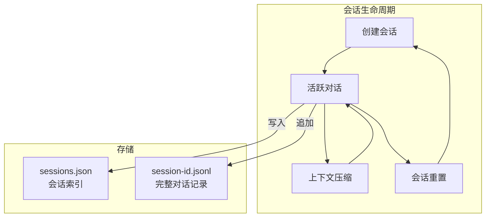
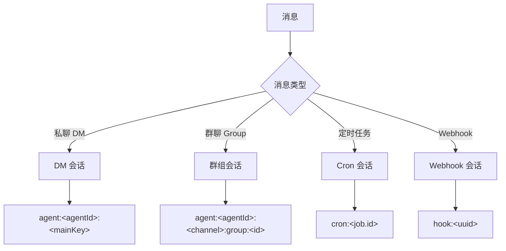
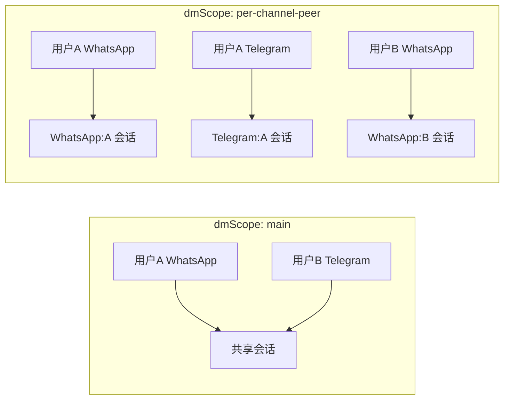
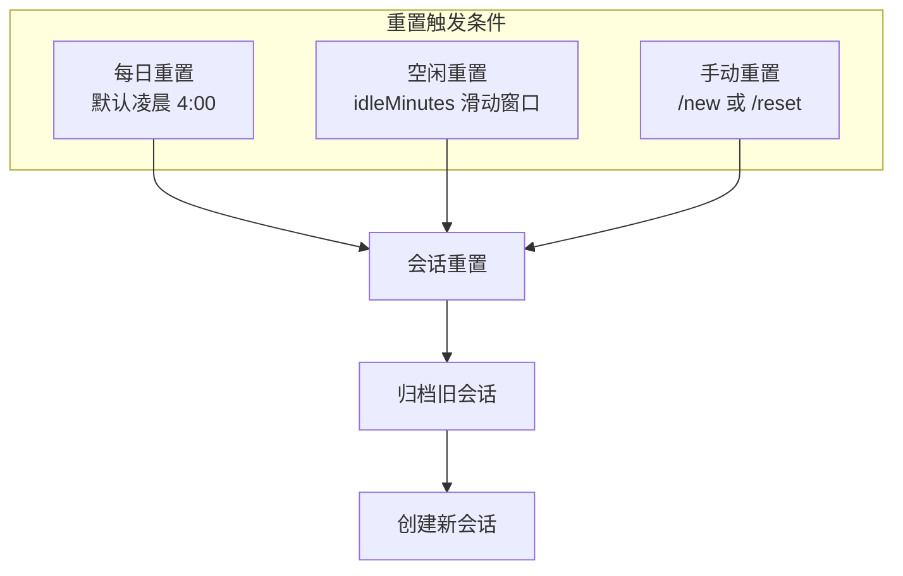
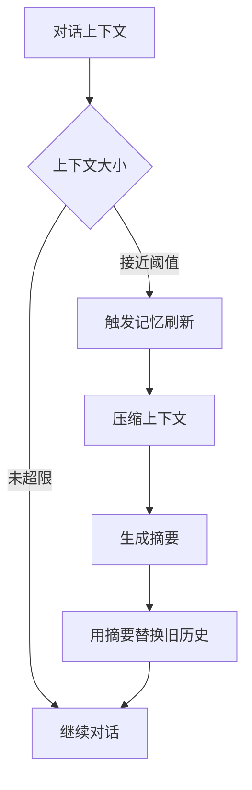

# 第九章：会话管理

[← 上一章：模型配置与管理](./08-models.md) | [返回目录](./README.md) | [下一章：插件开发指南 →](./10-plugins.md)

---

## 9.1 会话概述

Session（会话）是 OpenClaw 中对话上下文的基本单位。每个会话保持独立的对话历史、上下文窗口和状态。

### 会话的核心概念



## 9.2 会话键映射（Session Key）

OpenClaw 使用 **Session Key** 来唯一标识每个会话。不同来源的消息映射到不同的会话键：

### 映射规则



### DM 隔离模式（dmScope）

对于私聊消息，OpenClaw 提供 4 种隔离级别：

| dmScope 值 | Session Key 格式 | 说明 |
|------------|-------------------|------|
| `main`（默认） | `agent:<agentId>:main` | 所有私聊共享一个会话（连续性好） |
| `per-peer` | `agent:<agentId>:direct:<peerId>` | 每个联系人独立会话 |
| `per-channel-peer` | `agent:<agentId>:<channel>:direct:<peerId>` | 每个通道+联系人独立 |
| `per-account-channel-peer` | `agent:<agentId>:<channel>:<accountId>:direct:<peerId>` | 最细粒度隔离 |



### 配置建议

| 场景 | 推荐 dmScope | 原因 |
|------|-------------|------|
| 个人单用户 | `main` | 所有设备共享上下文，体验最连续 |
| 多用户共享 Gateway | `per-channel-peer` | 用户间上下文隔离 |
| 安全敏感场景 | `per-account-channel-peer` | 最严格隔离 |

```json5
{
  session: {
    dmScope: "per-channel-peer"  // 推荐多用户场景
  }
}
```

### 群聊会话隔离

群聊会话始终是隔离的：

```
Session Key: agent:<agentId>:<channel>:group:<groupId>
```

- 每个群有独立的会话
- Telegram 话题（Topics）进一步按 threadId 隔离：`agent:<agentId>:telegram:group:<groupId>:topic:<threadId>`

## 9.3 会话生命周期

### 自动重置



**默认行为：**
- **每日重置**：每天凌晨 4:00（Gateway 主机本地时间）自动重置
- **空闲重置**（可选）：设置 `idleMinutes` 滑动窗口

### 手动控制

在对话中可以使用斜杠命令控制会话：

| 命令 | 功能 |
|------|------|
| `/new` | 创建新会话 |
| `/reset` | 重置当前会话 |
| `/reset anthropic/claude-opus-4-6` | 重置并切换模型 |
| `/compact` | 压缩上下文（summarize + 释放窗口空间） |
| `/stop` | 中止当前运行 + 清除排队的后续任务 |
| `/status` | 查看 Agent 可达性 + 上下文使用量 |
| `/context list` | 查看系统提示词 + 工作区文件 |
| `/context detail` | 查看详细上下文信息 |

## 9.4 上下文压缩（Compaction）

当对话历史增长到接近模型的上下文窗口限制时，OpenClaw 会自动进行压缩：



### 压缩配置

```json5
{
  agents: {
    defaults: {
      compaction: {
        reserveTokensFloor: 20000,     // 保留 token 下限
        memoryFlush: {
          enabled: true,                // 启用压缩前记忆刷新
          softThresholdTokens: 4000     // 软阈值
        }
      }
    }
  }
}
```

## 9.5 会话维护（Maintenance）

OpenClaw 提供自动化的会话清理和维护功能：

```json5
{
  session: {
    maintenance: {
      mode: "warn",              // "warn"（仅告警）| "enforce"（自动执行）

      // 清理策略
      pruneAfter: "30d",         // 30 天后自动清理
      maxEntries: 500,           // 单会话最大条目数
      rotateBytes: "10mb",       // 单文件轮转大小
      resetArchiveRetention: "30d",  // 重置归档保留时间

      // 磁盘预算（可选）
      maxDiskBytes: undefined,   // 总磁盘预算
      highWaterBytes: "80%"      // 高水位（默认 maxDiskBytes 的 80%）
    }
  }
}
```

### 维护模式对比

| 模式 | 行为 |
|------|------|
| `warn` | 仅输出警告日志，不自动清理 |
| `enforce` | 自动执行清理策略 |

## 9.6 发送策略（Send Policy）

可以通过规则限制特定来源的消息处理：

```json5
{
  session: {
    sendPolicy: {
      rules: [
        // 禁止 Discord 群聊
        {
          action: "deny",
          match: { channel: "discord", chatType: "group" }
        },
        // 禁止 Cron 任务
        {
          action: "deny",
          match: { keyPrefix: "cron:" }
        }
      ],
      default: "allow"  // 默认允许
    }
  }
}
```

## 9.7 身份链接（Identity Links）

在多通道场景下，同一个用户可能在不同通道有不同的 ID。Identity Links 可以将它们映射到同一个身份：

```json5
{
  session: {
    identityLinks: [
      {
        canonical: "alice",
        peers: [
          { channel: "whatsapp", peerId: "+15551234567" },
          { channel: "telegram", peerId: "tg:123456" },
          { channel: "discord", peerId: "user:789012" }
        ]
      }
    ]
  }
}
```

这样，Alice 无论从哪个通道发消息，都会路由到同一个会话（配合 `per-peer` dmScope）。

## 9.8 查看和管理会话

### CLI 命令

```bash
# 查看会话概要
openclaw status

# 导出所有会话数据（JSON）
openclaw sessions --json

# 查看会话存储路径
# ~/.openclaw/agents/<agentId>/sessions/sessions.json  # 索引
# ~/.openclaw/agents/<agentId>/sessions/*.jsonl         # 记录
```

### 会话存储格式

**sessions.json（索引文件）：**

```json
{
  "agent:main:main": {
    "sessionId": "abc123",
    "updatedAt": "2026-03-25T08:00:00Z",
    "messageCount": 42
  }
}
```

**session-abc123.jsonl（记录文件）：**

```jsonl
{"role":"user","content":"你好","timestamp":"2026-03-25T08:00:00Z"}
{"role":"assistant","content":"你好！有什么我可以帮你的吗？","timestamp":"2026-03-25T08:00:01Z"}
```

## 9.9 本章小结

| 概念 | 说明 |
|------|------|
| **Session Key** | 会话的唯一标识，由来源信息生成 |
| **dmScope** | DM 隔离级别（main / per-peer / per-channel-peer / per-account-channel-peer） |
| **每日重置** | 默认凌晨 4:00 自动重置 |
| **上下文压缩** | 接近上下文窗口限制时自动压缩 |
| **记忆刷新** | 压缩前自动保存持久记忆 |
| **会话维护** | 自动清理过期/过大的会话数据 |
| **身份链接** | 跨通道的用户身份映射 |

---

[← 上一章：模型配置与管理](./08-models.md) | [返回目录](./README.md) | [下一章：插件开发指南 →](./10-plugins.md)
