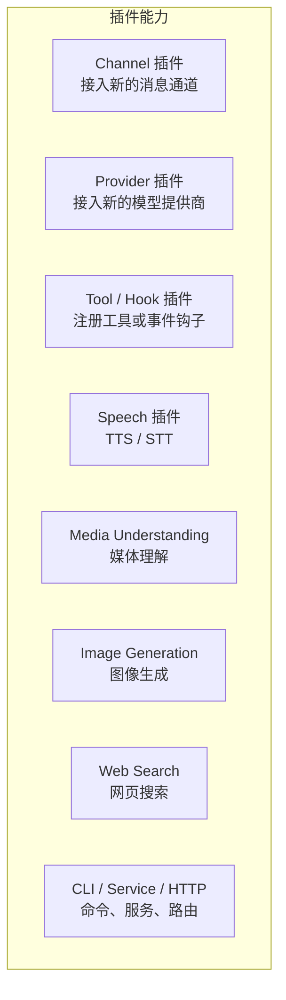
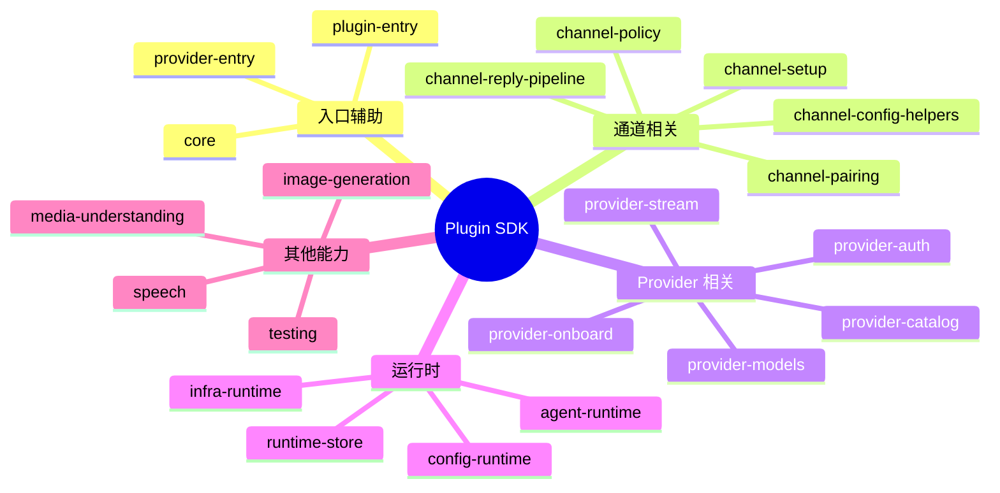

# 第十章：插件开发指南

[← 上一章：会话管理](./09-sessions.md) | [返回目录](./README.md) | [下一章：工具与自动化 →](./11-tools.md)

---

## 10.1 插件概述

OpenClaw 的插件系统可以扩展很多能力，但按照当前官方 SDK 的说法，更准确的分类方式是：



### 插件能力一览

| 能力           | 注册方法                                                      | 说明                       |
| -------------- | ------------------------------------------------------------- | -------------------------- |
| 文本推理 (LLM) | `api.registerProvider(...)`                                   | 注册模型 / 提供商          |
| 消息通道       | `api.registerChannel(...)` 或 `defineChannelPluginEntry(...)` | 注册聊天平台               |
| 语音           | `api.registerSpeechProvider(...)`                             | 注册语音能力               |
| 媒体理解       | `api.registerMediaUnderstandingProvider(...)`                 | 注册图片 / 音频 / 视频理解 |
| 图像生成       | `api.registerImageGenerationProvider(...)`                    | 注册图像生成能力           |
| 网页搜索       | `api.registerWebSearchProvider(...)`                          | 注册搜索提供商             |
| Agent 工具     | `api.registerTool(...)`                                       | 注册可调用工具             |
| 事件钩子       | `api.registerHook(...)`                                       | 注册 hook 处理逻辑         |
| HTTP 路由      | `api.registerHttpRoute(...)`                                  | 给 Gateway 增加路由        |
| Gateway 方法   | `api.registerGatewayMethod(...)`                              | 注册 Gateway RPC 方法      |
| CLI 子命令     | `api.registerCli(...)`                                        | 扩展 CLI                   |
| 后台服务       | `api.registerService(...)`                                    | 注册持续运行的服务         |
| 交互处理器     | `api.registerInteractiveHandler(...)`                         | 注册交互式处理器           |

> 重点区别：
>
> - **非 Channel 插件**通常用 `definePluginEntry(...)`
> - **Channel 插件**通常用 `defineChannelPluginEntry(...)`
> - `registerFull(api)` 只属于 **Channel 插件入口辅助函数**，不是所有插件都要改成它

## 10.2 快速开始：创建 Tool 插件

这是最简单、最稳定的入门方式：创建一个**非 Channel 插件**，用 `definePluginEntry(...)` 注册一个工具。

### 步骤 1：创建项目结构

```text
my-plugin/
├── package.json
├── openclaw.plugin.json
├── index.ts
├── api.ts                 # 可选：对外 barrel
└── runtime-api.ts         # 可选：内部运行时 barrel
```

### 步骤 2：编写 `package.json`

```json
{
  "name": "@myorg/openclaw-my-plugin",
  "version": "1.0.0",
  "type": "module",
  "openclaw": {
    "extensions": ["./index.ts"]
  },
  "dependencies": {},
  "devDependencies": {
    "openclaw": "latest"
  }
}
```

> `openclaw` 依赖应放在 `devDependencies` 或 `peerDependencies`，不要放进 `dependencies`。

### 步骤 3：编写插件清单

```json
{
  "id": "my-plugin",
  "name": "My Plugin",
  "description": "Adds a custom tool to OpenClaw",
  "configSchema": {
    "type": "object",
    "additionalProperties": false
  }
}
```

### 步骤 4：编写入口文件

```typescript
import { Type } from "@sinclair/typebox";
import { definePluginEntry } from "openclaw/plugin-sdk/plugin-entry";

export default definePluginEntry({
  id: "my-plugin",
  name: "My Plugin",
  description: "Adds a custom tool to OpenClaw",
  register(api) {
    api.registerTool({
      name: "my_tool",
      description: "执行自定义操作",
      parameters: Type.Object({
        input: Type.String({ description: "输入内容" }),
        outputMode: Type.Optional(Type.String({ description: "输出模式", default: "text" })),
      }),
      async execute(_id, params) {
        return {
          content: [
            {
              type: "text",
              text: `处理结果: ${params.input} (模式: ${params.outputMode ?? "text"})`,
            },
          ],
        };
      },
    });

    api.logger.info("My Plugin 已加载 ✓");
  },
});
```

这里有几个当前 SDK 下必须注意的事实：

- `definePluginEntry(...)` 需要 `id`、`name`、`description`、`register`
- `register(api)` 仍然是**非 Channel 插件**的标准入口
- Tool schema 里不要再用裸 `format` 作为字段名，当前仓库对这类 schema 有 guardrail

### 步骤 5：安装和测试

```bash
# 外部插件：发布后安装
openclaw plugins install @myorg/openclaw-my-plugin

# 仓库内插件：放在 extensions/ 目录下（自动发现）
pnpm test -- extensions/my-plugin/
```

如果是仓库内插件，提交前通常也要过：

```bash
pnpm check
```

## 10.3 Plugin SDK 导入规范

### 推荐导入方式

```typescript
import { definePluginEntry } from "openclaw/plugin-sdk/plugin-entry";
import { defineChannelPluginEntry } from "openclaw/plugin-sdk/core";
import { createPluginRuntimeStore } from "openclaw/plugin-sdk/runtime-store";
```

### 不推荐方式

```typescript
import { definePluginEntry } from "openclaw/plugin-sdk";
```

也就是说：**优先使用 `openclaw/plugin-sdk/<subpath>` 的精确子路径导入**，而不是根路径聚合导入。

### 常见子路径



## 10.4 创建 Channel 插件

Channel 插件是当前变化最大的一类，因此要特别尊重最新 SDK 事实。

### 关键结论

- `defineChannelPluginEntry(...)` 会自动执行 `api.registerChannel({ plugin })`
- `registerFull(api)` 只会在 `api.registrationMode === "full"` 时运行
- Channel 插件通常还会配一个轻量的 `setup-entry.ts`

### 第一步：构建 `ChannelPlugin` 对象

```typescript
// src/channel.ts
import {
  createChannelPluginBase,
  createChatChannelPlugin,
  type OpenClawConfig,
} from "openclaw/plugin-sdk/core";
import { acmeChatApi } from "./client.js";

type ResolvedAccount = {
  accountId: string | null;
  token: string;
  allowFrom: string[];
  dmPolicy: string | undefined;
};

function resolveAccount(cfg: OpenClawConfig, accountId?: string | null): ResolvedAccount {
  const section = (cfg.channels as Record<string, any>)?.["acme-chat"];
  const token = section?.token;
  if (!token) throw new Error("acme-chat: token is required");
  return {
    accountId: accountId ?? null,
    token,
    allowFrom: section?.allowFrom ?? [],
    dmPolicy: section?.dmPolicy,
  };
}

export const acmeChatPlugin = createChatChannelPlugin<ResolvedAccount>({
  base: createChannelPluginBase({
    id: "acme-chat",
    setup: {
      resolveAccount,
      inspectAccount(cfg) {
        const section = (cfg.channels as Record<string, any>)?.["acme-chat"];
        return {
          enabled: Boolean(section?.token),
          configured: Boolean(section?.token),
          tokenStatus: section?.token ? "available" : "missing",
        };
      },
    },
  }),
  security: {
    dm: {
      channelKey: "acme-chat",
      resolvePolicy: (account) => account.dmPolicy,
      resolveAllowFrom: (account) => account.allowFrom,
      defaultPolicy: "allowlist",
    },
  },
  pairing: {
    text: {
      idLabel: "Acme Chat username",
      message: "Send this code to verify your identity:",
      notify: async ({ target, code }) => {
        await acmeChatApi.sendDm(target, `Pairing code: ${code}`);
      },
    },
  },
  threading: { topLevelReplyToMode: "reply" },
  outbound: {
    attachedResults: {
      sendText: async (params) => {
        const result = await acmeChatApi.sendMessage(params.to, params.text);
        return { messageId: result.id };
      },
    },
    base: {
      sendMedia: async (params) => {
        await acmeChatApi.sendFile(params.to, params.filePath);
      },
    },
  },
});
```

### 第二步：编写 `index.ts`

```typescript
import { defineChannelPluginEntry } from "openclaw/plugin-sdk/core";
import { acmeChatPlugin } from "./src/channel.js";

export default defineChannelPluginEntry({
  id: "acme-chat",
  name: "Acme Chat",
  description: "Acme Chat channel plugin",
  plugin: acmeChatPlugin,
  registerFull(api) {
    api.registerCli(
      ({ program }) => {
        program.command("acme-chat").description("Acme Chat management");
      },
      { commands: ["acme-chat"] },
    );
  },
});
```

这就是这次用户特别点名的地方：

- **Channel 插件入口**现在很常见的写法是 `registerFull(api)`
- 但这不是说所有插件都从 `register(api)` 改成 `registerFull(api)`
- 正确说法是：**`defineChannelPluginEntry(...)` 支持 `registerFull(api)`，非 Channel 插件仍然用 `register(api)`**

### 第三步：可选的 `setup-entry.ts`

```typescript
import { defineSetupPluginEntry } from "openclaw/plugin-sdk/core";
import { acmeChatPlugin } from "./src/channel.js";

export default defineSetupPluginEntry(acmeChatPlugin);
```

这一步的意义是：在 setup / onboarding 场景下，OpenClaw 可以加载更轻量的入口，而不是把整个运行时都拉起来。

## 10.5 创建 Provider 插件

Provider 插件也仍然使用 `definePluginEntry(...)`，而不是 `registerFull(...)`。

### 一个符合当前官方文档的最小例子

```typescript
import { definePluginEntry } from "openclaw/plugin-sdk/plugin-entry";
import { createProviderApiKeyAuthMethod } from "openclaw/plugin-sdk/provider-auth";

export default definePluginEntry({
  id: "acme-ai",
  name: "Acme AI",
  description: "Acme AI model provider",
  register(api) {
    api.registerProvider({
      id: "acme-ai",
      label: "Acme AI",
      docsPath: "/providers/acme-ai",
      envVars: ["ACME_AI_API_KEY"],
      auth: [
        createProviderApiKeyAuthMethod({
          providerId: "acme-ai",
          methodId: "api-key",
          label: "Acme AI API key",
          hint: "API key from your Acme AI dashboard",
          optionKey: "acmeAiApiKey",
          flagName: "--acme-ai-api-key",
          envVar: "ACME_AI_API_KEY",
          promptMessage: "Enter your Acme AI API key",
          defaultModel: "acme-ai/acme-large",
        }),
      ],
      catalog: {
        order: "simple",
        run: async (ctx) => {
          const { apiKey } = ctx.resolveProviderApiKey("acme-ai");
          if (!apiKey) return null;
          return {
            provider: {
              api: "openai-completions",
              baseUrl: "https://api.acme-ai.com/v1",
              apiKey,
              models: [{ id: "acme-large", name: "Acme Large" }],
            },
          };
        },
      },
    });
  },
});
```

### 什么时候用更窄的辅助函数？

如果你的插件只是注册**一个**文本 provider，并且结构很标准，可以优先考虑官方更窄的辅助函数：

- `defineSingleProviderPluginEntry(...)`

这样能减少样板代码，也更贴近当前官方 provider 插件文档。

## 10.6 注册事件钩子

Hook 这部分在最新官方文档里仍然成立，下面这个写法是符合当前语义的：

```typescript
register(api) {
  api.registerHook(
    ["before_tool_call"],
    async (event) => {
      if (event.toolName === "dangerous_tool") {
        api.logger.warn("拦截危险工具调用");
        return { block: true };
      }
      return {};
    },
    { priority: 100 },
  );

  api.registerHook(["message_sending"], async (event) => {
    if (event.content.includes("敏感词")) {
      return { cancel: true };
    }
    return {};
  });
}
```

### Hook 决策语义

| 事件               | 决策                | 效果                     |
| ------------------ | ------------------- | ------------------------ |
| `before_tool_call` | `{ block: true }`   | 终止并阻止工具调用       |
| `before_tool_call` | `{ block: false }`  | 视为“不做决定”，继续传递 |
| `message_sending`  | `{ cancel: true }`  | 终止并取消消息发送       |
| `message_sending`  | `{ cancel: false }` | 视为“不做决定”，继续传递 |

## 10.7 注册可选工具

```typescript
register(api) {
  api.registerTool({
    name: "basic_tool",
    description: "基本工具",
    parameters: Type.Object({ input: Type.String() }),
    async execute(_id, params) {
      return { content: [{ type: "text", text: params.input }] };
    },
  });

  api.registerTool(
    {
      name: "advanced_tool",
      description: "高级工具（需手动启用）",
      parameters: Type.Object({ pipeline: Type.String() }),
      async execute(_id, params) {
        return { content: [{ type: "text", text: params.pipeline }] };
      },
    },
    { optional: true },
  );
}
```

用户可以在配置里显式启用：

```json5
{
  tools: {
    allow: ["advanced_tool"],
  },
}
```

## 10.8 入口辅助函数与注册模式

这是当前插件系统里非常值得搞清楚的一层：

| 辅助函数                        | 适用对象                   | 核心特点                                                   |
| ------------------------------- | -------------------------- | ---------------------------------------------------------- |
| `definePluginEntry(...)`        | 非 Channel 插件            | 直接提供 `register(api)`                                   |
| `defineChannelPluginEntry(...)` | Channel 插件               | 自动注册 channel，并按模式决定是否执行 `registerFull(api)` |
| `defineSetupPluginEntry(...)`   | Channel 的 setup-only 入口 | 导出轻量 `{ plugin }`                                      |

### `api.registrationMode`

| 模式              | 含义                      | 一般应注册什么              |
| ----------------- | ------------------------- | --------------------------- |
| `"full"`          | 正常完整启动              | 全部能力                    |
| `"setup-only"`    | 仅用于 setup / onboarding | 只保留最轻量的 channel 注册 |
| `"setup-runtime"` | setup 时但带运行时        | channel + 轻量运行时能力    |

这就是为什么 Channel 插件的“完整能力”通常放到 `registerFull(api)`，而不是无条件注册：这样 setup 阶段不会把过重的 CLI / service / HTTP 路由全拉起来。

## 10.9 `api` 对象常用字段

下面这些字段可以直接在当前 `OpenClawPluginApi` 类型里找到：

```typescript
api.id: string
api.name: string
api.version?: string
api.description?: string
api.source: string
api.rootDir?: string
api.registrationMode: "full" | "setup-only" | "setup-runtime"
api.config: OpenClawConfig
api.pluginConfig?: Record<string, unknown>
api.runtime: PluginRuntime
api.logger: PluginLogger

api.registerTool(...)
api.registerHook(...)
api.registerHttpRoute(...)
api.registerChannel(...)
api.registerGatewayMethod(...)
api.registerCli(...)
api.registerService(...)
api.registerProvider(...)
api.registerSpeechProvider(...)
api.registerMediaUnderstandingProvider(...)
api.registerImageGenerationProvider(...)
api.registerWebSearchProvider(...)
api.registerInteractiveHandler(...)
api.onConversationBindingResolved(...)
```

> 注意：旧示例里偶尔会出现 `api.resolvePath(...)` 之类的字段，但你写文档或示例时应以**当前类型定义**为准，不要继续沿用旧接口印象。

## 10.10 插件内部模块约定

```text
my-plugin/
├── api.ts               # 对外 barrel（可选）
├── runtime-api.ts       # 内部运行时 barrel（可选）
├── index.ts             # 主入口
├── setup-entry.ts       # channel 插件常见的轻量入口
└── src/
    ├── client.ts
    ├── handler.ts
    └── utils.ts
```

### 当前仓库约定

- 优先用 `api.ts` / `runtime-api.ts` 作为本插件内部的公共导出面
- 不要在插件内部通过 `openclaw/plugin-sdk/<your-plugin>` 回头导入自己
- 在 `extensions/<id>` 内不要用相对路径跨出本插件包根目录
- 生产代码优先依赖 `openclaw/plugin-sdk/*` 这个公开契约，而不是 core 内部私有路径

## 10.11 发布前检查清单

- ✅ `package.json` 有正确的 `openclaw` 元数据
- ✅ `openclaw.plugin.json` 清单存在且字段匹配
- ✅ 非 Channel 插件使用 `definePluginEntry(...)`
- ✅ Channel 插件使用 `defineChannelPluginEntry(...)`，必要时补 `registerFull(...)`
- ✅ 如果 Channel 需要 setup-only 入口，补 `setup-entry.ts`
- ✅ 导入使用精确的 `plugin-sdk/<subpath>` 路径
- ✅ 插件内部不用 SDK 自引用自己
- ✅ `pnpm test -- extensions/<plugin>/` 通过
- ✅ 仓库内插件在提交前尽量过 `pnpm check`

## 10.12 本章小结

| 步骤              | 说明                                                                               |
| ----------------- | ---------------------------------------------------------------------------------- |
| 1. 创建项目       | `package.json` + `openclaw.plugin.json` + 入口文件                                 |
| 2. 选入口辅助函数 | 非 Channel 用 `definePluginEntry(...)`，Channel 用 `defineChannelPluginEntry(...)` |
| 3. 注册能力       | Provider / Tool / Hook / Channel / CLI / Service 等                                |
| 4. 处理注册模式   | Channel 场景下区分 `full` / `setup-only` / `setup-runtime`                         |
| 5. 测试与校验     | `pnpm test -- extensions/<plugin>/`，必要时 `pnpm check`                           |
| 6. 发布与安装     | 发布到 npm 后用 `openclaw plugins install <name>`                                  |

---

[← 上一章：会话管理](./09-sessions.md) | [返回目录](./README.md) | [下一章：工具与自动化 →](./11-tools.md)
