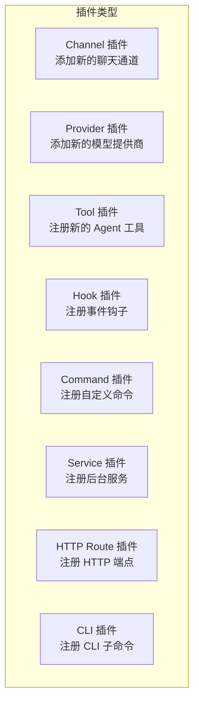
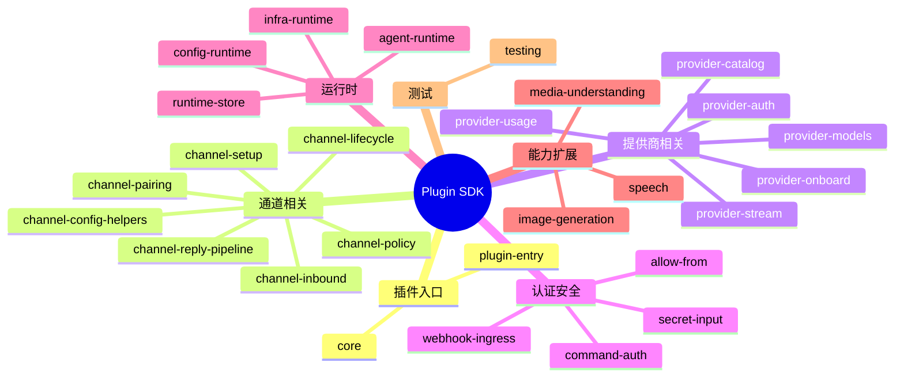

# 第十章：插件开发指南

[← 上一章：会话管理](./09-sessions.md) | [返回目录](./README.md) | [下一章：工具与自动化 →](./11-tools.md)

---

## 10.1 插件概述

OpenClaw 拥有完整的插件系统，让你可以扩展几乎所有功能：



### 插件能力一览

| 能力 | 注册方法 | 说明 |
|------|----------|------|
| 文本推理 (LLM) | `api.registerProvider()` | 添加 AI 模型提供商 |
| 消息通道 | `api.registerChannel()` | 添加聊天平台 |
| 语音 (TTS/STT) | `api.registerSpeechProvider()` | 添加语音提供商 |
| 媒体理解 | `api.registerMediaUnderstandingProvider()` | 图片/音频/视频分析 |
| 图像生成 | `api.registerImageGenerationProvider()` | 图像生成 |
| 网页搜索 | `api.registerWebSearchProvider()` | 搜索引擎 |
| Agent 工具 | `api.registerTool()` | Agent 可调用的工具 |
| 自定义命令 | `api.registerCommand()` | 斜杠命令 |
| 事件钩子 | `api.registerHook()` | 事件拦截/处理 |
| HTTP 路由 | `api.registerHttpRoute()` | Gateway HTTP 端点 |
| Gateway 方法 | `api.registerGatewayMethod()` | Gateway RPC 方法 |
| CLI 子命令 | `api.registerCli()` | CLI 扩展 |
| 后台服务 | `api.registerService()` | 持续运行的服务 |
| 上下文引擎 | `api.registerContextEngine()` | 自定义上下文构建（独占） |
| 记忆提示 | `api.registerMemoryPromptSection()` | 自定义记忆注入（独占） |

## 10.2 快速开始：创建 Tool 插件

### 步骤 1：创建项目结构

```
my-plugin/
├── package.json           # npm 包配置
├── openclaw.plugin.json   # 插件清单
├── index.ts               # 入口文件
├── api.ts                 # 公共导出（可选）
└── runtime-api.ts         # 内部运行时导出（可选）
```

### 步骤 2：编写 package.json

```json
{
  "name": "@myorg/openclaw-my-plugin",
  "version": "1.0.0",
  "type": "module",
  "openclaw": {
    "extensions": ["./index.ts"]
  },
  "dependencies": {},
  "devDependencies": {
    "openclaw": "latest"
  }
}
```

> ⚠️ `openclaw` 放在 `devDependencies` 或 `peerDependencies`，不要放在 `dependencies`

### 步骤 3：编写插件清单

```json
{
  "id": "my-plugin",
  "name": "My Plugin",
  "description": "一个示例工具插件",
  "configSchema": {
    "type": "object",
    "additionalProperties": false
  }
}
```

### 步骤 4：编写入口文件

```typescript
// index.ts
import { definePluginEntry } from "openclaw/plugin-sdk/plugin-entry";
import { Type } from "@sinclair/typebox";

export default definePluginEntry({
  id: "my-plugin",
  name: "My Plugin",

  register(api) {
    // 注册一个 Agent 工具
    api.registerTool({
      name: "my_tool",
      description: "执行自定义操作",
      parameters: Type.Object({
        input: Type.String({ description: "输入内容" }),
        format: Type.Optional(
          Type.String({ description: "输出格式", default: "text" })
        ),
      }),
      async execute(_id, params) {
        const result = `处理结果: ${params.input} (格式: ${params.format || "text"})`;
        return {
          content: [{ type: "text", text: result }],
        };
      },
    });

    api.logger.info("My Plugin 已加载 ✓");
  },
});
```

### 步骤 5：安装和测试

```bash
# 外部插件：发布到 npm 后安装
openclaw plugins install @myorg/openclaw-my-plugin

# 仓库内插件：放在 extensions/ 目录下（自动发现）
# extensions/my-plugin/...
```

## 10.3 Plugin SDK 导入规范

### 正确的导入方式

```typescript
// ✅ 正确：使用具体的子路径导入
import { definePluginEntry } from "openclaw/plugin-sdk/plugin-entry";
import { defineChannelPluginEntry } from "openclaw/plugin-sdk/core";
import { createPluginRuntimeStore } from "openclaw/plugin-sdk/runtime-store";

// ❌ 错误：使用根路径导入（已弃用）
import { definePluginEntry } from "openclaw/plugin-sdk";
```

### SDK 子路径分类



## 10.4 创建 Channel 插件

Channel 插件用于添加新的聊天平台支持：

```typescript
// index.ts
import {
  defineChannelPluginEntry,
  createChatChannelPlugin,
} from "openclaw/plugin-sdk/core";

export default defineChannelPluginEntry({
  id: "my-channel",
  name: "My Channel",
  channelId: "my-channel",

  register(api) {
    const channel = createChatChannelPlugin({
      id: "my-channel",
      name: "My Channel",

      // 启动连接
      async connect(config) {
        // 连接到聊天平台
        api.logger.info("连接到 My Channel...");
      },

      // 发送消息
      async sendMessage(target, message) {
        // 向聊天平台发送消息
        return { ok: true, messageId: "msg-123" };
      },

      // 断开连接
      async disconnect() {
        api.logger.info("断开 My Channel 连接");
      },
    });

    api.registerChannel(channel);
  },
});
```

## 10.5 创建 Provider 插件

Provider 插件用于添加新的 AI 模型提供商：

```typescript
// index.ts
import { definePluginEntry } from "openclaw/plugin-sdk/plugin-entry";

export default definePluginEntry({
  id: "my-provider",
  name: "My AI Provider",

  register(api) {
    api.registerProvider({
      id: "my-provider",
      name: "My AI",

      // 模型列表
      models: [
        { id: "my-model-small", name: "My Model Small", contextWindow: 8192 },
        { id: "my-model-large", name: "My Model Large", contextWindow: 128000 },
      ],

      // 推理调用
      async inference(request) {
        // 调用你的 AI API
        const response = await fetch("https://api.my-ai.com/v1/chat", {
          method: "POST",
          headers: { "Content-Type": "application/json" },
          body: JSON.stringify(request),
        });
        return response.json();
      },
    });
  },
});
```

## 10.6 注册事件钩子

```typescript
register(api) {
  // 在工具调用前拦截
  api.registerHook(
    ["before_tool_call"],
    async (event) => {
      if (event.toolName === "dangerous_tool") {
        api.logger.warn("拦截危险工具调用");
        return { block: true };  // 阻止执行
      }
      return {};  // 不干预
    },
    { priority: 100 }  // 优先级（数字越大越先执行）
  );

  // 在消息发送前拦截
  api.registerHook(
    ["message_sending"],
    async (event) => {
      if (event.content.includes("敏感词")) {
        return { cancel: true };  // 取消发送
      }
      return {};
    }
  );
}
```

### Hook 决策语义

| 事件 | 决策 | 效果 |
|------|------|------|
| `before_tool_call` | `{ block: true }` | 终止，阻止工具调用 |
| `before_tool_call` | `{ block: false }` | 不干预，传递给下一个 hook |
| `message_sending` | `{ cancel: true }` | 终止，取消消息发送 |
| `message_sending` | `{ cancel: false }` | 不干预，传递给下一个 hook |

## 10.7 注册可选工具

```typescript
register(api) {
  // 必需工具（始终可用）
  api.registerTool({
    name: "basic_tool",
    description: "基本工具",
    parameters: Type.Object({ input: Type.String() }),
    async execute(_id, params) {
      return { content: [{ type: "text", text: params.input }] };
    },
  });

  // 可选工具（用户需要显式启用）
  api.registerTool(
    {
      name: "advanced_tool",
      description: "高级工具（需手动启用）",
      parameters: Type.Object({ pipeline: Type.String() }),
      async execute(_id, params) {
        return { content: [{ type: "text", text: params.pipeline }] };
      },
    },
    { optional: true }  // 标记为可选
  );
}
```

用户在配置中启用可选工具：

```json5
{
  tools: {
    allow: ["advanced_tool"]  // 显式启用
  }
}
```

## 10.8 API 对象参考

`api` 对象包含以下常用字段：

```typescript
api.id: string                           // 插件 ID
api.name: string                         // 显示名称
api.version?: string                     // 插件版本
api.description?: string                 // 插件描述
api.source: string                       // 插件源路径
api.rootDir?: string                     // 插件根目录
api.config: OpenClawConfig               // 当前配置快照
api.pluginConfig: Record<string, unknown> // 插件专属配置
api.runtime: PluginRuntime               // 运行时辅助工具
api.logger: PluginLogger                 // 作用域日志器
api.registrationMode: PluginRegistrationMode // "full" | "setup-only" | "setup-runtime"
api.resolvePath(input): string           // 解析相对于插件根目录的路径
```

## 10.9 插件内部模块约定

```
my-plugin/
├── api.ts               # 公共导出（其他插件/代码可以导入的）
├── runtime-api.ts       # 内部运行时导出（本插件内部使用）
├── index.ts             # 主入口（definePluginEntry）
├── setup-entry.ts       # 轻量级 setup-only 入口（可选）
└── src/                 # 具体实现
    ├── client.ts
    ├── handler.ts
    └── utils.ts
```

> ⚠️ **重要规则**：不要在插件内部通过 `openclaw/plugin-sdk/<your-plugin>` 导入自己的代码。使用本地相对路径（如 `./api.ts`）。

## 10.10 发布前检查清单

- ✅ `package.json` 包含正确的 `openclaw` 元数据
- ✅ `openclaw.plugin.json` 清单存在且有效
- ✅ 入口使用 `definePluginEntry` 或 `defineChannelPluginEntry`
- ✅ 导入使用具体的 `plugin-sdk/<subpath>` 路径
- ✅ 内部导入使用本地模块，不使用 SDK 自引用
- ✅ 测试通过
- ✅ `pnpm check` 通过（仓库内插件）
- ✅ 不包含敏感信息（API Key 等）

## 10.11 本章小结

| 步骤 | 说明 |
|------|------|
| 1. 创建项目 | `package.json` + `openclaw.plugin.json` + `index.ts` |
| 2. 定义入口 | `definePluginEntry()` 或 `defineChannelPluginEntry()` |
| 3. 注册能力 | `api.registerTool()` / `api.registerChannel()` / ... |
| 4. 测试 | 本地测试或使用 `plugin-sdk/testing` 工具 |
| 5. 发布 | ClawHub 或 npm |
| 6. 安装 | `openclaw plugins install <name>` |

---

[← 上一章：会话管理](./09-sessions.md) | [返回目录](./README.md) | [下一章：工具与自动化 →](./11-tools.md)
