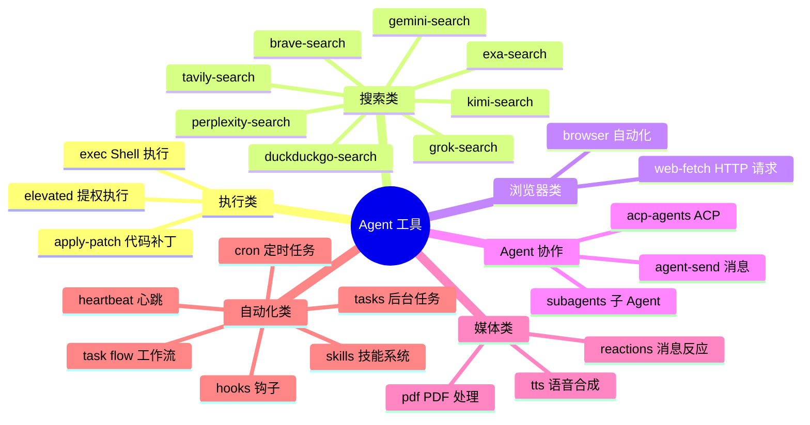
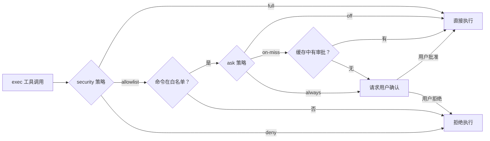
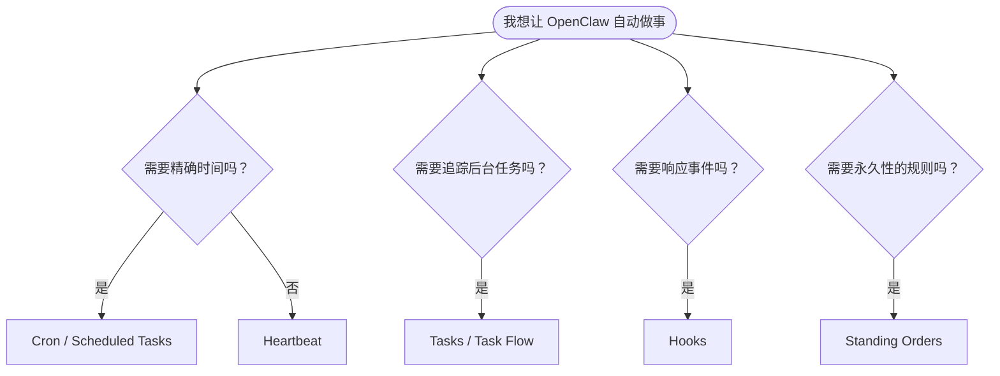
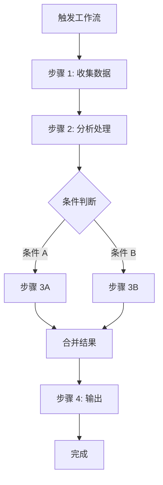

# 第十一章：工具与自动化

[← 上一章：插件开发指南](./10-plugins.md) | [返回目录](./README.md) | [下一章：安全配置 →](./12-security.md)

---

## 11.1 工具概述

OpenClaw 的 Agent 可以使用多种工具来完成任务。工具（Tool）是 Agent 在对话中可以调用的能力模块。

但在新版文档体系里，一个更准确的理解是：

> **Tools 负责“做事”，Automation 负责“什么时候做、为什么做、做完怎么追踪”。**



## 11.2 Slash 命令

Slash 命令是用户在对话中直接输入的控制指令，以 `/` 开头：

### 常用命令

| 命令 | 功能 | 示例 |
|------|------|------|
| `/model` | 切换 AI 模型 | `/model openai/gpt-5.4` |
| `/model list` | 列出可用模型 | `/model list` |
| `/status` | 查看 Agent 状态 | `/status` |
| `/new` | 创建新会话 | `/new` |
| `/reset` | 重置会话 | `/reset` |
| `/compact` | 压缩上下文 | `/compact` |
| `/stop` | 中止当前任务 | `/stop` |
| `/context list` | 查看上下文 | `/context list` |
| `/context detail` | 详细上下文 | `/context detail` |

### 使用示例

```
用户: /status
Bot:  🦞 Agent 状态
      模型: anthropic/claude-sonnet-4-6
      会话: active (42 messages)
      上下文: 12,345 / 200,000 tokens
      工具: 15 个可用
      通道: whatsapp ✓, telegram ✓

用户: /compact
Bot:  ✓ 上下文已压缩
      之前: 12,345 tokens
      之后: 3,456 tokens
      释放: 8,889 tokens
```

## 11.3 Shell 执行工具

`exec` 工具允许 Agent 在主机或沙盒中执行 Shell 命令：

### 安全级别



### 配置

```json5
{
  tools: {
    exec: {
      security: "allowlist",  // "deny" | "allowlist" | "full"
      ask: "on-miss"          // "off" | "on-miss" | "always"
    }
  }
}
```

### security 策略

| 值 | 说明 | 适用场景 |
|------|------|----------|
| `"deny"` | 完全禁止命令执行 | 最严格安全要求 |
| `"allowlist"` | 仅白名单内命令可执行 | 日常开发（默认） |
| `"full"` | 允许所有命令执行 | 完全信任环境 |

### ask 审批策略

| 值 | 说明 | 适用场景 |
|------|------|----------|
| `"off"` | 不需要用户确认 | 全自动工作流 |
| `"on-miss"` | 首次执行需确认，缓存命中后自动通过 | 日常开发（默认） |
| `"always"` | 每次执行都需要用户确认 | 安全敏感环境 |

## 11.4 浏览器自动化

Agent 可以通过浏览器工具进行网页操作：

```
功能：
- 打开网页
- 截图
- 点击元素
- 填写表单
- 提取内容
- 执行 JavaScript

底层技术：CDP（Chrome DevTools Protocol）
```

## 11.5 Web 搜索

OpenClaw 支持多个搜索引擎，Agent 可以实时搜索网络信息：

| 搜索引擎 | 说明 | 需要 |
|----------|------|------|
| **Brave Search** | 隐私优先的搜索引擎 | API Key |
| **DuckDuckGo** | 隐私搜索（免费） | 无需 Key |
| **Perplexity** | AI 增强搜索 | API Key |
| **Gemini Search** | Google AI 搜索 | Google API Key |
| **Grok Search** | xAI 搜索 | xAI API Key |
| **Kimi Search** | Moonshot 搜索 | API Key |
| **Exa Search** | 语义搜索引擎 | API Key |
| **Tavily** | AI 研究助手 | API Key |
| **Firecrawl** | 网页爬取 + 结构化 | API Key |

## 11.6 Automation & Tasks（新版重点）

新版 OpenClaw 文档把自动化拆得更清楚了。你可以用下面这个思路理解：



### 这几个概念怎么区分？

| 能力 | 你可以把它理解成 | 最适合做什么 |
|------|------------------|--------------|
| **Cron** | 定时闹钟 | “每天 9 点发日报” |
| **Heartbeat** | 周期巡检 | “每 30 分钟检查一次是否有新动态” |
| **Hooks** | 事件触发器 | “当 `/reset` 发生时自动保存上下文” |
| **Tasks** | 后台任务台账 | “我要看到哪些后台工作正在跑、跑完没” |
| **Task Flow** | 多步骤工作流 | “调研 → 分析 → 汇总 → 发送结果” |
| **Standing Orders** | 持久操作规则 | “每次回复前都检查合规要求” |

### Cron vs Heartbeat

| 维度 | Cron | Heartbeat |
|------|------|-----------|
| 时间精度 | 高，适合精确调度 | 较灵活，适合周期巡检 |
| 上下文 | 可隔离，也可绑定已有会话 | 通常走主会话上下文 |
| 是否生成任务记录 | 会 | 通常不会 |
| 适合场景 | 日报、提醒、定时汇总 | 收件箱检查、日历提醒、轮询观察 |

## 11.7 Hooks（事件驱动自动化）

Hooks 是新版文档里非常值得学习的一块。它的本质是：

> **当某个事件发生时，运行一段本地脚本。**

典型事件包括：

- `/new`
- `/reset`
- `/stop`
- agent bootstrap
- 工具调用前后
- 消息发送前后

常见用途：

- 在 `/new` / `/reset` 时保存记忆快照
- 记录命令日志做审计
- 在特定工具调用前做权限检查
- 给工作区自动补充额外文件

CLI 例子：

```bash
openclaw hooks list
openclaw hooks enable session-memory
openclaw hooks check
openclaw hooks info session-memory
```

Bundled hooks 中比较值得记住的有：

- `session-memory`：在 `/new` 或 `/reset` 时保存上下文到工作区记忆
- `bootstrap-extra-files`：在 bootstrap 时额外注入文件
- `command-logger`：记录命令日志

## 11.8 技能系统（Skills）

Skills 是比工具更高层次的能力模块，定义了 Agent 在特定领域的专长和行为模式。

### 技能 vs 工具

| 维度 | Tool（工具） | Skill（技能） |
|------|-------------|--------------|
| 粒度 | 单个功能点 | 领域级能力 |
| 定义方式 | TypeScript 代码 | Markdown + 配置 |
| 注入方式 | 注册到工具列表 | 注入到上下文提示词 |
| 示例 | `exec`、`web_search` | 代码审查、文档写作 |

### 技能来源

```
1. 捆绑技能（随 OpenClaw 安装附带）
2. 托管/本地技能（~/.openclaw/skills）
3. 工作区技能（workspace/skills）
4. ClawHub 技能（clawhub.ai 社区市场）
```

### 创建自定义技能

```markdown
<!-- workspace/skills/code-review/SKILL.md -->
# Code Review 技能

## 描述
你是一个专业的代码审查助手。

## 触发条件
当用户请求代码审查、Review、CR 时激活。

## 行为规则
1. 首先理解代码的目的和上下文
2. 检查代码风格和命名规范
3. 检查潜在的 bug 和安全问题
4. 检查性能问题
5. 提供具体的改进建议
6. 使用 diff 格式展示修改建议

## 输出格式
使用以下结构：
- 📋 概要
- 🐛 问题
- 💡 建议
- ✅ 亮点
```

## 11.9 Task Flow / Lobster 工作流

Lobster 可以把它理解成 OpenClaw 的复杂工作流编排能力；而新版文档更强调它上层的 **Task Flow** 概念，用来管理可持久追踪的多步骤流程：



## 11.10 定时任务（Cron）

OpenClaw 支持 Cron 表达式驱动的周期性任务，而且新版设计已经比“普通 Linux cron”更接近“AI 调度器”：

- 可以跑在 **main session**
- 可以跑在 **isolated session**
- 可以绑定 **current session**
- 也可以发到 **自定义 persistent session**
- 可以选择 **announce / webhook / none** 三种交付方式

```bash
# 一次性提醒
openclaw cron add \
  --name "Reminder" \
  --at "2026-05-01T16:00:00Z" \
  --session main \
  --system-event "Reminder: check the docs update" \
  --wake now \
  --delete-after-run

# 每天 7 点定时摘要
openclaw cron add \
  --name "Morning brief" \
  --cron "0 7 * * *" \
  --tz "America/Los_Angeles" \
  --session isolated \
  --message "Summarize overnight updates." \
  --announce
```

### Cron 运行位置怎么理解？

| sessionTarget | 作用 |
|---------------|------|
| `main` | 进入主会话，适合“像平时聊天一样继续思考” |
| `isolated` | 独立的 `cron:<jobId>` 会话，不污染主会话 |
| `current` | 绑定创建任务时所在的会话 |
| `session:custom-id` | 绑定到一个长期存在的自定义会话 |

### 交付方式（delivery）

| mode | 说明 |
|------|------|
| `announce` | 任务完成后把结果发回目标聊天 |
| `webhook` | 任务完成后 POST 到指定 URL |
| `none` | 静默运行，只在内部留痕 |

### Cron 表达式速查

```
 ┌─────────── 分钟 (0-59)
 │ ┌─────────── 小时 (0-23)
 │ │ ┌─────────── 日 (1-31)
 │ │ │ ┌─────────── 月 (1-12)
 │ │ │ │ ┌─────────── 星期 (0-7, 0和7都是周日)
 │ │ │ │ │
 * * * * *
```

| 表达式 | 含义 |
|--------|------|
| `0 9 * * *` | 每天 9:00 |
| `0 */2 * * *` | 每 2 小时 |
| `0 9 * * 1-5` | 工作日 9:00 |
| `0 9,18 * * *` | 每天 9:00 和 18:00 |
| `*/30 * * * *` | 每 30 分钟 |

## 11.11 CLI 参考入口（补充）

新版 CLI 文档页把命令树整理得更完整了。除了你常见的 `config / models / channels / pairing`，现在也建议记住这些入口：

```bash
openclaw docs
openclaw hooks ...
openclaw webhooks ...
openclaw memory ...
openclaw sandbox ...
openclaw approvals ...
openclaw security ...
openclaw secrets ...
```

全局参数里也有两个很实用：

- `--dev`：把状态隔离到 `~/.openclaw-dev`
- `--profile <name>`：把状态隔离到 `~/.openclaw-<name>`

这两个参数对你同时维护“正式环境 / 测试环境 / 演示环境”特别有帮助。

## 11.12 工具安全策略

### 工具配置文件（Profile）

```json5
{
  tools: {
    profile: "coding",      // 预设配置

    // 自定义允许/禁止
    allow: ["read", "web_search", "exec"],
    deny: ["group:automation"]
  }
}
```

### 预设 Profile 对比

| Profile | 特点 | 适用场景 |
|---------|------|----------|
| `coding` | 开放文件读写、代码执行 | 开发者日常 |
| `messaging` | 限制文件和执行权限 | 聊天助手 |
| `custom` | 完全自定义 | 特殊需求 |

### 工具分组

```
group:automation  → 自动化工具（Cron、Lobster 等）
group:runtime     → 运行时工具（exec 等）
group:fs          → 文件系统工具（read、write、edit 等）
```

## 11.13 本章小结

| 类别 | 代表工具 | 用途 |
|------|----------|------|
| **执行** | exec, apply-patch | Shell 命令、代码修改 |
| **搜索** | brave-search, web-fetch | 网络搜索、HTTP 请求 |
| **浏览器** | browser | 网页自动化 |
| **协作** | agent-send, subagents | Agent 间通信 |
| **自动化** | cron, heartbeat, hooks, tasks | 调度、事件响应、后台任务追踪 |
| **工作流** | task flow, lobster | 多步骤流程编排 |
| **技能** | skills | 领域专长定义 |
| **命令** | /model, /status, /new | 用户直接控制 |

---

[← 上一章：插件开发指南](./10-plugins.md) | [返回目录](./README.md) | [下一章：安全配置 →](./12-security.md)
