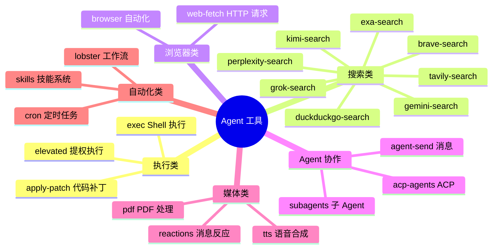
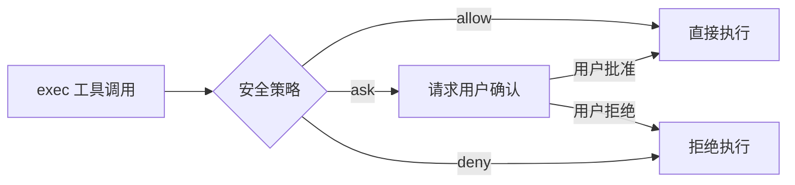
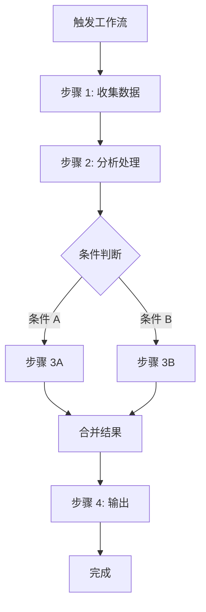

# 第十一章：工具与自动化

[← 上一章：插件开发指南](./10-plugins.md) | [返回目录](./README.md) | [下一章：安全配置 →](./12-security.md)

---

## 11.1 工具概述

OpenClaw 的 Agent 可以使用多种工具来完成任务。工具（Tool）是 Agent 在对话中可以调用的能力模块：



## 11.2 Slash 命令

Slash 命令是用户在对话中直接输入的控制指令，以 `/` 开头：

### 常用命令

| 命令 | 功能 | 示例 |
|------|------|------|
| `/model` | 切换 AI 模型 | `/model openai/gpt-5.4` |
| `/model list` | 列出可用模型 | `/model list` |
| `/status` | 查看 Agent 状态 | `/status` |
| `/new` | 创建新会话 | `/new` |
| `/reset` | 重置会话 | `/reset` |
| `/compact` | 压缩上下文 | `/compact` |
| `/stop` | 中止当前任务 | `/stop` |
| `/context list` | 查看上下文 | `/context list` |
| `/context detail` | 详细上下文 | `/context detail` |

### 使用示例

```
用户: /status
Bot:  🦞 Agent 状态
      模型: anthropic/claude-sonnet-4-6
      会话: active (42 messages)
      上下文: 12,345 / 200,000 tokens
      工具: 15 个可用
      通道: whatsapp ✓, telegram ✓

用户: /compact
Bot:  ✓ 上下文已压缩
      之前: 12,345 tokens
      之后: 3,456 tokens
      释放: 8,889 tokens
```

## 11.3 Shell 执行工具

`exec` 工具允许 Agent 在主机或沙盒中执行 Shell 命令：

### 安全级别



### 配置

```json5
{
  tools: {
    exec: {
      security: "ask",     // "allow" | "ask" | "deny"
      ask: "first"          // "always"（每次都问）| "first"（首次确认后自动）
    }
  }
}
```

### 审批模式

| 模式 | 说明 | 适用场景 |
|------|------|----------|
| `allow` | 自动允许所有执行 | 完全信任环境 |
| `ask` + `first` | 首次需要确认，之后自动 | 日常开发 |
| `ask` + `always` | 每次都需要确认 | 安全敏感环境 |
| `deny` | 完全禁止 | 最严格安全要求 |

## 11.4 浏览器自动化

Agent 可以通过浏览器工具进行网页操作：

```
功能：
- 打开网页
- 截图
- 点击元素
- 填写表单
- 提取内容
- 执行 JavaScript

底层技术：CDP（Chrome DevTools Protocol）
```

## 11.5 Web 搜索

OpenClaw 支持多个搜索引擎，Agent 可以实时搜索网络信息：

| 搜索引擎 | 说明 | 需要 |
|----------|------|------|
| **Brave Search** | 隐私优先的搜索引擎 | API Key |
| **DuckDuckGo** | 隐私搜索（免费） | 无需 Key |
| **Perplexity** | AI 增强搜索 | API Key |
| **Gemini Search** | Google AI 搜索 | Google API Key |
| **Grok Search** | xAI 搜索 | xAI API Key |
| **Kimi Search** | Moonshot 搜索 | API Key |
| **Exa Search** | 语义搜索引擎 | API Key |
| **Tavily** | AI 研究助手 | API Key |
| **Firecrawl** | 网页爬取 + 结构化 | API Key |

## 11.6 技能系统（Skills）

Skills 是比工具更高层次的能力模块，定义了 Agent 在特定领域的专长和行为模式。

### 技能 vs 工具

| 维度 | Tool（工具） | Skill（技能） |
|------|-------------|--------------|
| 粒度 | 单个功能点 | 领域级能力 |
| 定义方式 | TypeScript 代码 | Markdown + 配置 |
| 注入方式 | 注册到工具列表 | 注入到上下文提示词 |
| 示例 | `exec`、`web_search` | 代码审查、文档写作 |

### 技能来源

```
1. 捆绑技能（随 OpenClaw 安装附带）
2. 托管/本地技能（~/.openclaw/skills）
3. 工作区技能（workspace/skills）
4. ClawHub 技能（clawhub.ai 社区市场）
```

### 创建自定义技能

```markdown
<!-- workspace/skills/code-review/SKILL.md -->
# Code Review 技能

## 描述
你是一个专业的代码审查助手。

## 触发条件
当用户请求代码审查、Review、CR 时激活。

## 行为规则
1. 首先理解代码的目的和上下文
2. 检查代码风格和命名规范
3. 检查潜在的 bug 和安全问题
4. 检查性能问题
5. 提供具体的改进建议
6. 使用 diff 格式展示修改建议

## 输出格式
使用以下结构：
- 📋 概要
- 🐛 问题
- 💡 建议
- ✅ 亮点
```

## 11.7 Lobster 工作流引擎

Lobster 是 OpenClaw 的工作流编排引擎，支持复杂的多步骤自动化：



## 11.8 定时任务（Cron）

OpenClaw 支持 Cron 表达式驱动的周期性任务：

```json5
{
  cron: {
    jobs: [
      {
        id: "daily-summary",
        schedule: "0 9 * * *",           // 每天早上 9 点
        message: "请生成今天的工作总结",
        agentId: "work"                   // 发给哪个 Agent
      },
      {
        id: "weekly-report",
        schedule: "0 17 * * 5",          // 每周五下午 5 点
        message: "生成本周工作报告"
      }
    ]
  }
}
```

### Cron 表达式速查

```
 ┌─────────── 分钟 (0-59)
 │ ┌─────────── 小时 (0-23)
 │ │ ┌─────────── 日 (1-31)
 │ │ │ ┌─────────── 月 (1-12)
 │ │ │ │ ┌─────────── 星期 (0-7, 0和7都是周日)
 │ │ │ │ │
 * * * * *
```

| 表达式 | 含义 |
|--------|------|
| `0 9 * * *` | 每天 9:00 |
| `0 */2 * * *` | 每 2 小时 |
| `0 9 * * 1-5` | 工作日 9:00 |
| `0 9,18 * * *` | 每天 9:00 和 18:00 |
| `*/30 * * * *` | 每 30 分钟 |

## 11.9 工具安全策略

### 工具配置文件（Profile）

```json5
{
  tools: {
    profile: "coding",      // 预设配置

    // 自定义允许/禁止
    allow: ["read", "web_search", "exec"],
    deny: ["group:automation"]
  }
}
```

### 预设 Profile 对比

| Profile | 特点 | 适用场景 |
|---------|------|----------|
| `coding` | 开放文件读写、代码执行 | 开发者日常 |
| `messaging` | 限制文件和执行权限 | 聊天助手 |
| `custom` | 完全自定义 | 特殊需求 |

### 工具分组

```
group:automation  → 自动化工具（Cron、Lobster 等）
group:runtime     → 运行时工具（exec 等）
group:fs          → 文件系统工具（read、write、edit 等）
```

## 11.10 本章小结

| 类别 | 代表工具 | 用途 |
|------|----------|------|
| **执行** | exec, apply-patch | Shell 命令、代码修改 |
| **搜索** | brave-search, web-fetch | 网络搜索、HTTP 请求 |
| **浏览器** | browser | 网页自动化 |
| **协作** | agent-send, subagents | Agent 间通信 |
| **自动化** | cron, lobster | 定时任务、工作流 |
| **技能** | skills | 领域专长定义 |
| **命令** | /model, /status, /new | 用户直接控制 |

---

[← 上一章：插件开发指南](./10-plugins.md) | [返回目录](./README.md) | [下一章：安全配置 →](./12-security.md)
