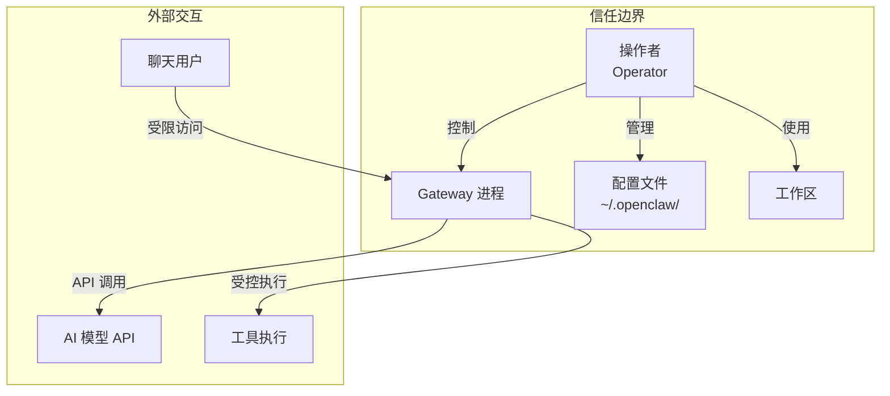
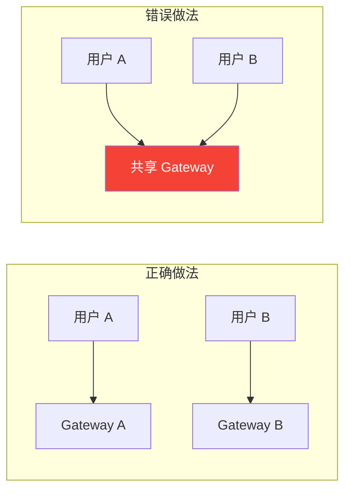
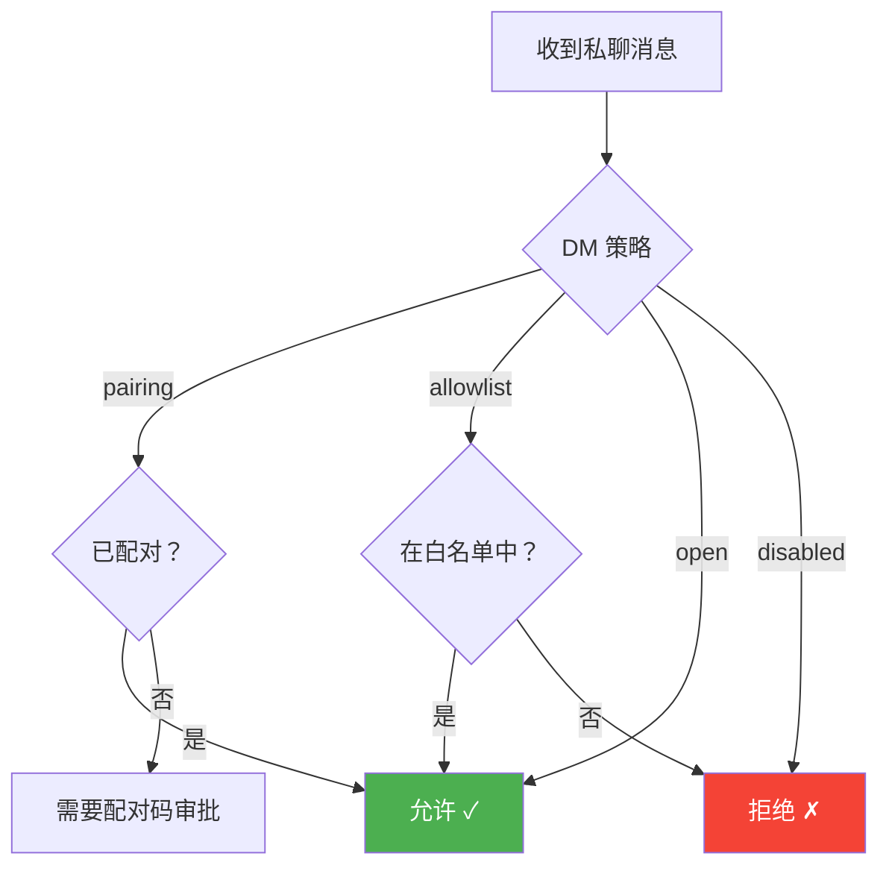
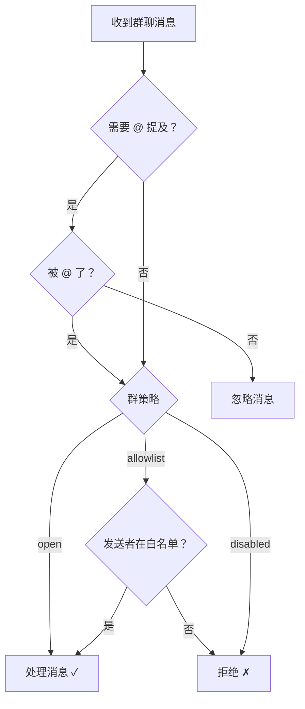
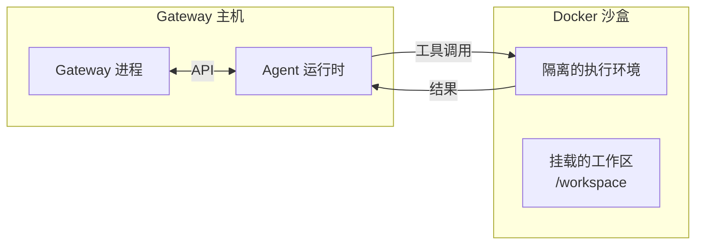

# 第十二章：安全配置

[← 上一章：工具与自动化](./11-tools.md) | [返回目录](./README.md) | [下一章：部署方案 →](./13-deployment.md)

---

## 12.1 安全模型概述

OpenClaw 的安全设计基于一个核心假设：

> **每个 Gateway 的信任边界是一个用户（操作者）。**



### 关键安全原则

| 原则 | 说明 |
|------|------|
| **单用户信任** | 一个 Gateway = 一个信任的操作者 |
| **不是多租户** | 不设计为多个不信任用户共享 |
| **安全默认值** | 默认配置是安全的 |
| **显式控制** | 高权限操作需要明确配置 |

### ⚠️ 重要：何时需要多个 Gateway？

如果你需要为**互不信任的用户**提供服务，应该部署**独立的 Gateway 实例**：



## 12.2 信任边界矩阵

| 边界 | 含义 | 常见误解 |
|------|------|----------|
| `gateway.auth` | 认证调用者身份 | 不是每条消息都需要签名 |
| `sessionKey` | 路由消息到正确会话 | 不是用户认证边界 |
| 提示词护栏 | 降低模型滥用风险 | 提示注入 ≠ 认证绕过 |
| `canvas.eval` / 浏览器 | 操作者有意的能力 | JS eval ≠ 自动漏洞 |
| 本地 TUI `!` shell | 操作者显式执行 | 本地 shell ≠ 远程注入 |
| 设备配对 | 操作者级别设备访问 | 设备控制 ≠ 不受信用户访问 |

### 以下不被视为安全漏洞

- 仅通过提示注入（无策略/认证/沙盒绕过）
- 基于"敌对多租户共享主机"假设的报告
- 将正常操作者读取权限归类为 IDOR
- 仅限 localhost 的发现
- 将 `sessionKey` 视为认证 Token 的缺失认证发现

## 12.3 快速安全配置

### 60 秒安全基线

```json5
{
  // 1. Gateway 认证
  gateway: {
    mode: "local",
    bind: "loopback",           // 仅本地访问
    auth: {
      mode: "token",
      token: "your-long-random-token-here"  // 使用强随机 Token
    }
  },

  // 2. 会话隔离
  session: {
    dmScope: "per-channel-peer"  // 每个通道+用户独立会话
  },

  // 3. 工具限制
  tools: {
    profile: "messaging",       // 限制性配置
    deny: ["group:automation", "group:runtime", "group:fs"],
    fs: { workspaceOnly: true },
    exec: { security: "deny", ask: "always" }
  },

  // 4. 通道访问控制
  channels: {
    whatsapp: {
      dmPolicy: "pairing",
      groups: { "*": { requireMention: true } }
    }
  }
}
```

## 12.4 访问控制

### DM 策略层次



### 群聊策略



### 完整的访问控制示例

```json5
{
  channels: {
    whatsapp: {
      // DM 控制
      dmPolicy: "pairing",
      allowFrom: ["+15551234567"],      // 额外白名单

      // 群聊控制
      groups: {
        "*": {
          requireMention: true,          // 所有群需要 @
          groupPolicy: "open"
        },
        "specific-group@g.us": {
          requireMention: false,         // 这个群不需要 @
          groupPolicy: "allowlist",
          allowFrom: ["+15551234567"]    // 群内白名单
        }
      }
    },

    telegram: {
      dmPolicy: "allowlist",
      allowFrom: ["tg:123456", "tg:789012"],
      groups: {
        "*": { requireMention: true }
      }
    }
  }
}
```

## 12.5 沙盒隔离

OpenClaw 支持将 Agent 的工具执行隔离在 Docker 沙盒中：



### 沙盒配置

```json5
{
  agents: {
    defaults: {
      sandbox: {
        mode: "non-main",    // "off" | "non-main" | "all"
        scope: "agent",      // "session" | "agent" | "shared"
        docker: {
          setupCommand: "apt-get update && apt-get install -y python3"
        }
      }
    }
  }
}
```

| 模式 | 说明 |
|------|------|
| `off` | 不使用沙盒（直接在主机执行） |
| `non-main` | 非主 Agent 使用沙盒 |
| `all` | 所有 Agent 都使用沙盒 |

| 作用域 | 说明 |
|--------|------|
| `session` | 每个会话独立的沙盒容器 |
| `agent` | 每个 Agent 共享一个沙盒 |
| `shared` | 所有 Agent 共享一个沙盒 |

### 为特定 Agent 配置沙盒

```json5
{
  agents: {
    list: [
      {
        id: "family",
        sandbox: {
          mode: "all",
          scope: "agent",
          docker: {
            setupCommand: "apt-get update && apt-get install -y python3"
          }
        },
        tools: {
          allow: ["read"],
          deny: ["write", "edit", "exec"]
        }
      }
    ]
  }
}
```

## 12.6 安全审计

OpenClaw 提供内置的安全审计工具：

```bash
# 基本审计
openclaw security audit

# 深度审计
openclaw security audit --deep

# 自动修复
openclaw security audit --fix

# JSON 格式输出（便于脚本处理）
openclaw security audit --json
```

### 审计检查项

审计工具会检查以下安全配置：

| 检查项 | 说明 |
|--------|------|
| Gateway 认证 | 是否启用了 Token 认证 |
| 绑定地址 | 是否仅绑定到 loopback |
| DM 策略 | 各通道是否设置了访问控制 |
| 群聊策略 | 是否要求 @ 提及 |
| 工具策略 | exec 执行权限是否过于宽松 |
| 文件系统 | 是否限制为工作区访问 |
| 沙盒状态 | 是否启用了沙盒隔离 |

## 12.7 SecretRef（密钥引用）

OpenClaw 支持多种安全的密钥存储方式，避免在配置文件中明文存储敏感信息：

### 环境变量引用

```json5
{
  channels: {
    discord: {
      token: {
        source: "env",
        provider: "default",
        id: "DISCORD_BOT_TOKEN"
      }
    }
  }
}
```

### CLI 设置密钥引用

```bash
# 从环境变量引用
openclaw config set channels.discord.token \
  --ref-provider default \
  --ref-source env \
  --ref-id DISCORD_BOT_TOKEN
```

## 12.8 安全配置最佳实践

### 个人使用

```json5
{
  gateway: { mode: "local", bind: "loopback", auth: { mode: "token" } },
  session: { dmScope: "main" },
  tools: { profile: "coding", exec: { security: "allowlist", ask: "on-miss" } },
  channels: {
    whatsapp: { dmPolicy: "pairing" },
    telegram: { dmPolicy: "pairing" }
  }
}
```

### 共享使用（家庭/团队）

```json5
{
  gateway: { mode: "local", bind: "loopback", auth: { mode: "token" } },
  session: { dmScope: "per-channel-peer" },  // 重要：隔离用户
  tools: { profile: "messaging", exec: { security: "deny" } },
  channels: {
    whatsapp: {
      dmPolicy: "pairing",
      groups: { "*": { requireMention: true } }
    }
  }
}
```

### 高安全要求

```json5
{
  gateway: { mode: "local", bind: "loopback", auth: { mode: "token" } },
  session: { dmScope: "per-account-channel-peer" },
  tools: {
    profile: "messaging",
    deny: ["group:automation", "group:runtime", "group:fs"],
    fs: { workspaceOnly: true },
    exec: { security: "deny" }
  },
  agents: { defaults: { sandbox: { mode: "all", scope: "session" } } },
  channels: {
    whatsapp: {
      dmPolicy: "allowlist",
      allowFrom: ["+15551234567"],
      groups: { "*": { requireMention: true, groupPolicy: "disabled" } }
    }
  }
}
```

## 12.9 本章小结

| 安全层 | 配置项 | 推荐值 |
|--------|--------|--------|
| **网络** | `gateway.bind` | `loopback` |
| **认证** | `gateway.auth.mode` | `token` |
| **DM 控制** | `channels.*.dmPolicy` | `pairing` |
| **群聊控制** | `groups.*.requireMention` | `true` |
| **会话隔离** | `session.dmScope` | `per-channel-peer` |
| **工具限制** | `tools.exec.security` | `allowlist` 或 `deny` |
| **文件限制** | `tools.fs.workspaceOnly` | `true` |
| **沙盒** | `agents.defaults.sandbox.mode` | `non-main` 或 `all` |

---

[← 上一章：工具与自动化](./11-tools.md) | [返回目录](./README.md) | [下一章：部署方案 →](./13-deployment.md)
