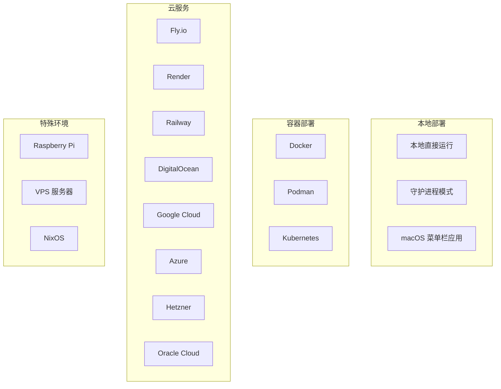

# 第十三章：部署方案

[← 上一章：安全配置](./12-security.md) | [返回目录](./README.md) | [下一章：参与贡献指南 →](./14-contributing.md)

---

## 13.1 部署方式概览

OpenClaw 支持多种部署方式，从个人电脑到云服务器：



## 13.2 本地部署

### 直接运行

最简单的方式，适合开发和测试：

```bash
# 前台运行
openclaw gateway --port 18789 --verbose

# 后台运行
nohup openclaw gateway --port 18789 > /tmp/openclaw-gateway.log 2>&1 &
```

### 守护进程模式（推荐）

安装为系统守护进程，开机自启：

```bash
# 安装守护进程
openclaw daemon install

# 管理守护进程
openclaw daemon start
openclaw daemon stop
openclaw daemon status
openclaw daemon restart
```

**各平台的守护进程实现：**

| 平台 | 技术 | 配置路径 |
|------|------|----------|
| macOS | LaunchAgent | `~/Library/LaunchAgents/` |
| Linux | systemd user unit | `~/.config/systemd/user/` |
| WSL2 | systemd user unit | `~/.config/systemd/user/` |

### macOS 菜单栏应用

OpenClaw 提供 macOS 原生菜单栏应用，集成了 Gateway 管理：

```bash
# 通过应用启动/停止 Gateway
# 或使用脚本
scripts/restart-mac.sh
```

## 13.3 Docker 部署

### 适用场景

| ✅ 适合 Docker | ❌ 不适合 Docker |
|----------------|-----------------|
| 隔离环境需求 | 追求最快开发循环 |
| 不想本地安装 | 需要频繁修改源码 |
| 服务器部署 | 本地开发调试 |
| CI/CD 环境 | - |

### 快速部署

```bash
# 方式一：使用官方脚本（推荐）
./scripts/docker/setup.sh

# 方式二：使用预构建镜像
export OPENCLAW_IMAGE="ghcr.io/openclaw/openclaw:latest"
./scripts/docker/setup.sh
```

### 手动 Docker 部署

```bash
# 1. 构建镜像
docker build -t openclaw:local -f Dockerfile .

# 2. 运行 Onboarding
docker compose run --rm --no-deps --entrypoint node openclaw-gateway \
  dist/index.js onboard --mode local --no-install-daemon

# 3. 设置 Gateway 模式
docker compose run --rm --no-deps --entrypoint node openclaw-gateway \
  dist/index.js config set gateway.mode local

# 4. 启动 Gateway
docker compose up -d openclaw-gateway
```

### Docker Compose 配置

OpenClaw 自带 `docker-compose.yml`，核心服务结构：

```yaml
# 简化的 docker-compose.yml 说明
services:
  openclaw-gateway:
    image: openclaw:local  # 或 ghcr.io/openclaw/openclaw:latest
    ports:
      - "18789:18789"
    volumes:
      - ~/.openclaw:/home/node/.openclaw
      - ~/.openclaw/workspace:/home/node/.openclaw/workspace
    environment:
      - OPENCLAW_GATEWAY_TOKEN=${OPENCLAW_GATEWAY_TOKEN}
    restart: unless-stopped
```

### 数据持久化

```mermaid
flowchart LR
    subgraph 主机
        H_CONFIG[~/.openclaw/]
        H_WORKSPACE[~/.openclaw/workspace]
    end

    subgraph Docker 容器
        C_CONFIG[/home/node/.openclaw]
        C_WORKSPACE[/home/node/.openclaw/workspace]
    end

    H_CONFIG -->|bind mount| C_CONFIG
    H_WORKSPACE -->|bind mount| C_WORKSPACE
```

### Docker 环境变量

| 变量 | 说明 |
|------|------|
| `OPENCLAW_IMAGE` | 使用远程镜像而非本地构建 |
| `OPENCLAW_DOCKER_APT_PACKAGES` | 额外安装的 apt 包 |
| `OPENCLAW_EXTENSIONS` | 预安装的扩展依赖 |
| `OPENCLAW_EXTRA_MOUNTS` | 额外的绑定挂载 |
| `OPENCLAW_HOME_VOLUME` | 将 `/home/node` 持久化到 Docker 卷 |
| `OPENCLAW_SANDBOX` | 启用沙盒引导 |
| `OPENCLAW_DOCKER_SOCKET` | 自定义 Docker Socket 路径 |

### 健康检查

```bash
# 存活探测
curl -fsS http://127.0.0.1:18789/healthz

# 就绪探测
curl -fsS http://127.0.0.1:18789/readyz

# 完整健康检查
docker compose exec openclaw-gateway \
  node dist/index.js health --token "$OPENCLAW_GATEWAY_TOKEN"
```

### 在 Docker 中配置通道

```bash
# WhatsApp（需要扫描 QR 码）
docker compose run --rm openclaw-cli channels login

# Telegram
docker compose run --rm openclaw-cli channels add \
  --channel telegram --token "<BOT_TOKEN>"

# Discord
docker compose run --rm openclaw-cli channels add \
  --channel discord --token "<BOT_TOKEN>"
```

## 13.4 云服务部署

### Fly.io

OpenClaw 自带 `fly.toml` 配置：

```bash
# 安装 flyctl
curl -L https://fly.io/install.sh | sh

# 部署
fly launch
fly deploy

# 查看日志
fly logs

# SSH 到容器
fly ssh console
```

### Render

OpenClaw 自带 `render.yaml` Blueprint：

```bash
# 通过 Render Dashboard 导入仓库
# 或使用 render.yaml 自动部署
```

### Railway

使用 Railway 的 Dockerfile 部署：

```bash
# 通过 Railway Dashboard 导入仓库
# 设置环境变量
# Railway 自动构建和部署
```

### VPS / 云服务器

```bash
# 1. SSH 到服务器
ssh user@your-server

# 2. 安装 Node.js
curl -o- https://raw.githubusercontent.com/nvm-sh/nvm/v0.40.3/install.sh | bash
nvm install 24

# 3. 安装 OpenClaw
npm install -g openclaw@latest

# 4. 运行 Onboard
openclaw onboard --install-daemon

# 5. 配置远程访问（可选）
openclaw config set gateway.mode lan
openclaw config set gateway.bind lan
```

## 13.5 远程访问

### 方式一：Tailscale（推荐）

```bash
# 安装 Tailscale
curl -fsSL https://tailscale.com/install.sh | sh

# 启用 Tailscale
sudo tailscale up

# OpenClaw 通过 Tailscale IP 访问
# http://<tailscale-ip>:18789
```

### 方式二：SSH 隧道

```bash
# 从本地机器建立隧道
ssh -L 18789:localhost:18789 user@remote-server

# 现在可以通过 localhost:18789 访问远程 Gateway
```

### 方式三：反向代理

```nginx
# Nginx 配置示例
server {
    listen 443 ssl;
    server_name openclaw.yourdomain.com;

    ssl_certificate /path/to/cert.pem;
    ssl_certificate_key /path/to/key.pem;

    location / {
        proxy_pass http://127.0.0.1:18789;
        proxy_http_version 1.1;
        proxy_set_header Upgrade $http_upgrade;
        proxy_set_header Connection "upgrade";
        proxy_set_header Host $host;
    }
}
```

## 13.6 Raspberry Pi 部署

OpenClaw 可以运行在 Raspberry Pi 上（需要 Pi 4 或更新型号）：

```bash
# 安装 Node.js（ARM64）
curl -o- https://raw.githubusercontent.com/nvm-sh/nvm/v0.40.3/install.sh | bash
nvm install 24

# 安装 OpenClaw
npm install -g openclaw@latest

# 配置（建议使用 messaging profile 降低资源消耗）
openclaw onboard --install-daemon
openclaw config set tools.profile messaging
```

## 13.7 部署架构对比

| 部署方式 | 复杂度 | 适用场景 | 资源需求 |
|----------|--------|----------|----------|
| 本地直接运行 | ⭐ | 开发/测试 | 低 |
| 守护进程 | ⭐⭐ | 个人日常使用 | 低 |
| Docker | ⭐⭐ | 隔离/服务器 | 中 |
| Fly.io | ⭐⭐ | 云部署（简单） | 低 |
| VPS | ⭐⭐⭐ | 完全控制 | 中 |
| Kubernetes | ⭐⭐⭐⭐ | 企业级 | 高 |
| Raspberry Pi | ⭐⭐ | 低功耗常开 | 低 |

## 13.8 本章小结

| 步骤 | 建议 |
|------|------|
| **个人使用** | 守护进程模式 + Tailscale 远程访问 |
| **服务器部署** | Docker + 反向代理 |
| **云部署** | Fly.io 或 Railway |
| **低功耗** | Raspberry Pi + systemd |
| **远程访问** | Tailscale（首选）或 SSH 隧道 |
| **安全** | 始终使用 Token 认证 + loopback 绑定 |

---

[← 上一章：安全配置](./12-security.md) | [返回目录](./README.md) | [下一章：参与贡献指南 →](./14-contributing.md)
