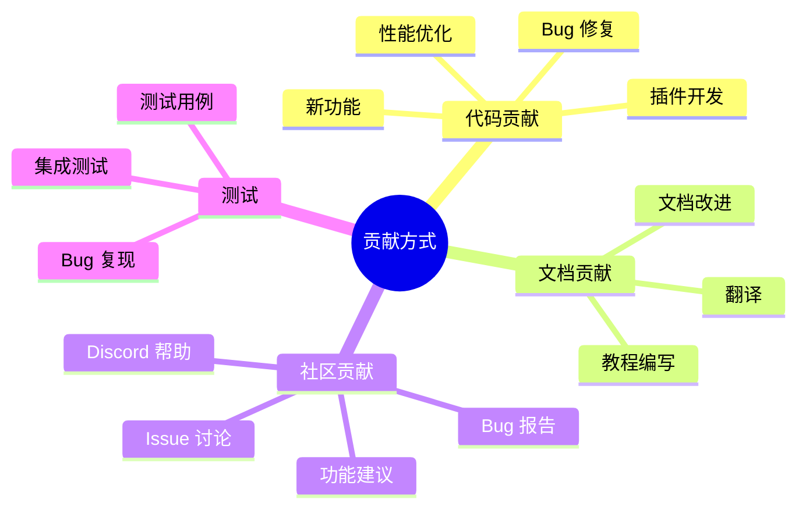
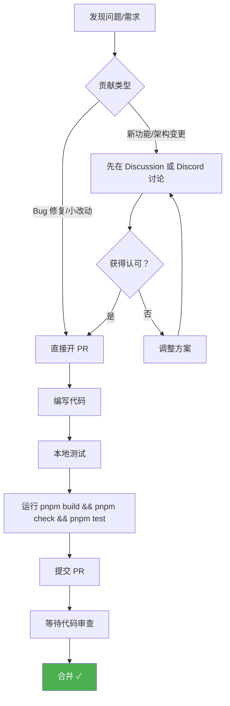

# 第十四章：参与贡献指南

[← 上一章：部署方案](./13-deployment.md) | [返回目录](./README.md)

---

## 14.1 为什么参与贡献？

OpenClaw 是一个活跃的开源项目，欢迎各种形式的贡献：



## 14.2 开发环境搭建

### 前置要求

| 工具 | 版本 | 用途 |
|------|------|------|
| Node.js | 22+ | 运行时 |
| pnpm | 最新 | 包管理器 |
| Git | 最新 | 版本控制 |
| Bun（可选） | 最新 | TypeScript 直接执行 |

### 搭建步骤

```bash
# 1. Fork 仓库到你的 GitHub 账号
# 2. 克隆你的 Fork
git clone https://github.com/YOUR_USERNAME/openclaw.git
cd openclaw

# 3. 安装依赖
pnpm install

# 4. 构建项目
pnpm build

# 5. 运行类型检查
pnpm tsgo

# 6. 运行代码检查
pnpm check

# 7. 运行测试
pnpm test

# 8. 以开发模式运行
pnpm openclaw --help
# 或
pnpm dev
```

### 开发命令速查

```bash
# === 常用开发命令 ===
pnpm install          # 安装依赖
pnpm build            # 构建（输出到 dist/）
pnpm tsgo             # TypeScript 类型检查
pnpm check            # Lint + 格式检查
pnpm format:fix       # 自动修复格式问题
pnpm test             # 运行测试
pnpm test:coverage    # 运行测试 + 覆盖率

# === 开发运行 ===
pnpm openclaw ...     # 以开发模式运行 CLI
pnpm dev              # 开发模式

# === 针对性测试 ===
pnpm test -- src/commands/my-file.test.ts           # 运行特定测试
pnpm test -- src/commands/my-file.test.ts -t "test name"  # 运行特定用例

# === 扩展测试 ===
pnpm test:extension <name>    # 测试特定扩展
pnpm test:contracts           # 运行契约测试

# === 配置文档 ===
pnpm config:docs:gen          # 生成配置文档
pnpm config:docs:check        # 检查配置文档漂移
pnpm plugin-sdk:api:gen       # 生成 Plugin SDK API 文档
pnpm plugin-sdk:api:check     # 检查 Plugin SDK API 漂移
```

## 14.3 项目结构概览

```
openclaw/
├── src/                  # 核心源码
│   ├── cli/              # CLI 命令
│   ├── commands/         # 内置命令
│   ├── gateway/          # Gateway 服务
│   ├── channels/         # 通道适配器
│   ├── agents/           # Agent 运行时
│   ├── sessions/         # 会话管理
│   ├── plugins/          # 插件系统
│   ├── plugin-sdk/       # 插件 SDK
│   └── ...
├── extensions/           # 内置插件（workspace 包）
├── apps/                 # 原生应用
│   ├── macos/            # macOS 菜单栏应用
│   ├── ios/              # iOS 节点
│   └── android/          # Android 节点
├── docs/                 # 文档（Mintlify）
├── test/                 # 集成测试
├── test-fixtures/        # 测试固定数据
├── scripts/              # 构建和工具脚本
├── ui/                   # Web UI
├── packages/             # 子包
└── vendor/               # 第三方依赖
```

## 14.4 贡献流程



### PR 提交前检查清单

- ✅ 本地测试通过
- ✅ `pnpm build` 通过
- ✅ `pnpm check` 通过（Lint + 格式）
- ✅ `pnpm test` 通过
- ✅ 一个 PR 只做一件事
- ✅ 描述了 What（做了什么）和 Why（为什么）
- ✅ UI 变更附带前后截图
- ✅ 使用 American English

### PR 注意事项

| ✅ 推荐 | ❌ 避免 |
|---------|---------|
| Bug 修复 PR | 纯重构 PR |
| 功能实现 PR | 测试仅修复已知 CI 失败 |
| 文档改进 PR | 未讨论的大型架构变更 |
| 针对性的修改 | 多个无关修改混在一起 |

## 14.5 代码风格

### TypeScript 规范

```typescript
// ✅ 正确：严格类型
function processMessage(message: IncomingMessage): ProcessedResult {
  // ...
}

// ❌ 错误：使用 any
function processMessage(message: any): any {
  // ...
}

// ✅ 正确：ESM 导入
import { Router } from "./router.js";
import type { Config } from "./types.js";

// ❌ 错误：CommonJS
const { Router } = require("./router");
```

### 命名规范

| 类型 | 风格 | 示例 |
|------|------|------|
| 变量/函数 | camelCase | `processMessage`, `userId` |
| 类型/接口 | PascalCase | `MessageHandler`, `SessionConfig` |
| 常量 | UPPER_SNAKE_CASE | `MAX_RETRIES`, `DEFAULT_PORT` |
| 文件名 | kebab-case | `message-handler.ts`, `session-config.ts` |
| 测试文件 | 源码名.test.ts | `message-handler.test.ts` |

### 代码质量要求

- 使用 **strict TypeScript**，避免 `any`
- 不添加 `@ts-nocheck`
- 使用 **ESM**（不使用 CommonJS）
- 导入使用 `.js` 扩展名
- 类型导入使用 `import type { X }`
- 文件保持在 ~700 行以内
- 为复杂逻辑添加简短注释
- 使用 American English 书写

### Lint 和格式化

```bash
# 检查（不修改）
pnpm check        # Oxlint + Oxfmt

# 修复格式
pnpm format:fix   # Oxfmt --write
```

## 14.6 测试规范

### 测试框架

OpenClaw 使用 **Vitest** 作为测试框架，配合 V8 覆盖率：

```bash
# 运行所有测试
pnpm test

# 运行特定测试
pnpm test -- src/my-module.test.ts

# 带覆盖率
pnpm test:coverage
```

### 覆盖率要求

```
Lines:      70%
Branches:   70%
Functions:  70%
Statements: 70%
```

### 测试命名规范

```typescript
// 测试文件名与源码文件名匹配
// src/session-manager.ts → src/session-manager.test.ts

describe("SessionManager", () => {
  it("should create new session for unknown key", () => {
    // ...
  });

  it("should return existing session for known key", () => {
    // ...
  });

  it("should reset session on /new command", () => {
    // ...
  });
});
```

### 测试清理

```typescript
// ✅ 正确：清理副作用
afterEach(() => {
  vi.restoreAllMocks();
  // 清理定时器、环境变量、全局状态等
});
```

## 14.7 Commit 规范

### 消息格式

```
<范围>: <简短描述>

示例:
CLI: add verbose flag to send
Gateway: fix WebSocket reconnection
Telegram: handle group topic messages
Docs: update configuration reference
Tests: add session isolation tests
```

### 范围参考

| 范围 | 说明 |
|------|------|
| `CLI` | CLI 相关 |
| `Gateway` | Gateway 核心 |
| `WhatsApp` / `Telegram` / `Discord` | 特定通道 |
| `Agent` | Agent 运行时 |
| `Session` | 会话管理 |
| `Config` | 配置系统 |
| `Docs` | 文档 |
| `Tests` | 测试 |
| `Build` | 构建系统 |
| `Security` | 安全相关 |

## 14.8 AI 辅助开发

OpenClaw 欢迎 AI 辅助的 PR（Vibe-Coded PR）：

### AI 辅助 PR 要求

- 在标题/描述中标明 AI 辅助
- 说明测试程度（未测试/轻度测试/完全测试）
- 尽可能附上使用的 prompt
- 确认你理解代码的功能
- 本地运行 Codex review
- 处理 bot review 中的所有对话

## 14.9 社区资源

| 资源 | 链接 |
|------|------|
| GitHub 仓库 | https://github.com/openclaw/openclaw |
| Discord 社区 | https://discord.gg/clawd |
| ClawHub（技能/插件市场） | https://clawhub.ai |
| 官方文档 | https://docs.openclaw.ai |
| 贡献指南 | CONTRIBUTING.md |
| 项目愿景 | VISION.md |
| 安全政策 | SECURITY.md |

## 14.10 漏洞报告

如果你发现安全漏洞，请通过以下方式报告：

| 组件 | 报告到 |
|------|--------|
| 核心 | [openclaw/openclaw](https://github.com/openclaw/openclaw) |
| macOS 应用 | [openclaw/openclaw](https://github.com/openclaw/openclaw)（apps/macos） |
| iOS 应用 | [openclaw/openclaw](https://github.com/openclaw/openclaw)（apps/ios） |
| Android 应用 | [openclaw/openclaw](https://github.com/openclaw/openclaw)（apps/android） |
| ClawHub | [openclaw/clawhub](https://github.com/openclaw/clawhub) |
| 不确定？ | 发邮件到 security@openclaw.ai |

### 报告需要包含

1. **标题**
2. **严重性评估**
3. **影响范围**
4. **受影响组件**
5. **技术复现步骤**
6. **演示影响**
7. **环境信息**
8. **修复建议**

## 14.11 本章小结

| 步骤 | 说明 |
|------|------|
| 1. 搭建环境 | `git clone` + `pnpm install` + `pnpm build` |
| 2. 理解代码 | 阅读相关源码和文档 |
| 3. 编写代码 | 遵循 TypeScript 严格模式 + ESM |
| 4. 测试 | `pnpm test`，覆盖率 >= 70% |
| 5. 检查 | `pnpm build && pnpm check && pnpm test` |
| 6. 提交 PR | 一个 PR 一件事，描述清楚 What & Why |
| 7. 代码审查 | 响应 reviewer 意见 |

---

[← 上一章：部署方案](./13-deployment.md) | [返回目录](./README.md)
