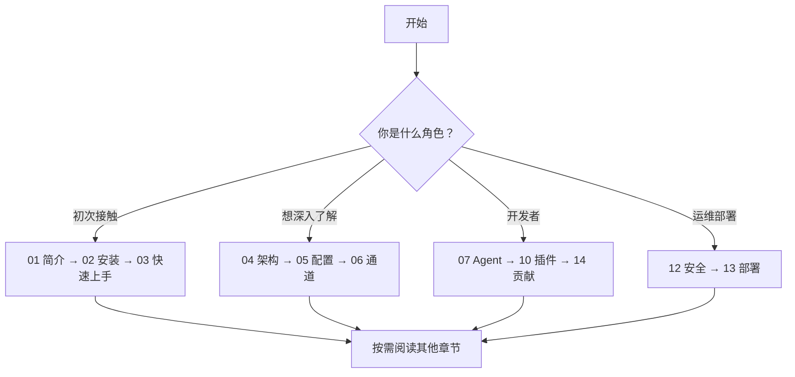

# 🦞 OpenClaw 中文学习教程

> **OpenClaw** —— 一个运行在你自己设备上的个人 AI 助手网关（Gateway）。

本教程基于 [OpenClaw 官方文档](https://docs.openclaw.ai) 编写，旨在帮助中文用户系统性地学习和掌握 OpenClaw 的安装、配置、使用和开发。

## 📖 教程目录

| 章节 | 标题 | 内容概要 |
|------|------|----------|
| [01](./01-introduction.md) | **OpenClaw 简介与核心概念** | 什么是 OpenClaw、核心理念、功能特性总览 |
| [02](./02-installation.md) | **安装与环境配置** | Node.js 环境、多平台安装方式、环境变量 |
| [03](./03-quickstart.md) | **快速上手指南** | 5 分钟上手、Onboard 引导流程、发送第一条消息 |
| [04](./04-architecture.md) | **系统架构详解** | Gateway 架构、WebSocket 协议、设备配对、数据流 |
| [05](./05-configuration.md) | **配置文件详解** | openclaw.json 结构、配置方式、常用配置项 |
| [06](./06-channels.md) | **消息通道配置** | WhatsApp、Telegram、Discord、QQ Bot 等通道的接入 |
| [07](./07-agents.md) | **Agent 智能体系统** | 工作区、引导文件、多 Agent 路由、记忆与技能系统 |
| [08](./08-models.md) | **模型配置与管理** | 模型选择、Fallback 机制、CLI 管理、别名系统 |
| [09](./09-sessions.md) | **会话管理** | 会话键映射、生命周期、DM 隔离、自动清理 |
| [10](./10-plugins.md) | **插件开发指南** | Plugin SDK、插件类型、开发流程、注册 API |
| [11](./11-tools.md) | **工具与自动化** | 内置工具、Slash 命令、Cron、Hooks、Tasks、Skills |
| [12](./12-security.md) | **安全配置** | 信任模型、访问控制、沙盒隔离、安全审计 |
| [13](./13-deployment.md) | **部署方案** | Docker 部署、云服务部署、远程访问 |
| [14](./14-contributing.md) | **参与贡献指南** | 开发环境、PR 规范、代码风格、社区参与 |
| [15](./15-openclaw-json-full-reference.md) | **`openclaw.json` 全量配置总参考** | 全量配置路径、中文用途、适用场景与是否建议使用 |

## 🎯 阅读建议

- **新手用户**：建议从第 01 章开始，按顺序阅读到第 03 章即可上手
- **深度使用者**：重点关注第 04-09 章的架构、配置和会话管理
- **插件开发者**：重点阅读第 07、10、11 章
- **运维/部署人员**：重点阅读第 12、13 章

## 🔗 相关链接

- 官方网站：https://openclaw.ai
- 官方文档：https://docs.openclaw.ai
- GitHub 仓库：https://github.com/openclaw/openclaw
- Discord 社区：https://discord.gg/clawd
- DeepWiki：https://deepwiki.com/openclaw/openclaw

## 📝 说明

- 本教程为中文编写，专业术语保留英文原文并附中文解释
- 代码示例和配置项均来自官方文档和源码
- 教程内容已按 `origin/main` 上游文档补充到 **OpenClaw 2026.4.7** 左右的能力面，后续版本仍可能继续变化
- 如有疑问，请以 [官方文档](https://docs.openclaw.ai) 为准
