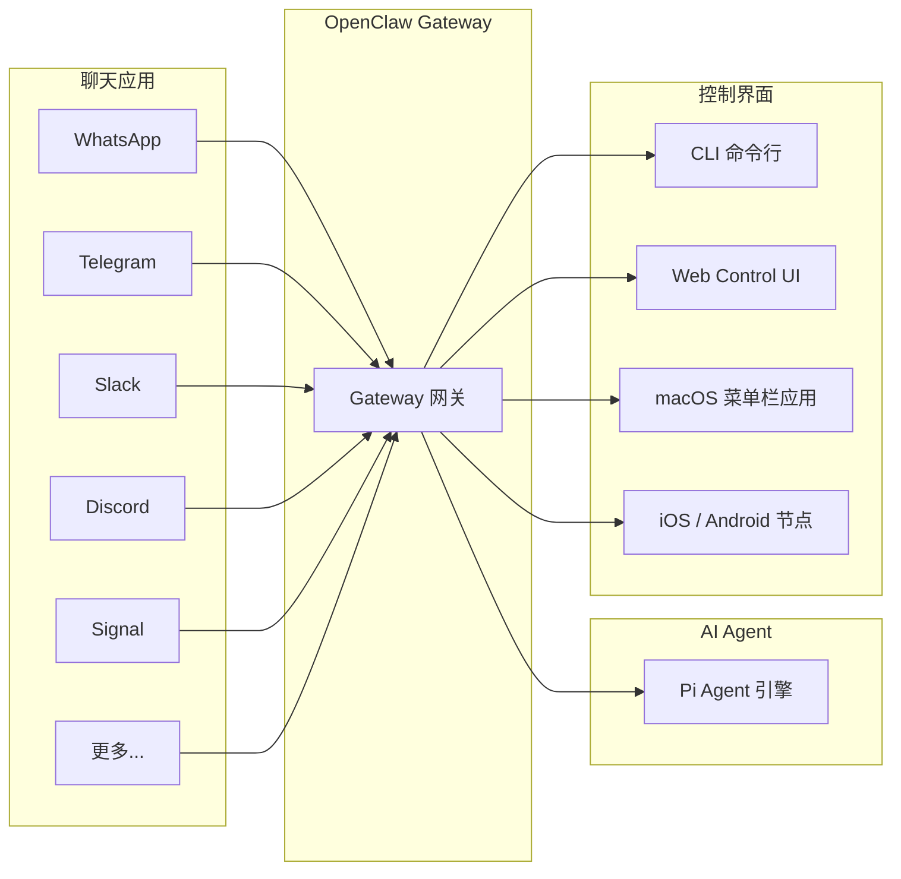

# 01 — 什么是 OpenClaw 🦞

## 一句话定义

**OpenClaw** 是一个开源的、自托管的**个人 AI 助手网关（Gateway）**。它运行在你自己的设备上，将你日常使用的聊天应用（WhatsApp、Telegram、Slack、Discord、Signal 等 26+ 平台）统一接入 AI Agent，让你随时随地和 AI 助手对话。

> 📌 核心理念：**一个 Gateway，多个渠道（Channel），你的数据，你做主。**

## 🤔 OpenClaw 能做什么

### 核心功能一览

| 功能 | 说明 |
|------|------|
| 🌐 多渠道网关 | 一个 Gateway 进程同时服务 Discord、Telegram、WhatsApp、Slack 等 26+ 渠道 |
| 🤖 Agent 原生 | 内置 Agent 运行时，支持工具调用（Tool Use）、会话（Session）、记忆（Memory） |
| 🔄 多 Agent 路由 | 支持多个 Agent，每个 Agent 独立 Workspace、Session、Skills |
| 🖼️ 多媒体支持 | 收发图片、音频、视频、文档，支持语音转文字和 TTS |
| 🔧 工具与 Skills | 55+ 内置 Skills，浏览器自动化、Shell 执行、Web 搜索、代码执行等 |
| 📱 移动端节点 | iOS / Android 节点支持 Canvas、相机、语音和设备操作 |
| 🔒 自托管 | 运行在你自己的机器上，数据不经过任何第三方云服务 |
| 🧩 插件架构 | 支持通过插件扩展渠道、Provider、功能 |

## 🏗️ 技术栈概览

| 层级 | 技术选型 |
|------|----------|
| 语言 | TypeScript（ESM，严格模式） |
| 运行时 | Node.js 22+（开发也支持 Bun） |
| 包管理 | pnpm |
| 构建 | tsdown（输出到 `dist/`） |
| Lint / Format | Oxlint + Oxfmt |
| 测试 | Vitest + V8 Coverage |
| CLI 框架 | Commander + @clack/prompts |
| 协议 | WebSocket（JSON 文本帧） |
| 授权 | MIT 开源许可 |

## 🎯 适合谁用

| 用户类型 | 是否适合 | 说明 |
|----------|----------|------|
| 想要个人 AI 助手的开发者 | ✅ 非常适合 | 核心设计目标就是"个人助手" |
| 想在手机上随时 AI 对话 | ✅ 适合 | 通过 WhatsApp、Telegram 等发消息即可 |
| 想自建 AI 服务的极客 | ✅ 适合 | 完全自托管，支持自定义 Provider |
| 想管理多模型的高级用户 | ✅ 适合 | 支持 35+ Provider，模型 Fallback 链 |
| 企业多租户场景 | ⚠️ 不适合 | 设计为单操作员信任模型，不支持多租户隔离 |

## 🆚 和其他方案的区别

OpenClaw 的独特之处在于：

1. **多渠道统一**：不是一个聊天机器人框架，而是**真正的多渠道 AI 助手网关**。你在 WhatsApp 发的消息和在 Telegram 发的消息可以共享同一个 AI 会话
2. **自托管优先**：数据始终在你的设备上，不依赖任何云服务
3. **Agent 原生**：不只是转发消息，内置完整的 Agent 运行时——支持工具调用、记忆、Session 管理、Compaction
4. **开源且可扩展**：MIT 许可，插件架构支持社区扩展

## 📌 关键概念速查

| 概念 | 含义 |
|------|------|
| **Gateway** | OpenClaw 的核心进程，负责消息路由、Session 管理、渠道连接 |
| **Channel** | 消息渠道，如 WhatsApp、Telegram、Discord |
| **Agent** | AI 助手实例，包含 Workspace、Session、Skills |
| **Session** | 一次对话上下文，存储在本地 JSONL 文件中 |
| **Workspace** | Agent 的工作目录，存放 AGENTS.md、SOUL.md 等引导文件 |
| **Skills** | AgentSkills 兼容的技能文件夹，教 Agent 使用特定工具 |
| **Pi** | 内置的 Agent 运行时引擎，负责模型调用和工具执行 |
| **Node** | 远程执行表面（iOS/Android/macOS），与 Gateway 配对 |
| **Control UI** | Web 控制面板，可在浏览器中聊天和管理配置 |
| **Provider** | 模型服务提供商，如 Anthropic、OpenAI、Google |

---

> ⏭️ 下一篇：[系统架构与核心原理](./02-architecture.md) — 深入了解 OpenClaw 各组件如何协作。
