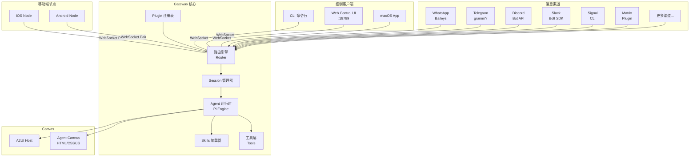
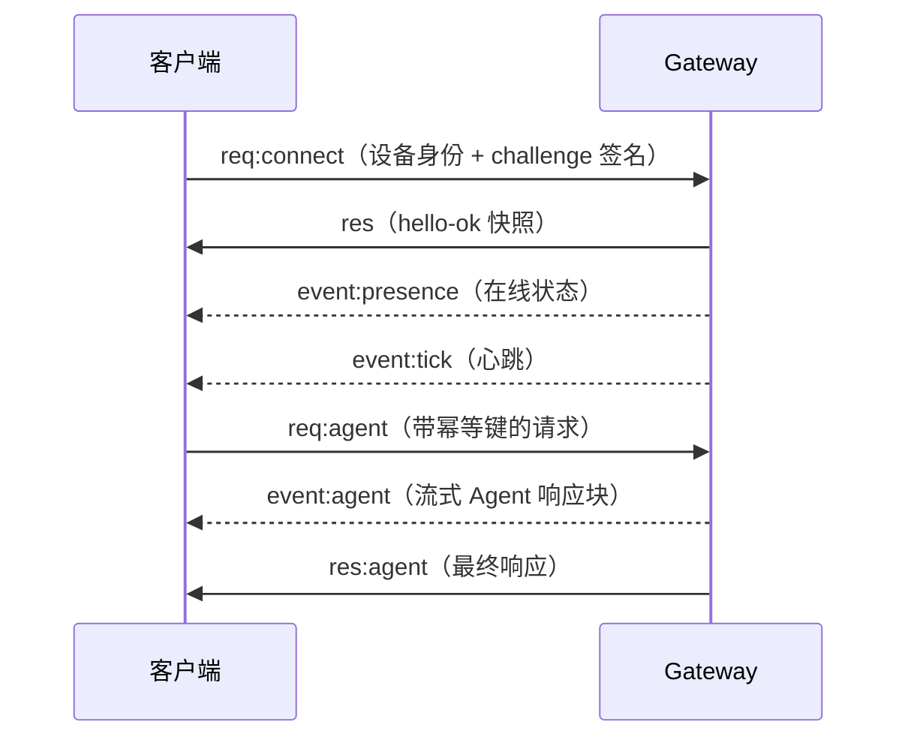
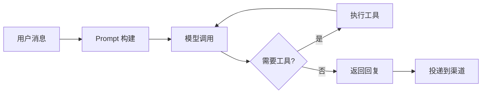
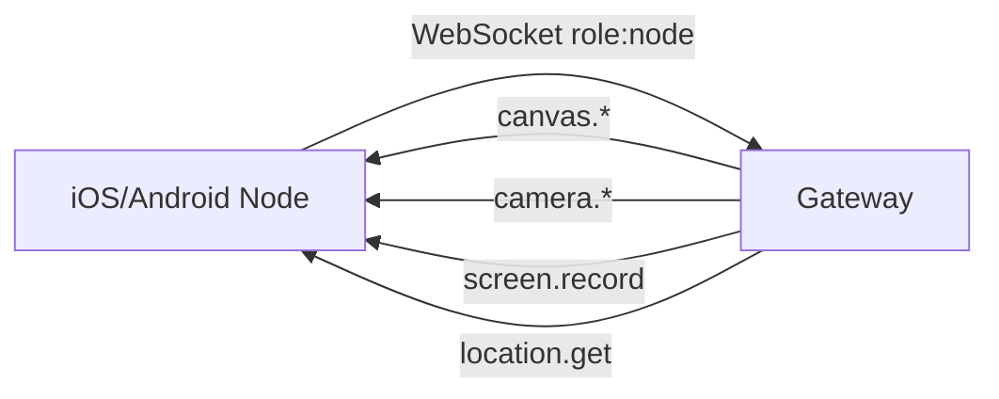

# 02 — 系统架构与核心原理 🏛️

## 整体架构

OpenClaw 采用 **WebSocket Gateway 架构**，一个长期运行的 Gateway 进程作为所有消息渠道和控制客户端的中枢。



## 核心组件详解

### 1. Gateway（网关）

Gateway 是 OpenClaw 的核心进程，它是整个系统的**唯一中枢**。

| 属性 | 说明 |
|------|------|
| 进程模型 | 单进程，每台主机运行一个 Gateway |
| 默认端口 | `18789`（TCP，本地回环绑定） |
| 通信协议 | WebSocket，JSON 文本帧 |
| 身份验证 | 共享密钥（Token/Password）、Tailscale 身份或可信代理头 |
| 事件类型 | `agent`、`chat`、`presence`、`health`、`heartbeat`、`cron` |

Gateway 的核心职责：

- 维护所有渠道连接（WhatsApp/Baileys、Telegram/grammY、Slack 等）
- 管理 Session 状态和路由
- 暴露类型化的 WebSocket API（请求/响应/事件帧）
- 在 JSON Schema 上验证入站帧
- 托管 Control UI 和 Canvas

### 2. 连接生命周期

一个客户端与 Gateway 的交互流程：



关键规则：

- **握手是强制的**：非 JSON 的第一帧会导致连接被立即关闭
- **幂等性**：对有副作用的方法（`send`、`agent`）必须提供幂等键
- **事件不回放**：客户端断线后不会收到离线期间的事件，必须重新刷新

### 3. Agent 运行时（Pi Engine）

Agent 是 AI 助手的核心，基于 Pi Agent 引擎运行。



Agent 运行时负责：

- 构建 System Prompt（包含工具列表、Skills、Workspace 信息、运行时元数据）
- 调用模型并处理流式响应
- 管理工具调用循环
- 会话（Session）存储和恢复
- 上下文压缩（Compaction）

### 4. Session 路由

不同来源的消息被路由到不同的 Session：

| 消息来源 | 路由策略 |
|----------|----------|
| 私聊（DM） | 默认共享 `main` Session |
| 群聊 | 每个群独立 Session |
| 频道/房间 | 每个房间独立 Session |
| Cron 定时任务 | 每次运行使用新 Session |
| Webhook | 每个 Hook 独立 Session |

Session 的存储位置：

```
~/.openclaw/agents/<agentId>/sessions/
├── sessions.json         # Session 索引
├── <sessionId>.jsonl     # 会话记录（JSONL 格式）
└── ...
```

### 5. Wire Protocol（通信协议）

OpenClaw 使用 WebSocket 进行所有通信，协议细节如下：

| 属性 | 规格 |
|------|------|
| 传输层 | WebSocket（文本帧，JSON 编码） |
| 认证方式 | 共享密钥 Token、Tailscale 身份、可信代理头 |
| 配对机制 | 设备 ID 需要审批，Gateway 签发设备 Token |
| 签名 | 所有连接签署 `connect.challenge` nonce（v3 绑定 `platform` + `deviceFamily`） |

### 6. Node（远程节点）

Node 是通过 WebSocket 与 Gateway 配对的远程执行表面。



配对完成后，Node 的操作被视为可信操作员操作。

## 🔑 架构不变量（Invariants）

理解以下不变量可以帮助你避免常见误解：

1. **每台主机只运行一个 Gateway**（单 Baileys Session 约束）
2. **Gateway 是 Session 状态的唯一所有者**——UI 客户端查询 Gateway 获取 Session 数据
3. **事件不回放**——客户端必须在断线后重新刷新
4. **单操作员信任模型**——每个 Gateway 对应一个可信操作员

## 📂 关键目录结构

```
~/.openclaw/
├── openclaw.json              # 配置文件（JSON5 格式）
├── workspace/                 # 默认 Agent 工作区
│   ├── AGENTS.md              # 操作指令和记忆
│   ├── SOUL.md                # 角色、边界、语气
│   ├── USER.md                # 用户信息
│   ├── TOOLS.md               # 工具使用备注
│   ├── MEMORY.md              # 长期记忆
│   └── memory/                # 每日记忆笔记
├── agents/                    # Agent 状态
│   └── main/
│       ├── agent/             # 认证信息等
│       └── sessions/          # 会话记录
├── skills/                    # 本地 Skills
└── credentials/               # Web Provider 凭证
```

---

> ⏭️ 下一篇：[快速上手指南](./03-getting-started.md) — 从零安装 OpenClaw 并发出你的第一条消息。
