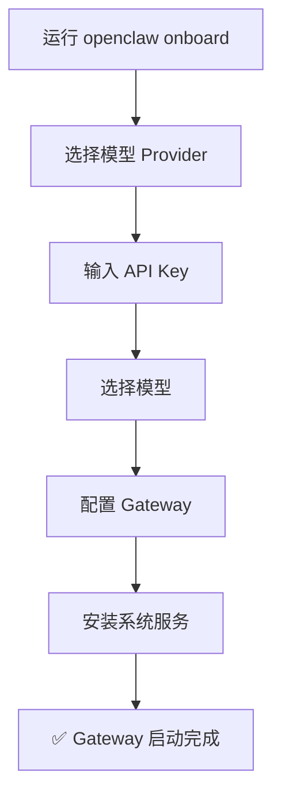

# 03 — 快速上手指南 🚀

## 前置准备

| 项目 | 要求 |
|------|------|
| Node.js | 推荐 Node 24；也支持 Node 22 LTS（22.14+） |
| 操作系统 | macOS / Linux / Windows（推荐 WSL2） |
| API Key | 至少一个模型 Provider 的 API Key（Anthropic、OpenAI、Google 等） |

## 第一步：安装 OpenClaw

### 方式一：一键安装脚本（推荐）

```bash
# macOS / Linux
curl -fsSL https://openclaw.ai/install.sh | bash

# Windows (PowerShell)
iwr -useb https://openclaw.ai/install.ps1 | iex
```

### 方式二：npm 全局安装

```bash
# 使用 npm
npm install -g openclaw@latest

# 使用 pnpm
pnpm add -g openclaw@latest

# 使用 bun
bun add -g openclaw@latest
```

### 方式三：Docker

```bash
# 参考 Docker 文档
# https://docs.openclaw.ai/install/docker
docker pull openclaw/openclaw
```

安装完成后验证：

```bash
openclaw --version
# 输出类似：openclaw 2026.x.x
```

## 第二步：运行 Onboarding 向导

OpenClaw 提供交互式向导来完成首次配置，这是推荐的设置方式。

```bash
openclaw onboard --install-daemon
```

向导会引导你完成以下步骤：



> 💡 `--install-daemon` 参数会将 Gateway 安装为系统服务（守护进程），实现开机自启动。

### Onboard 向导做了什么？

1. 创建配置文件 `~/.openclaw/openclaw.json`
2. 配置模型 Provider 和 API Key
3. 设置默认模型
4. 创建 Workspace 目录（`~/.openclaw/workspace`）
5. 启动 Gateway 进程

## 第三步：验证 Gateway 运行状态

```bash
openclaw gateway status
```

如果看到 Gateway 正在监听 `18789` 端口，说明启动成功。

```bash
# 查看渠道连接状态
openclaw channels status
```

## 第四步：打开 Control UI

```bash
openclaw dashboard
```

这会在浏览器中打开 Web 控制面板（默认地址：`http://127.0.0.1:18789`）。

在 Control UI 中你可以：
- 💬 直接和 AI 助手聊天
- ⚙️ 管理配置
- 📊 查看 Session 历史
- 🔌 管理渠道连接

## 第五步：发送你的第一条消息

### 通过 Control UI

打开 `http://127.0.0.1:18789`，在聊天框中输入消息，即可获得 AI 回复。

### 通过 CLI

```bash
# 发送消息并获取回复
openclaw message send "你好，请介绍一下你自己"
```

### 通过 Telegram（最快接入渠道）

1. 在 [BotFather](https://t.me/BotFather) 创建一个 Telegram Bot
2. 获取 Bot Token
3. 配置到 OpenClaw：

```bash
openclaw config set channels.telegram.botToken "你的Bot-Token"
openclaw config set channels.telegram.enabled true
```

4. 在 Telegram 中给你的 Bot 发消息，即可获得 AI 回复

## 第六步：后续建议

完成上述步骤后，你已经有了一个运行中的个人 AI 助手。接下来可以：

| 接下来做什么 | 参考文档 |
|------------|----------|
| 连接更多聊天渠道 | [10-消息渠道接入指南](./10-channels.md) |
| 深入了解配置项 | [04-配置详解](./04-configuration.md) |
| 配置安全策略 | [05-安全配置](./05-security.md) |
| 选择和切换模型 | [06-模型与 Provider](./06-models-and-providers.md) |
| 启用工具和 Skills | [07-工具与 Skills](./07-tools-and-skills.md) |
| 节省 Token 费用 | [08-Token 节省](./08-token-saving.md) |

## 🔧 常用 CLI 命令速查

```bash
# === 基础操作 ===
openclaw onboard              # 交互式向导
openclaw gateway status       # 查看 Gateway 状态
openclaw dashboard            # 打开 Web 控制面板

# === 配置管理 ===
openclaw config get           # 查看当前配置
openclaw config set <key> <value>  # 设置配置项
openclaw configure            # 交互式配置

# === 模型管理 ===
openclaw models list          # 列出可用模型
openclaw models status        # 查看模型状态
openclaw models set <ref>     # 设置默认模型

# === 渠道管理 ===
openclaw channels status      # 查看渠道状态
openclaw channels status --probe  # 深度探测

# === Agent 管理 ===
openclaw agents list          # 列出 Agent
openclaw agents add <name>    # 添加 Agent

# === Session 管理 ===
openclaw sessions list        # 列出 Session
openclaw sessions cleanup --dry-run  # 预览清理

# === 诊断 ===
openclaw doctor               # 诊断问题
openclaw doctor --fix         # 自动修复
openclaw security audit       # 安全审计
```

## 🔍 环境变量

| 环境变量 | 说明 |
|----------|------|
| `OPENCLAW_HOME` | 主目录（路径解析基准） |
| `OPENCLAW_STATE_DIR` | 覆盖状态目录路径 |
| `OPENCLAW_CONFIG_PATH` | 覆盖配置文件路径 |

---

> ⏭️ 下一篇：[openclaw.json 配置详解](./04-configuration.md) — 了解每个配置项的含义和默认值。
