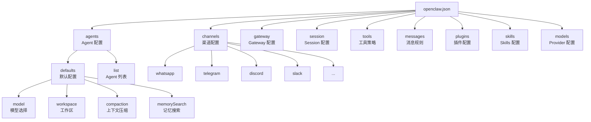

# 04 — openclaw.json 配置详解 ⚙️

## 配置基础

OpenClaw 从 `~/.openclaw/openclaw.json` 读取配置，格式为 **JSON5**（支持注释和尾随逗号）。如果配置文件不存在，Gateway 使用安全默认值启动。

### 配置编辑方式

| 方式 | 命令 / 路径 | 说明 |
|------|------------|------|
| 交互式向导 | `openclaw onboard` 或 `openclaw configure` | 推荐新手使用 |
| CLI 命令 | `openclaw config get/set/unset` | 单项快速修改 |
| Control UI | `http://127.0.0.1:18789` Config 页签 | 可视化管理 |
| 直接编辑 | `~/.openclaw/openclaw.json` | 支持热重载 |

> ⚠️ **严格校验**：Gateway 启动时会严格校验配置，未知字段或类型错误会导致启动失败。使用 `openclaw doctor` 可以诊断配置问题。

## 配置结构总览



## 常用配置项详解

### 1. `agents` — Agent 配置

Agent 配置控制 AI 助手的核心行为。

```json5
{
  "agents": {
    "defaults": {
      // 工作区目录（Agent 的文件读写基础目录）
      "workspace": "~/.openclaw/workspace",

      // 主模型
      "model": {
        "primary": "anthropic/claude-sonnet-4-6",
        "fallbacks": ["openai/gpt-5.4"]
      },

      // 模型允许列表（设置后仅允许列表中的模型）
      "models": {
        "anthropic/claude-sonnet-4-6": { "alias": "Sonnet" },
        "openai/gpt-5.4": { "alias": "GPT" }
      },

      // 图像模型（当主模型不支持图片输入时的后备模型）
      "imageModel": "openai/gpt-5.4",

      // 图片生成模型
      "imageGenerationModel": "openai/dall-e-3",

      // 上下文压缩配置
      "compaction": {
        "mode": "safeguard",       // safeguard（默认）| off | always
        "model": "openai/gpt-5.4", // 可使用不同模型做压缩
        "identifierPolicy": "strict" // 保留不透明标识符
      },

      // 记忆搜索
      "memorySearch": {
        "provider": "openai"       // openai | gemini | voyage | mistral
      },

      // 流式分块配置
      "blockStreamingDefault": "off",  // off（默认）| text_end | message_end

      // Skills 允许列表（不设置则不限制）
      "skills": ["github", "weather"]
    },

    // 多 Agent 列表
    "list": [
      {
        "id": "coding",
        "workspace": "~/projects",
        "skills": ["github", "coding-agent"]
      }
    ]
  }
}
```

### 2. `channels` — 渠道配置

每个渠道都在 `channels.<provider>` 下配置。

```json5
{
  "channels": {
    // Telegram 示例
    "telegram": {
      "enabled": true,
      "botToken": "123456:ABC-DEF",  // Telegram Bot Token
      "dmPolicy": "pairing",         // pairing | allowlist | open | disabled
      "allowFrom": ["tg:123456789"],  // 允许的用户 ID
      "groups": {
        "*": {
          "requireMention": true      // 群聊中需要 @提及才响应
        }
      }
    },

    // WhatsApp 示例
    "whatsapp": {
      "allowFrom": ["+15555550123"],  // 允许的电话号码
      "dmPolicy": "pairing",
      "groups": {
        "*": { "requireMention": true }
      }
    },

    // Discord 示例
    "discord": {
      "enabled": true,
      "botToken": "你的Discord-Bot-Token",
      "dmPolicy": "pairing"
    }
  }
}
```

**DM 策略（`dmPolicy`）说明：**

| 策略 | 行为 |
|------|------|
| `pairing`（默认） | 未知发送者收到一次性配对码，操作员需要手动批准 |
| `allowlist` | 仅 `allowFrom` 列表中的发送者可以通信 |
| `open` | 允许所有人（需设置 `allowFrom: ["*"]`） |
| `disabled` | 忽略所有私聊消息 |

**群聊策略（`groupPolicy`）说明：**

| 策略 | 行为 |
|------|------|
| `allowlist`（默认） | 仅配置的群组可以使用 |
| `open` | 绕过群组允许列表 |
| `disabled` | 屏蔽所有群聊消息 |

### 3. `gateway` — Gateway 配置

```json5
{
  "gateway": {
    "mode": "local",        // local（默认）| remote
    "bind": "loopback",    // loopback（仅本地）| 0.0.0.0（所有接口）
    "port": 18789,          // 默认端口
    "auth": {
      "mode": "token",
      "token": "你的长随机Token"  // 建议使用强密码
    },
    "controlUi": {
      "enabled": true       // 启用 Web Control UI
    }
  }
}
```

### 4. `session` — Session 配置

```json5
{
  "session": {
    // DM 隔离策略
    "dmScope": "main",      // main（默认，所有DM共享）
                            // per-peer（按发送者隔离）
                            // per-channel-peer（按渠道+发送者隔离，推荐）
                            // per-account-channel-peer（最细粒度）

    // Session 重置
    "reset": {
      "dailyAt": "04:00",   // 每日重置时间（默认凌晨 4 点）
      "idleMinutes": 120     // 可选：空闲 N 分钟后重置
    },

    // Session 维护
    "maintenance": {
      "mode": "warn",        // warn（默认，仅报告）| enforce（自动清理）
      "pruneAfter": "30d",   // 保留天数
      "maxEntries": 500      // 最大条目数
    },

    // 跨渠道身份关联
    "identityLinks": [
      // 将同一个人在不同渠道的身份关联到同一个 Session
    ]
  }
}
```

### 5. `tools` — 工具策略

```json5
{
  "tools": {
    // 工具配置文件（预设的工具集合）
    "profile": "messaging",   // messaging | coding | full

    // 拒绝列表
    "deny": ["group:automation", "group:runtime"],

    // 文件系统限制
    "fs": {
      "workspaceOnly": true   // 限制文件操作在 Workspace 内
    },

    // Shell 执行策略
    "exec": {
      "security": "deny",     // deny | allowlist | full
      "ask": "always"          // off | on-miss | always
    },

    // 提权访问
    "elevated": {
      "enabled": false         // 是否允许逃逸沙箱
    }
  }
}
```

**`tools.exec.security` 说明：**

| 值 | 说明 |
|----|------|
| `deny` | 禁止所有 Shell 执行（最安全） |
| `allowlist` | 仅允许白名单中的命令 |
| `full` | 允许所有命令（需谨慎使用） |

**`tools.exec.ask` 说明：**

| 值 | 说明 |
|----|------|
| `off` | 不弹出审批提示 |
| `on-miss` | 仅在命令不在白名单时提示 |
| `always` | 每次执行都需要审批 |

### 6. `messages` — 消息规则

```json5
{
  "messages": {
    "groupChat": {
      // 群聊中的 @提及模式
      "mentionPatterns": ["@openclaw", "@assistant"]
    }
  }
}
```

### 7. `skills` — Skills 配置

```json5
{
  "skills": {
    "load": {
      // 额外的 Skills 目录
      "extraDirs": ["/path/to/custom-skills"]
    }
  }
}
```

### 8. `plugins` — 插件配置

```json5
{
  "plugins": {
    "entries": {
      "memory-wiki": {
        "enabled": true          // 启用 Memory Wiki 插件
      },
      "voice-call": {
        "enabled": true,
        "config": {
          "provider": "twilio"   // 插件特定配置
        }
      }
    }
  }
}
```

## 📋 默认值速查表

| 配置路径 | 默认值 | 说明 |
|----------|--------|------|
| `gateway.mode` | `"local"` | 本地模式 |
| `gateway.bind` | `"loopback"` | 仅本地回环 |
| `gateway.port` | `18789` | 监听端口 |
| `session.dmScope` | `"main"` | DM 共享同一 Session |
| `session.reset.dailyAt` | `"04:00"` | 每日凌晨 4 点重置 |
| `session.maintenance.mode` | `"warn"` | 仅报告可清理内容 |
| `tools.exec.security` | `"deny"` | 禁止 Shell 执行 |
| `tools.exec.ask` | `"off"` | 不弹出审批 |
| `agents.defaults.blockStreamingDefault` | `"off"` | 不启用流式分块 |
| `agents.defaults.compaction.mode` | `"safeguard"` | 安全保护模式 |
| `agents.defaults.compaction.identifierPolicy` | `"strict"` | 严格保留标识符 |

## 🛠️ 配置诊断

```bash
# 检查配置是否有问题
openclaw doctor

# 自动修复安全修复
openclaw doctor --fix

# 验证配置文件格式
openclaw config get
```

---

> ⏭️ 下一篇：[安全配置与最佳实践](./05-security.md) — 了解如何安全地运行 OpenClaw。
