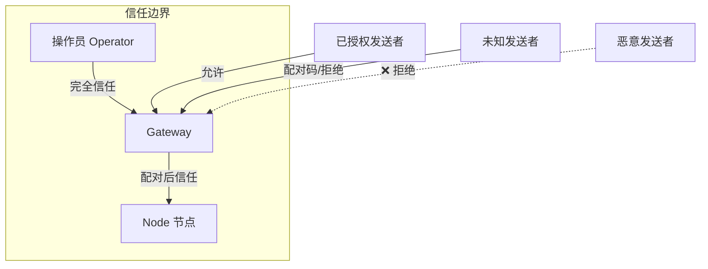
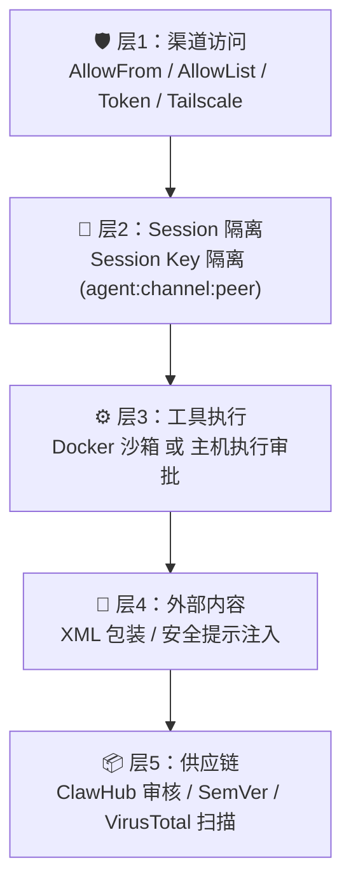

# 05 — 安全配置与最佳实践 🔒

## 信任模型

OpenClaw 采用**单操作员信任模型**（Personal Assistant Model）：每个 Gateway 对应一个可信操作员。



### 关键原则

| 原则 | 说明 |
|------|------|
| ✅ 支持 | 每个 Gateway 一个操作员/信任边界 |
| ✅ 支持 | 一台主机/OS 用户运行一个 Gateway |
| ❌ 不支持 | 多个互不信任的用户共享一个 Agent/Gateway |
| 💡 解决方案 | 如需多用户隔离，使用独立的 Gateway + 独立凭证 |

## 五层信任边界

OpenClaw 设计了五层安全防护：



### 层1：渠道访问控制

控制谁可以向你的 AI 助手发送消息。

```json5
{
  "channels": {
    "whatsapp": {
      "dmPolicy": "pairing",         // 推荐：配对模式
      "allowFrom": ["+15555550123"], // 已知用户
      "groups": {
        "*": { "requireMention": true } // 群聊需 @提及
      }
    },
    "telegram": {
      "dmPolicy": "allowlist",        // 或使用白名单模式
      "allowFrom": ["tg:123456789"]
    }
  }
}
```

**DM 策略对比：**

| 策略 | 安全等级 | 行为 | 适用场景 |
|------|---------|------|----------|
| `disabled` | 🔒🔒🔒 | 禁止所有私聊 | 仅使用群聊的场景 |
| `allowlist` | 🔒🔒 | 仅白名单用户 | 已知固定用户群 |
| `pairing`（默认） | 🔒 | 新用户需配对码 | 个人使用（推荐） |
| `open` | ⚠️ | 允许所有人 | 公开 Bot（需谨慎） |

> 📌 配对码在 1 小时后过期，每个渠道最多 3 个挂起的配对请求。

### 层2：Session 隔离

控制不同发送者的会话是否隔离。

```json5
{
  "session": {
    "dmScope": "per-channel-peer"  // 推荐：按渠道+发送者隔离
  }
}
```

| 策略 | 说明 | 推荐场景 |
|------|------|----------|
| `main` | 所有 DM 共享一个 Session | 仅自己使用 |
| `per-peer` | 按发送者隔离（跨渠道） | 少量用户 |
| `per-channel-peer` | 按渠道+发送者隔离 | **推荐** |
| `per-account-channel-peer` | 最细粒度隔离 | 最高安全需求 |

> 💡 使用 `session.identityLinks` 可以将同一个人的不同渠道身份关联到同一个 Session。

### 层3：工具执行安全

控制 AI 助手能执行哪些工具和 Shell 命令。

```json5
{
  "tools": {
    "profile": "messaging",   // 基础消息模式，限制危险工具

    // 明确拒绝的工具组
    "deny": [
      "group:automation",
      "group:runtime",
      "group:fs",
      "sessions_spawn",
      "sessions_send"
    ],

    // 文件系统限制
    "fs": {
      "workspaceOnly": true    // 仅允许 Workspace 内的文件操作
    },

    // Shell 执行策略
    "exec": {
      "security": "deny",     // 完全禁止 Shell 执行
      "ask": "always"          // 即使允许，每次也要审批
    },

    // 提权访问
    "elevated": {
      "enabled": false         // 禁止沙箱逃逸
    }
  }
}
```

### 层4：外部内容防护

OpenClaw 自动对外部内容进行安全处理：

- 外部消息使用 XML 包装隔离
- 注入安全提示，防止提示注入（Prompt Injection）攻击

### 层5：供应链安全

通过 ClawHub（Skills 市场）安装的 Skills 经过：

- 模式审核标记
- SemVer 版本控制
- GitHub 账号年龄验证

## 🛡️ 60 秒加固配置

以下是一份可以在 60 秒内应用的加固配置模板：

```json5
{
  // Gateway 绑定和认证
  "gateway": {
    "mode": "local",
    "bind": "loopback",
    "auth": {
      "mode": "token",
      "token": "替换为长随机Token-至少32位"
    }
  },

  // Session 隔离
  "session": {
    "dmScope": "per-channel-peer"
  },

  // 工具安全策略
  "tools": {
    "profile": "messaging",
    "deny": [
      "group:automation",
      "group:runtime",
      "group:fs",
      "sessions_spawn",
      "sessions_send"
    ],
    "fs": { "workspaceOnly": true },
    "exec": { "security": "deny", "ask": "always" },
    "elevated": { "enabled": false }
  },

  // 渠道安全
  "channels": {
    "whatsapp": {
      "dmPolicy": "pairing",
      "groups": { "*": { "requireMention": true } }
    }
  }
}
```

## 🔍 安全审计

OpenClaw 提供内置的安全审计工具：

```bash
# 基础安全审计
openclaw security audit

# 深度审计
openclaw security audit --deep

# 自动修复
openclaw security audit --fix

# 输出 JSON 格式（便于自动化）
openclaw security audit --json
```

审计会检查：

- Gateway 认证配置
- 渠道访问策略
- 工具执行权限
- Session 隔离状态
- 已知安全风险

## 📋 安全配置检查清单

| 检查项 | 操作 |
|--------|------|
| ✅ Gateway 绑定 | 设置 `bind: "loopback"` 防止外部访问 |
| ✅ 认证 Token | 设置长随机 Token（至少 32 字符） |
| ✅ DM 策略 | 设为 `pairing` 或 `allowlist` |
| ✅ 群聊提及 | 启用 `requireMention` |
| ✅ Session 隔离 | 设为 `per-channel-peer` |
| ✅ 工具限制 | 设置合适的 `tools.profile` |
| ✅ Shell 执行 | 默认 `deny`，按需开放 |
| ✅ 文件系统 | 启用 `workspaceOnly` |
| ✅ 提权访问 | 保持 `elevated.enabled: false` |
| ✅ 运行审计 | 定期运行 `openclaw security audit` |

---

> ⏭️ 下一篇：[模型与 Provider 配置](./06-models-and-providers.md) — 了解如何选择和配置 AI 模型。
