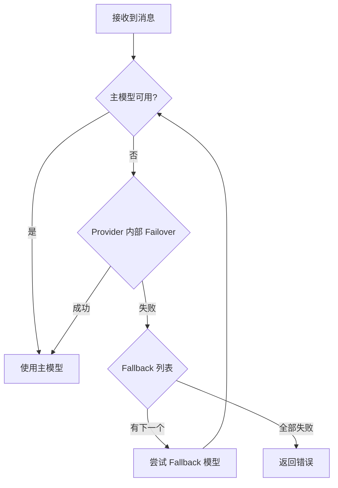

# 06 — 模型与 Provider 配置 🧠

## 模型引用格式

OpenClaw 使用 `provider/model` 格式引用模型，以第一个 `/` 作为分隔符。

```
anthropic/claude-sonnet-4-6    → Provider: anthropic, Model: claude-sonnet-4-6
openai/gpt-5.4                 → Provider: openai,    Model: gpt-5.4
google/gemini-2.5-pro          → Provider: google,    Model: gemini-2.5-pro
openrouter/anthropic/claude-sonnet-4-6 → Provider: openrouter, Model: anthropic/claude-sonnet-4-6
```

> 💡 如果省略 Provider 前缀，OpenClaw 会尝试：别名匹配 → 唯一 Provider 匹配 → 默认 Provider。

## 模型选择策略

OpenClaw 的模型调用遵循以下顺序：



### 配置示例

```json5
{
  "agents": {
    "defaults": {
      "model": {
        // 主模型：优先使用
        "primary": "anthropic/claude-sonnet-4-6",

        // Fallback 链：主模型不可用时按顺序尝试
        "fallbacks": [
          "openai/gpt-5.4",
          "google/gemini-2.5-pro"
        ]
      }
    }
  }
}
```

## 支持的 Provider（35+）

OpenClaw 支持 35+ 模型 Provider，以下为部分常用的 Provider：

| Provider | 代表模型 | 认证方式 |
|----------|---------|---------|
| Anthropic | claude-sonnet-4-6, claude-opus-4-6 | API Key |
| OpenAI | gpt-5.4, o3 | API Key / OAuth |
| Google | gemini-2.5-pro | API Key |
| Mistral | mistral-large | API Key |
| OpenRouter | 聚合多个 Provider | API Key |
| Ollama | 本地模型（llama 等） | 无需认证 |
| vLLM | 自托管模型 | 自定义端点 |
| SGLang | 自托管模型 | 自定义端点 |

### 快速配置 Provider

使用交互式向导是最简单的方式：

```bash
openclaw onboard    # 首次设置，包含 Provider 配置
```

## 特殊用途模型

除主模型外，OpenClaw 支持为不同任务指定专用模型：

```json5
{
  "agents": {
    "defaults": {
      // 主模型
      "model": { "primary": "anthropic/claude-sonnet-4-6" },

      // 图像输入模型（当主模型不支持图片时）
      "imageModel": "openai/gpt-5.4",

      // PDF 处理模型（优先使用 pdfModel → imageModel → primary）
      "pdfModel": "openai/gpt-5.4",

      // 图片生成模型
      "imageGenerationModel": "openai/dall-e-3",

      // 音乐生成模型
      "musicGenerationModel": "minimax/music-01",

      // 视频生成模型
      "videoGenerationModel": "minimax/video-01"
    }
  }
}
```

## 模型允许列表

设置 `models` 后，它会成为该 Agent 的模型**允许列表**。用户只能在列表中的模型之间切换。

```json5
{
  "agents": {
    "defaults": {
      "model": { "primary": "anthropic/claude-sonnet-4-6" },
      "models": {
        "anthropic/claude-sonnet-4-6": { "alias": "Sonnet" },
        "anthropic/claude-opus-4-6": { "alias": "Opus" },
        "openai/gpt-5.4": { "alias": "GPT" }
      }
    }
  }
}
```

设置别名后，用户可以使用 `/model Sonnet` 快速切换。

## 在聊天中切换模型

OpenClaw 支持在聊天对话中实时切换模型：

```
/model              # 打开紧凑选择器
/model list         # 显示所有可用模型
/model 3            # 按编号选择
/model openai/gpt-5.4  # 按完整引用选择
/model Sonnet       # 按别名选择
/model status       # 查看详细状态
```

## CLI 模型管理命令

```bash
# 查看模型
openclaw models list                # 列出可用模型
openclaw models status              # 查看当前模型状态

# 设置模型
openclaw models set anthropic/claude-sonnet-4-6  # 设置主模型
openclaw models set-image openai/gpt-5.4         # 设置图像模型

# 别名管理
openclaw models aliases list        # 列出别名
openclaw models aliases add Sonnet anthropic/claude-sonnet-4-6  # 添加别名
openclaw models aliases remove Sonnet  # 移除别名

# Fallback 管理
openclaw models fallbacks list      # 列出 Fallback 链
openclaw models fallbacks add openai/gpt-5.4  # 添加 Fallback
openclaw models fallbacks remove openai/gpt-5.4  # 移除 Fallback
openclaw models fallbacks clear     # 清空 Fallback
```

## 自托管模型配置

OpenClaw 支持连接自托管或 OpenAI 兼容的模型端点：

### Ollama（本地模型）

```json5
{
  // Ollama 在本地运行，无需 API Key
  "agents": {
    "defaults": {
      "model": { "primary": "ollama/llama3.1" }
    }
  }
}
```

### vLLM / SGLang

```json5
{
  // 自托管 OpenAI 兼容端点
  "agents": {
    "defaults": {
      "model": { "primary": "vllm/my-model" }
    }
  }
}
```

## 🎯 模型选择建议

| 用途 | 推荐选择 |
|------|----------|
| 日常对话 | 主流 Provider 的旗舰模型（如 claude-sonnet-4-6, gpt-5.4） |
| 编程辅助 | 支持工具调用的最新模型 |
| 成本敏感 | 使用较小模型作为 Fallback，旗舰模型作为 Primary |
| 隐私优先 | 使用 Ollama 本地模型，避免数据外传 |
| 高可用 | 配置多个 Provider 的 Fallback 链 |

---

> ⏭️ 下一篇：[工具与 Skills 使用指南](./07-tools-and-skills.md) — 了解如何使用工具和 Skills 增强 AI 助手。
