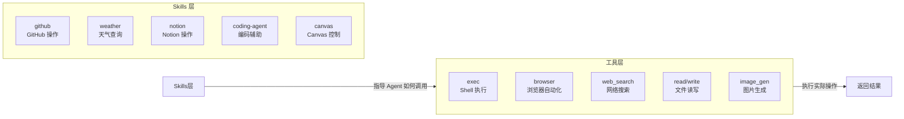
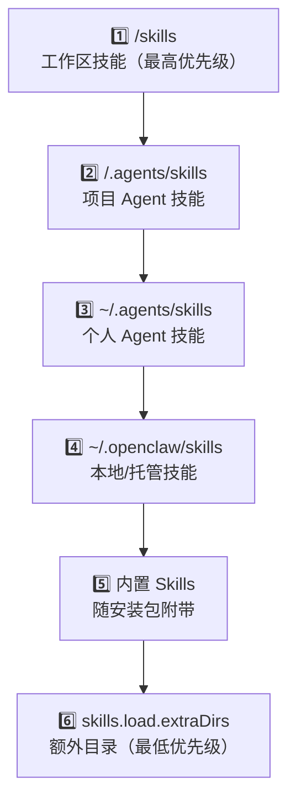

# 07 — 工具与 Skills 使用指南 🔧

## 工具（Tools）与 Skills 的区别

| 维度 | Tools（工具） | Skills（技能） |
|------|--------------|---------------|
| 定义 | Agent 可调用的内置功能 | 教 Agent 如何使用工具的指令文件夹 |
| 格式 | 内置于 Agent 运行时 | 目录 + `SKILL.md`（YAML 前置 + Markdown 指令） |
| 管理 | 通过 `tools.*` 配置控制 | 通过文件系统和 `skills.*` 配置控制 |
| 兼容 | OpenClaw 原生 | [AgentSkills](https://agentskills.io) 兼容格式 |



## 内置工具概览

### 核心工具

| 工具 | 功能 | 说明 |
|------|------|------|
| `read` | 读取文件 | 读取 Workspace 中的文件内容 |
| `write` | 写入文件 | 创建或覆盖文件 |
| `edit` | 编辑文件 | 精确替换文件中的文本 |
| `exec` | Shell 执行 | 运行 Shell 命令，支持前台/后台 |
| `browser` | 浏览器自动化 | 使用 headless Chrome 进行网页操作 |
| `web_fetch` | HTTP 请求 | 获取网页内容（含 SSRF 防护） |

### 搜索工具

| 工具 | Provider | 说明 |
|------|---------|------|
| `brave_search` | Brave | Brave 搜索 API |
| `duckduckgo_search` | DuckDuckGo | 无需 API Key 的搜索 |
| `exa_search` | Exa | AI 原生搜索 |
| `tavily_search` | Tavily | AI 搜索引擎 |
| `perplexity_search` | Perplexity | AI 搜索助手 |
| `gemini_search` | Google | Gemini 搜索 |
| `grok_search` | xAI | Grok 搜索 |
| `searxng_search` | SearXNG | 自托管搜索引擎 |
| `ollama_search` | Ollama | 本地模型搜索 |

### 媒体工具

| 工具 | 功能 |
|------|------|
| `image_generation` | 生成图片（DALL-E 等） |
| `video_generation` | 生成视频 |
| `music_generation` | 生成音乐 |
| `tts` | 文本转语音（多 Provider 支持） |
| `pdf` | PDF 文档处理 |

### 高级工具

| 工具 | 功能 |
|------|------|
| `subagents` | 生成子 Agent 执行特定任务 |
| `thinking` | 扩展推理模式 |
| `apply_patch` | 应用 diff 补丁 |
| `code_execution` | 代码执行 |
| `lobster` | 工作流管道 |
| `slash_commands` | 斜杠命令交互 |

## Skills 加载机制

### 加载优先级（从高到低）



如果同名 Skill 出现在多个位置，**高优先级覆盖低优先级**。

### Skill 文件结构

每个 Skill 是一个包含 `SKILL.md` 的目录：

```
skills/
└── weather/
    └── SKILL.md     # YAML 前置 + Markdown 指令
```

`SKILL.md` 示例：

```markdown
---
name: weather
description: "查询天气信息"
tools: ["exec"]
env:
  - WEATHER_API_KEY
---

# Weather Skill

使用 `curl` 调用天气 API 查询指定城市的天气。

## 用法

获取天气：`curl "https://api.weather.com/..."`
```

## 常用 Skills 推荐

### 📱 效率工具类

| Skill | 功能 | 依赖 |
|-------|------|------|
| `github` | GitHub 仓库操作（PR、Issue 等） | `gh` CLI |
| `gh-issues` | GitHub Issue 管理 | `gh` CLI |
| `notion` | Notion 页面读写 | Notion API |
| `obsidian` | Obsidian 笔记管理 | Obsidian Vault |
| `trello` | Trello 看板操作 | Trello API |
| `slack` | Slack 频道操作 | Slack API |

### 🛠️ 开发工具类

| Skill | 功能 | 依赖 |
|-------|------|------|
| `coding-agent` | 编码辅助 Agent | 内置 |
| `oracle` | 专业问答 Agent | 内置 |
| `canvas` | Canvas 可视化控制 | Node 节点 |
| `mcporter` | MCP Server 集成 | MCP 协议 |

### 🍎 Apple 生态类

| Skill | 功能 | 平台 |
|-------|------|------|
| `apple-notes` | Apple Notes 读写 | macOS |
| `apple-reminders` | Apple Reminders 管理 | macOS |
| `bear-notes` | Bear 笔记 | macOS |
| `imsg` | iMessage 消息 | macOS |

### 🎵 生活类

| Skill | 功能 |
|-------|------|
| `weather` | 查询天气 |
| `spotify-player` | Spotify 播放控制 |

### 📦 Skill 管理类

| Skill | 功能 |
|-------|------|
| `clawhub` | ClawHub 技能市场管理 |
| `skill-creator` | 创建新 Skill |
| `model-usage` | 模型使用量跟踪 |

## Skills 配置

### 全局 Skills 允许列表

```json5
{
  "agents": {
    "defaults": {
      // 设置后，仅允许列表中的 Skills
      "skills": ["github", "weather", "coding-agent"]
    }
  }
}
```

### 每个 Agent 独立配置

```json5
{
  "agents": {
    "defaults": {
      "skills": ["github", "weather"]  // 共享基线
    },
    "list": [
      { "id": "writer" },                          // 继承 defaults
      { "id": "docs", "skills": ["notion"] },       // 替换为独立列表
      { "id": "locked", "skills": [] }              // 无 Skills
    ]
  }
}
```

> 📌 注意：设置 `agents.list[].skills` 后不会与 defaults 合并，而是**完全替换**。

### 添加额外 Skills 目录

```json5
{
  "skills": {
    "load": {
      "extraDirs": ["/path/to/my-skills"]
    }
  }
}
```

## ClawHub — Skills 市场

[ClawHub](https://clawhub.ai) 是 OpenClaw 的 Skills 发现和安装平台。

```bash
# 搜索 Skills
openclaw skills search weather

# 安装 Skill
openclaw skills install weather

# 更新 Skill
openclaw skills update weather

# 列出已安装的 Skills
openclaw skills list
```

## 工具安全配置

```json5
{
  "tools": {
    // 使用预设配置文件
    "profile": "messaging",   // messaging | coding | full

    // 拒绝特定工具或工具组
    "deny": ["group:automation", "exec"],

    // Shell 执行策略
    "exec": {
      "security": "allowlist",  // deny | allowlist | full
      "ask": "on-miss"           // off | on-miss | always
    }
  }
}
```

---

> ⏭️ 下一篇：[Token 节省与上下文管理](./08-token-saving.md) — 了解如何有效管理上下文窗口和节省 Token。
