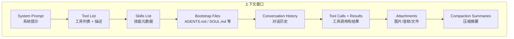
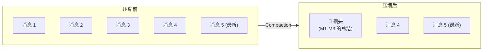

# 08 — Token 节省与上下文管理 💰

## 什么是上下文（Context）

上下文是 OpenClaw 发送给模型的**全部内容**，受模型的上下文窗口（Token 限制）约束。



### 上下文的组成部分

| 组成部分 | 说明 | 优化空间 |
|----------|------|----------|
| System Prompt | 每次运行自动构建 | 较小，基本不可优化 |
| 工具列表 | 根据配置的工具生成描述 | 减少不必要的工具 |
| Skills 元数据 | 加载的 Skills 简介 | 减少不必要的 Skills |
| Bootstrap Files | AGENTS.md、SOUL.md 等 | ⬆️ 保持精简 |
| 对话历史 | 之前的消息 | ⬆️ 通过 Compaction 优化 |
| 工具调用结果 | 执行工具返回的数据 | 返回值大小影响显著 |
| 附件/转录 | 图片、音频、文件 | 注意大文件 |
| Provider 包装 | 不可见但计入 Token | 不可控 |

## Compaction（上下文压缩）

Compaction 是 OpenClaw 管理上下文长度的核心机制。当对话接近上下文窗口限制时，自动将较早的对话轮次**摘要压缩**。



### 关键特性

| 特性 | 说明 |
|------|------|
| 自动触发 | 接近上下文窗口时自动启动 |
| 非破坏性 | 完整对话仍保存在磁盘（JSONL 文件），只是改变模型"看到"的内容 |
| 保留标识符 | 默认 `strict` 策略保留不透明标识符（URL、ID 等） |
| 可配置模型 | 可指定不同模型执行压缩（降低成本） |
| 自动提醒 | 压缩前提醒 Agent 将重要信息保存到记忆文件 |

### Compaction 配置

```json5
{
  "agents": {
    "defaults": {
      "compaction": {
        // 压缩模式
        "mode": "safeguard",         // safeguard（默认）| off | always

        // 压缩使用的模型（可选，可用廉价模型降低成本）
        "model": "openai/gpt-5.4",

        // 标识符策略
        "identifierPolicy": "strict"  // strict（默认）：保留所有标识符
      }
    }
  }
}
```

**Compaction 模式说明：**

| 模式 | 行为 |
|------|------|
| `safeguard`（默认） | 接近上下文限制或溢出错误时自动触发 |
| `off` | 禁用压缩（长对话可能导致上下文溢出） |
| `always` | 积极压缩（节省 Token 但可能丢失细节） |

## 💡 节省 Token 的实用技巧

### 技巧一：精简 Bootstrap 文件

Bootstrap 文件（AGENTS.md、SOUL.md 等）在每次会话开始时注入上下文。保持它们精简直接影响 Token 消耗。

```
~/.openclaw/workspace/
├── AGENTS.md      # 📌 保持简洁，避免冗长指令
├── SOUL.md        # 📌 角色描述不宜过长
├── USER.md        # 📌 仅包含必要的用户信息
└── TOOLS.md       # 📌 工具备注按需维护
```

> 📌 单个文件默认最大 20,000 字符。超出部分会被截断并标记为 `TRUNCATED`。

### 技巧二：控制 Skills 数量

每个加载的 Skill 都会在 System Prompt 中占用空间。只启用你实际需要的 Skills：

```json5
{
  "agents": {
    "defaults": {
      // 明确指定需要的 Skills，而不是加载全部
      "skills": ["github", "weather"]
    }
  }
}
```

### 技巧三：使用 Compaction 专用模型

Compaction 可以使用比主模型更便宜的模型：

```json5
{
  "agents": {
    "defaults": {
      "model": { "primary": "anthropic/claude-sonnet-4-6" },
      "compaction": {
        "mode": "safeguard",
        // 用廉价模型做摘要，节省成本
        "model": "openai/gpt-5.4"
      }
    }
  }
}
```

### 技巧四：合理管理 Session

Session 越长，累积的 Token 越多。合理控制 Session 生命周期：

```json5
{
  "session": {
    "reset": {
      "dailyAt": "04:00",     // 每日重置
      "idleMinutes": 60        // 空闲 1 小时后重置
    }
  }
}
```

手动重置当前 Session：

```
/new       # 开始新 Session
/reset     # 重置当前 Session
/compact   # 手动触发压缩
```

### 技巧五：减少不必要的工具

每个工具在 System Prompt 中都有描述占用空间。禁用不需要的工具：

```json5
{
  "tools": {
    // 使用 messaging 配置文件限制工具集
    "profile": "messaging",

    // 或明确拒绝不需要的工具组
    "deny": ["group:automation", "group:runtime"]
  }
}
```

### 技巧六：使用检查命令监控上下文

```bash
# 在聊天中查看上下文使用情况
/status           # 快速查看"有多满"
/context list     # 查看注入了什么、大致大小
/context detail   # 每个文件/工具/技能的详细分析
/usage tokens     # 在每次回复后附加 Token 使用量
```

示例输出：`14,250 total / ctx=32,000` — 已使用 14,250 Token，上下文窗口为 32,000。

### 技巧七：利用记忆文件系统

告诉 Agent 将重要信息写入 `MEMORY.md`，而不是让它在对话历史中反复回忆。这样即使 Session 重置或 Compaction 发生，关键信息也不会丢失。

```
用户: "记住我偏好使用 TypeScript"
Agent: (写入 MEMORY.md)
```

## 📊 Token 消耗参考

| 场景 | 预估 Token 量 | 说明 |
|------|--------------|------|
| 空白对话启动 | ~2,000-5,000 | System Prompt + Tools + Skills + Bootstrap |
| 一轮普通对话 | ~500-2,000 | 用户消息 + AI 回复 |
| 一次工具调用 | ~1,000-5,000 | 取决于工具返回数据量 |
| Bootstrap 文件 | ~500-3,000 | 取决于文件内容长度 |
| 图片附件 | ~1,000-5,000 | 取决于图片大小和模型 |

> 💡 以上为粗略估算，实际消耗取决于模型的 Tokenizer 和具体内容。

## Session 维护与清理

长期使用后，Session 文件会积累。配置自动清理：

```json5
{
  "session": {
    "maintenance": {
      "mode": "enforce",       // 自动清理
      "pruneAfter": "30d",    // 30 天后清理
      "maxEntries": 500        // 最多保留 500 条
    }
  }
}
```

预览清理效果：

```bash
openclaw sessions cleanup --dry-run
```

---

> ⏭️ 下一篇：[Agent 配置与多 Agent 实践](./09-agent-config.md) — 了解如何配置单 Agent 和多 Agent 系统。
