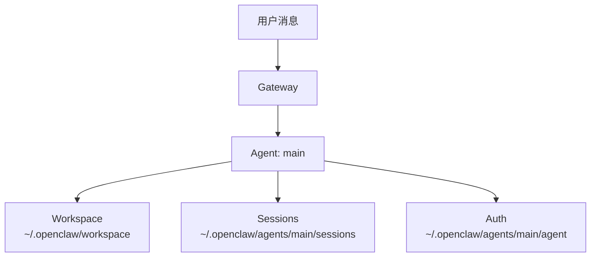
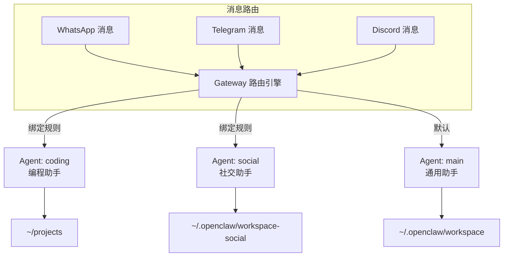

# 09 — Agent 配置与多 Agent 实践 🤖

## 什么是 Agent

在 OpenClaw 中，一个 Agent 是一个**完整的 AI 助手实例**，拥有独立的：

| 组件 | 说明 | 默认路径 |
|------|------|----------|
| Workspace | 文件读写目录 + Bootstrap 文件 | `~/.openclaw/workspace` |
| State Directory | 认证信息、模型注册表 | `~/.openclaw/agents/<agentId>/agent` |
| Session Store | 对话历史 | `~/.openclaw/agents/<agentId>/sessions` |
| Skills | 可用的技能集合 | 按加载优先级合并 |
| 模型配置 | 主模型、Fallback、别名 | 继承 defaults 或独立配置 |

## 单 Agent 模式（默认）

OpenClaw 默认运行单个 Agent，`agentId` 为 `main`。



### 单 Agent 最小配置

```json5
{
  "agents": {
    "defaults": {
      "workspace": "~/.openclaw/workspace",
      "model": {
        "primary": "anthropic/claude-sonnet-4-6"
      }
    }
  },
  "channels": {
    "whatsapp": {
      "allowFrom": ["+15555550123"]
    }
  }
}
```

### Bootstrap 文件

Agent 启动时，Workspace 中的 Bootstrap 文件会被注入到上下文中：

| 文件 | 用途 | 加载时机 |
|------|------|----------|
| `AGENTS.md` | 操作指令 + 行为记忆 | 每次 Session 开始 |
| `SOUL.md` | 角色人设、语气、边界规则 | 每次 Session 开始 |
| `USER.md` | 用户信息、偏好 | 每次 Session 开始 |
| `TOOLS.md` | 工具使用备注（仅指导性质） | 每次 Session 开始 |
| `IDENTITY.md` | Agent 名称、表情符号 | 每次 Session 开始 |
| `BOOTSTRAP.md` | 首次运行仪式（完成后删除） | 仅首次 |
| `HEARTBEAT.md` | 心跳运行检查清单 | 心跳触发时 |
| `BOOT.md` | 启动检查清单 | 每次启动 |
| `MEMORY.md` | 长期持久记忆 | 每次 DM Session 开始 |
| `memory/YYYY-MM-DD.md` | 每日笔记 | 今天和昨天自动加载 |

> 📌 空白文件会被跳过，缺失的文件会插入"missing file"标记。单个文件最大约 20,000 字符。

### 实例：个性化你的 Agent

在 `~/.openclaw/workspace/SOUL.md` 中定义 Agent 人设：

```markdown
# 角色设定

你是一位专业且友好的编程助手。

## 行为准则

- 回复使用中文
- 代码注释使用英文
- 遇到不确定的问题时明确告知
- 优先使用 TypeScript

## 语气

专业但不刻板，偶尔可以用 emoji 增添活力。
```

## 多 Agent 模式

当你需要不同场景使用不同 AI 助手时，可以配置多个 Agent。每个 Agent 拥有独立的一切。



### 创建多 Agent

```bash
# 创建编程专用 Agent
openclaw agents add coding

# 创建社交专用 Agent
openclaw agents add social
```

每个 Agent 自动获得：

- 独立 Workspace（`~/.openclaw/workspace-<agentId>`）
- 独立 `SOUL.md`、`AGENTS.md`、`USER.md`
- 独立认证目录（`~/.openclaw/agents/<agentId>/agent`）
- 独立 Session 存储（`~/.openclaw/agents/<agentId>/sessions`）

### 多 Agent 配置示例

```json5
{
  "agents": {
    // 所有 Agent 的共享默认配置
    "defaults": {
      "model": {
        "primary": "anthropic/claude-sonnet-4-6",
        "fallbacks": ["openai/gpt-5.4"]
      },
      "skills": ["github", "weather"]
    },

    // Agent 列表
    "list": [
      {
        "id": "coding",
        "workspace": "~/projects",               // 自定义 Workspace
        "skills": ["github", "coding-agent"],      // 替换 Skills 列表
        "model": {
          "primary": "anthropic/claude-sonnet-4-6" // 使用强模型
        }
      },
      {
        "id": "social",
        "workspace": "~/.openclaw/workspace-social",
        // 继承 defaults 的 model 和 skills
      },
      {
        "id": "locked",
        "skills": [],                              // 无 Skills
        "model": {
          "primary": "ollama/llama3.1"             // 使用本地模型
        }
      }
    ]
  }
}
```

### Agent 路由绑定

使用绑定规则将特定渠道/群组的消息路由到指定 Agent：

```bash
# 查看当前绑定
openclaw agents list --bindings

# 添加绑定（将 Telegram 消息路由到 coding Agent）
# 通过配置文件设置
```

### 多 Agent 目录结构

```
~/.openclaw/
├── openclaw.json               # 统一配置文件
├── workspace/                  # main Agent Workspace
│   ├── AGENTS.md
│   ├── SOUL.md
│   └── ...
├── workspace-coding/           # coding Agent Workspace
│   ├── AGENTS.md
│   ├── SOUL.md
│   └── ...
├── workspace-social/           # social Agent Workspace
│   ├── AGENTS.md
│   ├── SOUL.md
│   └── ...
├── agents/
│   ├── main/
│   │   ├── agent/              # 认证信息
│   │   │   └── auth-profiles.json
│   │   └── sessions/           # 会话记录
│   ├── coding/
│   │   ├── agent/
│   │   └── sessions/
│   └── social/
│       ├── agent/
│       └── sessions/
└── skills/                     # 共享 Skills（所有 Agent 可见）
```

### 认证配置注意事项

- 每个 Agent 的认证信息（`auth-profiles.json`）存储在各自的 `agent/` 目录
- **不要**在不同 Agent 间共享同一个 `agentDir`
- 如需共享凭证，复制 `auth-profiles.json` 到目标 Agent 目录

## 实战案例

### 案例一：开发者 + 日常助手

分离编程需求和日常聊天，使用不同模型控制成本：

```json5
{
  "agents": {
    "defaults": {
      "model": { "primary": "openai/gpt-5.4" }
    },
    "list": [
      {
        "id": "coding",
        "workspace": "~/projects",
        "model": { "primary": "anthropic/claude-sonnet-4-6" },
        "skills": ["github", "coding-agent"]
        // coding Agent 使用旗舰模型，配备编程 Skills
      }
      // main Agent 使用默认模型处理日常对话
    ]
  }
}
```

### 案例二：多语言助手

为不同语言环境创建不同人设的 Agent：

```json5
{
  "agents": {
    "list": [
      {
        "id": "cn-assistant",
        "workspace": "~/.openclaw/workspace-cn"
        // SOUL.md 中设定：使用中文回复
      },
      {
        "id": "en-assistant",
        "workspace": "~/.openclaw/workspace-en"
        // SOUL.md 中设定：使用英文回复
      }
    ]
  }
}
```

### 案例三：安全隔离

为不同信任级别的用户使用不同 Agent：

```json5
{
  "agents": {
    "list": [
      {
        "id": "trusted",
        "skills": ["github", "exec", "coding-agent"]
        // 可信用户：完整工具权限
      },
      {
        "id": "public",
        "skills": ["weather"],
        "model": { "primary": "ollama/llama3.1" }
        // 公开用户：受限 Skills + 本地模型（无 API 成本）
      }
    ]
  },
  "session": {
    "dmScope": "per-channel-peer"
  }
}
```

## Workspace 安全提示

| 注意点 | 说明 |
|--------|------|
| Workspace 不是沙箱 | Workspace 是默认 `cwd`，不是硬隔离 |
| 相对路径 | 在 Workspace 内解析 |
| 绝对路径 | 可以访问 Workspace 以外的内容 |
| 沙箱隔离 | 使用 `agents.defaults.sandbox` 配置 Docker 沙箱 |
| 文件系统限制 | 设置 `tools.fs.workspaceOnly: true` 限制文件操作范围 |

---

> ⏭️ 下一篇：[消息渠道接入指南](./10-channels.md) — 了解如何连接各种聊天平台。
