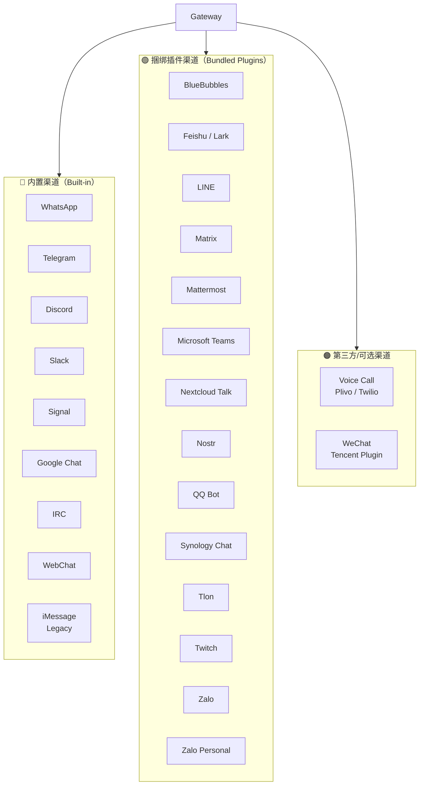

# 10 — 消息渠道接入指南 📱

## 渠道全景

OpenClaw 支持 26+ 消息渠道，分为三类：



## 快速接入推荐

| 渠道 | 接入难度 | 说明 |
|------|---------|------|
| 🥇 Telegram | ⭐ 极简 | 只需一个 Bot Token |
| 🥈 Discord | ⭐⭐ 简单 | 创建 Bot 应用 + Token |
| 🥉 WhatsApp | ⭐⭐ 简单 | QR 码配对（手机扫码） |
| Slack | ⭐⭐⭐ 中等 | 需要创建 Slack App |
| Signal | ⭐⭐⭐ 中等 | 需要 Signal CLI |
| Microsoft Teams | ⭐⭐⭐⭐ 较复杂 | Azure Bot Framework |

## Telegram（推荐入门渠道）

### 步骤 1：创建 Bot

1. 打开 Telegram，搜索 [BotFather](https://t.me/BotFather)
2. 发送 `/newbot`，按提示设置名称
3. 获取 Bot Token（格式：`123456:ABC-DEF...`）

### 步骤 2：配置 OpenClaw

```bash
# CLI 方式
openclaw config set channels.telegram.botToken "你的Bot-Token"
openclaw config set channels.telegram.enabled true
```

或直接编辑 `openclaw.json`：

```json5
{
  "channels": {
    "telegram": {
      "enabled": true,
      "botToken": "123456:ABC-DEF...",
      "dmPolicy": "pairing",           // 新用户需配对
      "allowFrom": ["tg:你的用户ID"]    // 可选：白名单
    }
  }
}
```

### 步骤 3：发送消息

在 Telegram 中搜索你的 Bot 名称，发送任意消息即可收到 AI 回复。

## WhatsApp

### 步骤 1：配置

```json5
{
  "channels": {
    "whatsapp": {
      "allowFrom": ["+你的手机号"],     // 国际格式
      "dmPolicy": "pairing",
      "groups": {
        "*": { "requireMention": true }  // 群聊需 @提及
      }
    }
  }
}
```

### 步骤 2：QR 码配对

Gateway 启动后，会生成 QR 码。用手机 WhatsApp 扫描完成配对。

```bash
# 查看配对状态
openclaw channels status --probe
```

> ⚠️ WhatsApp 使用 Baileys 库，每台主机只能运行一个 WhatsApp Session。

## Discord

### 步骤 1：创建 Bot 应用

1. 访问 [Discord Developer Portal](https://discord.com/developers/applications)
2. 创建新应用 → Bot → 获取 Token
3. 邀请 Bot 到你的服务器

### 步骤 2：配置

```json5
{
  "channels": {
    "discord": {
      "enabled": true,
      "botToken": "你的Discord-Bot-Token",
      "dmPolicy": "pairing"
    }
  }
}
```

## Slack

### 步骤 1：创建 Slack App

1. 访问 [Slack API](https://api.slack.com/apps)，创建新应用
2. 配置 Bot Token Scopes
3. 安装到工作区，获取 Bot Token

### 步骤 2：配置

```json5
{
  "channels": {
    "slack": {
      "enabled": true,
      "botToken": "xoxb-...",
      "appToken": "xapp-...",
      "dmPolicy": "pairing"
    }
  }
}
```

## 通用渠道配置模式

所有渠道共享相同的访问控制配置模式：

### DM 策略

```json5
{
  "channels": {
    "<渠道名>": {
      "dmPolicy": "pairing",   // pairing | allowlist | open | disabled
      "allowFrom": [            // 允许的用户标识列表
        "tg:123456789",         // Telegram 用户 ID
        "+15555550123",          // WhatsApp 电话号码
        "discord:987654321"      // Discord 用户 ID
      ]
    }
  }
}
```

### 群聊配置

```json5
{
  "channels": {
    "<渠道名>": {
      "groupPolicy": "allowlist",     // allowlist | open | disabled
      "groups": {
        "*": {
          "requireMention": true       // 群聊中需 @提及才响应
        },
        "特定群组ID": {
          "requireMention": false      // 特定群组无需 @提及
        }
      }
    }
  },
  "messages": {
    "groupChat": {
      "mentionPatterns": ["@openclaw", "@assistant"]
    }
  }
}
```

## 渠道状态检查

```bash
# 查看所有渠道状态
openclaw channels status

# 深度探测（验证连接）
openclaw channels status --probe

# 查看特定渠道
openclaw channels status telegram
```

## 渠道功能对比

| 渠道 | DM | 群聊 | 图片 | 音频 | 反应 | 文件 |
|------|-----|------|------|------|------|------|
| WhatsApp | ✅ | ✅ | ✅ | ✅ | ✅ | ✅ |
| Telegram | ✅ | ✅ | ✅ | ✅ | ✅ | ✅ |
| Discord | ✅ | ✅ | ✅ | ✅ | ✅ | ✅ |
| Slack | ✅ | ✅ | ✅ | ✅ | ✅ | ✅ |
| Signal | ✅ | ✅ | ✅ | ✅ | ✅ | ✅ |
| WebChat | ✅ | — | ✅ | — | — | ✅ |
| Matrix | ✅ | ✅ | ✅ | — | ✅ | ✅ |
| iMessage | ✅ | ✅ | ✅ | ✅ | ✅ | — |

> 📌 各渠道的具体媒体支持能力以官方文档为准。

## 多渠道同时使用

OpenClaw 的核心优势之一是**一个 Gateway 同时服务多个渠道**：

```json5
{
  "channels": {
    "telegram": {
      "enabled": true,
      "botToken": "tg-token...",
      "dmPolicy": "pairing"
    },
    "discord": {
      "enabled": true,
      "botToken": "dc-token...",
      "dmPolicy": "pairing"
    },
    "whatsapp": {
      "allowFrom": ["+15555550123"],
      "dmPolicy": "pairing"
    }
  }
}
```

配合 `session.identityLinks`，可以将同一个人在不同渠道的身份关联到同一个 Session，实现跨渠道的连续对话体验。

---

> ⏭️ 下一篇：[不同用户场景最佳配置推荐](./11-best-practices.md) — 为不同使用场景提供配置参考。
