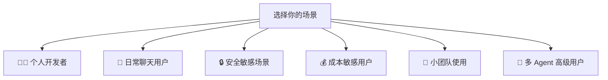

# 11 — 不同用户场景最佳配置推荐 🎯

## 场景总览



## 场景一：个人开发者 🧑‍💻

**目标**：一个强大的编程助手，可以在多个渠道随时对话，支持代码执行和 GitHub 操作。

```json5
{
  // Agent 配置：使用旗舰模型 + 编程 Skills
  "agents": {
    "defaults": {
      "workspace": "~/projects",
      "model": {
        "primary": "anthropic/claude-sonnet-4-6",
        "fallbacks": ["openai/gpt-5.4"]
      },
      "skills": ["github", "coding-agent"],
      "compaction": {
        "mode": "safeguard"
      }
    }
  },

  // 渠道：Telegram + WebChat
  "channels": {
    "telegram": {
      "enabled": true,
      "botToken": "你的Token",
      "dmPolicy": "allowlist",
      "allowFrom": ["tg:你的ID"]
    }
  },

  // 工具：允许执行但需审批
  "tools": {
    "exec": {
      "security": "allowlist",
      "ask": "on-miss"
    },
    "fs": { "workspaceOnly": true }
  },

  // Session：每日重置
  "session": {
    "reset": { "dailyAt": "04:00" }
  },

  // Gateway：本地绑定
  "gateway": {
    "mode": "local",
    "bind": "loopback"
  }
}
```

**要点**：
- 使用旗舰模型保证代码质量
- 开启 GitHub 和 coding-agent Skills
- 工具执行使用 allowlist 模式，兼顾安全和便利
- Workspace 直接指向项目目录

## 场景二：日常聊天用户 💬

**目标**：轻量级的日常 AI 助手，主要用于问答和信息查询，尽量节省费用。

```json5
{
  "agents": {
    "defaults": {
      "model": {
        "primary": "openai/gpt-5.4"
      },
      // 只启用必要的 Skills
      "skills": ["weather"],
      "compaction": {
        "mode": "safeguard",
        // 用廉价模型做压缩
        "model": "openai/gpt-5.4"
      }
    }
  },

  "channels": {
    "whatsapp": {
      "dmPolicy": "pairing",
      "allowFrom": ["+你的手机号"],
      "groups": { "*": { "requireMention": true } }
    }
  },

  // 工具：最小化
  "tools": {
    "profile": "messaging",
    "exec": { "security": "deny" },
    "elevated": { "enabled": false }
  },

  // Session：空闲自动重置（节省 Token）
  "session": {
    "reset": {
      "dailyAt": "04:00",
      "idleMinutes": 60
    }
  }
}
```

**要点**：
- 使用成本较低的模型
- 工具集最小化（messaging 配置文件）
- 禁止 Shell 执行
- 空闲 Session 自动重置以节省 Token

## 场景三：安全敏感场景 🔒

**目标**：最大化安全性，严格控制访问和工具权限。

```json5
{
  "agents": {
    "defaults": {
      "model": { "primary": "anthropic/claude-sonnet-4-6" }
    }
  },

  // Gateway 加固
  "gateway": {
    "mode": "local",
    "bind": "loopback",
    "auth": {
      "mode": "token",
      "token": "至少32位的随机字符串"
    }
  },

  // Session 严格隔离
  "session": {
    "dmScope": "per-channel-peer",
    "maintenance": {
      "mode": "enforce",
      "pruneAfter": "7d",
      "maxEntries": 100
    }
  },

  // 工具全面锁定
  "tools": {
    "profile": "messaging",
    "deny": [
      "group:automation",
      "group:runtime",
      "group:fs",
      "sessions_spawn",
      "sessions_send"
    ],
    "fs": { "workspaceOnly": true },
    "exec": { "security": "deny", "ask": "always" },
    "elevated": { "enabled": false }
  },

  // 渠道严格白名单
  "channels": {
    "telegram": {
      "enabled": true,
      "botToken": "...",
      "dmPolicy": "allowlist",
      "allowFrom": ["tg:你的ID"],
      "groups": { "*": { "requireMention": true } }
    }
  }
}
```

**要点**：
- Gateway 仅绑定本地回环 + Token 认证
- Session 按渠道+发送者隔离
- 工具全面禁止，仅保留消息功能
- 渠道使用严格白名单模式
- Session 自动清理，缩短保留期

## 场景四：成本敏感用户 💰

**目标**：尽可能节省 API 费用，同时保持可用性。

```json5
{
  "agents": {
    "defaults": {
      "model": {
        // 主模型用较便宜的选择
        "primary": "openai/gpt-5.4"
      },
      // 严格限制 Skills 数量
      "skills": [],
      "compaction": {
        "mode": "safeguard",
        "model": "openai/gpt-5.4"
      }
    }
  },

  // 工具最小化
  "tools": {
    "profile": "messaging",
    "exec": { "security": "deny" }
  },

  // 积极的 Session 重置
  "session": {
    "reset": {
      "dailyAt": "04:00",
      "idleMinutes": 30           // 30 分钟空闲即重置
    },
    "maintenance": {
      "mode": "enforce",
      "pruneAfter": "14d"         // 14 天后清理
    }
  }
}
```

**额外节省技巧**：

1. 精简 Workspace Bootstrap 文件（AGENTS.md、SOUL.md 等）
2. 不加载不必要的 Skills
3. 使用 `/compact` 手动触发压缩
4. 使用 `/usage tokens` 监控实际消耗
5. 考虑使用 Ollama 本地模型（完全免费）

## 场景五：小团队使用 🏢

**目标**：团队中几个人共用一个 Gateway，需要 Session 隔离。

```json5
{
  "agents": {
    "defaults": {
      "model": {
        "primary": "anthropic/claude-sonnet-4-6",
        "fallbacks": ["openai/gpt-5.4"]
      },
      "skills": ["github", "notion"]
    }
  },

  // Session：严格按渠道+用户隔离
  "session": {
    "dmScope": "per-channel-peer"
  },

  // 渠道：配对模式（新成员需要审批）
  "channels": {
    "slack": {
      "enabled": true,
      "botToken": "xoxb-...",
      "appToken": "xapp-...",
      "dmPolicy": "pairing"
    },
    "telegram": {
      "enabled": true,
      "botToken": "...",
      "dmPolicy": "pairing"
    }
  },

  // 工具：适度限制
  "tools": {
    "exec": {
      "security": "allowlist",
      "ask": "on-miss"
    },
    "fs": { "workspaceOnly": true }
  }
}
```

**要点**：
- Session 按渠道+用户隔离，每个人的对话互不可见
- 使用 pairing 模式控制新成员加入
- 工具使用 allowlist 模式

> ⚠️ 注意：OpenClaw 的信任模型为单操作员。如果团队成员之间互不信任，应使用独立的 Gateway 实例。

## 场景六：多 Agent 高级用户 🤖

**目标**：为不同用途配置专用 Agent。

```json5
{
  "agents": {
    "defaults": {
      "model": { "primary": "openai/gpt-5.4" },
      "skills": ["weather"]
    },
    "list": [
      {
        // 编程 Agent：旗舰模型 + 完整工具
        "id": "coding",
        "workspace": "~/projects",
        "model": { "primary": "anthropic/claude-sonnet-4-6" },
        "skills": ["github", "coding-agent"]
      },
      {
        // 写作 Agent：适合长文本的模型
        "id": "writer",
        "workspace": "~/.openclaw/workspace-writer",
        "skills": ["notion", "obsidian"]
      },
      {
        // 隐私 Agent：使用本地模型
        "id": "private",
        "workspace": "~/.openclaw/workspace-private",
        "model": { "primary": "ollama/llama3.1" },
        "skills": []
      }
    ]
  },

  "session": {
    "dmScope": "per-channel-peer"
  },

  "channels": {
    "telegram": {
      "enabled": true,
      "botToken": "...",
      "dmPolicy": "pairing"
    },
    "discord": {
      "enabled": true,
      "botToken": "...",
      "dmPolicy": "pairing"
    }
  }
}
```

**要点**：
- 编程 Agent 使用旗舰模型和编程 Skills
- 写作 Agent 配备笔记工具
- 隐私 Agent 使用本地模型，不发送数据到外部

## 📋 场景对比速查

| 维度 | 开发者 | 日常聊天 | 安全敏感 | 成本敏感 | 小团队 | 多 Agent |
|------|--------|---------|---------|---------|--------|---------|
| 模型 | 旗舰 | 中等 | 旗舰 | 经济型 | 旗舰+Fallback | 混合 |
| Skills | 编程相关 | 最少 | 无 | 无 | 团队协作 | 按Agent |
| 工具 | allowlist | messaging | deny | messaging | allowlist | 按Agent |
| Session隔离 | main | main | per-channel-peer | main | per-channel-peer | per-channel-peer |
| DM策略 | allowlist | pairing | allowlist | pairing | pairing | pairing |
| 成本控制 | 中 | 高 | 中 | 最高 | 中 | 灵活 |

---

> 🎉 恭喜！你已经完成了 OpenClaw 教程的全部内容。如需了解更多，请访问 [官方文档](https://docs.openclaw.ai)。
