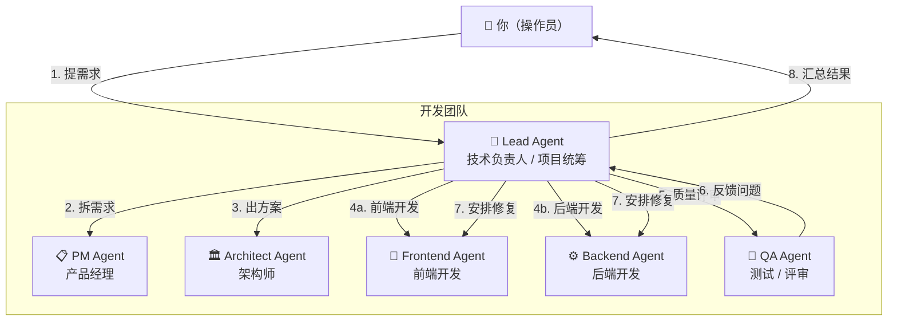
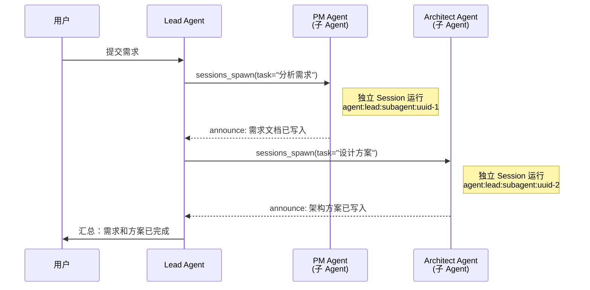
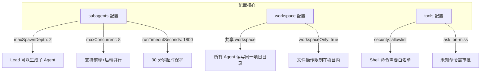
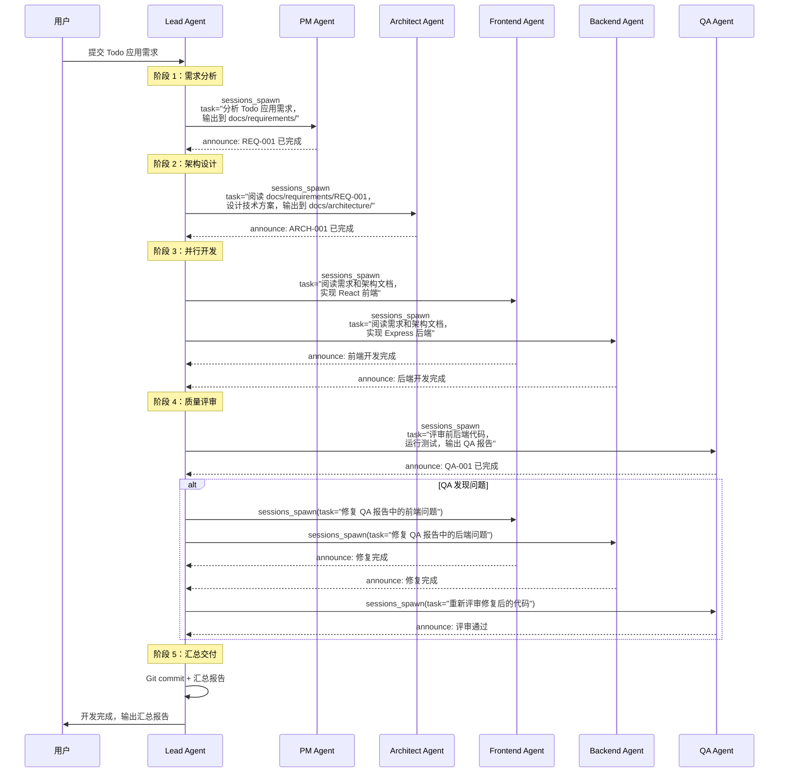
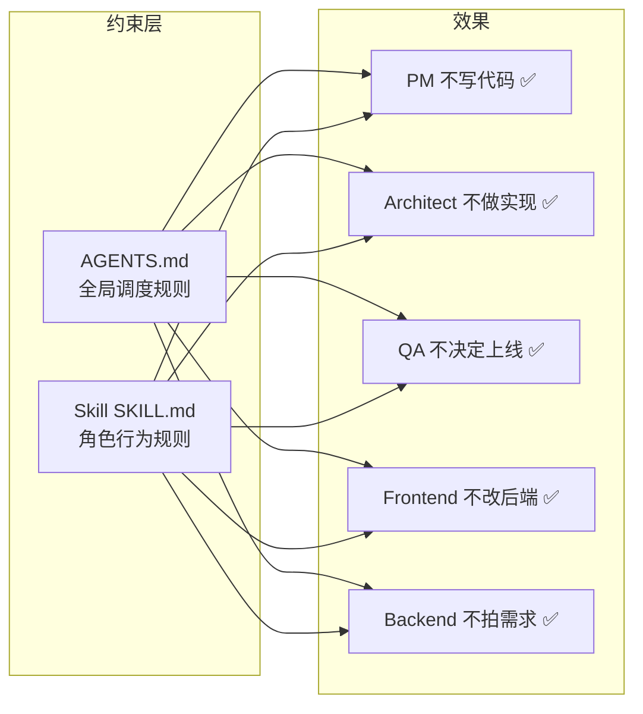
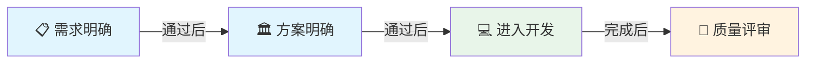
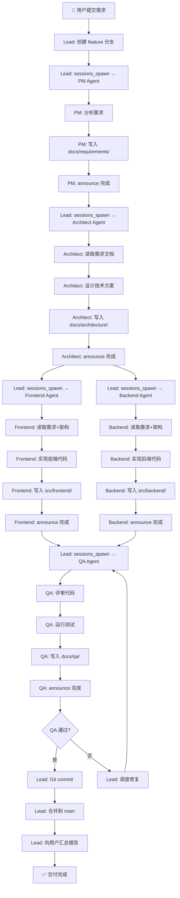

# 12 — 多 Agent 软件开发团队实施方案 🏗️

> 基于 OpenClaw 搭建一个真实参与软件研发的多 Agent 团队：需求 → 拆解 → 方案 → 开发 → 测试 → 汇总。

## 📋 方案目标

- 用 OpenClaw 构建一个能**稳定参与软件研发全流程**的 Agent 团队
- 不是演示或玩具，而是让 6 个 Agent 各司其职，通过 **Lead 编排模式**协同工作
- 最终形成标准链路：**需求 → 拆解 → 方案 → 开发 → 测试 → 汇总**

## 🏢 团队结构



### 角色定义

| 角色 | Agent ID | 职责 | 核心能力 |
|------|----------|------|----------|
| 🎯 Lead | `lead` | 项目统筹、子 Agent 调度、结果汇总 | `sessions_spawn`、编排、Git 操作 |
| 📋 PM | `pm` | 需求分析、任务拆分 | 文档读写、需求模板 |
| 🏛️ Architect | `architect` | 技术方案、架构设计 | 文档读写、代码阅读 |
| 🎨 Frontend | `frontend` | 前端代码实现 | 代码读写、Shell 执行 |
| ⚙️ Backend | `backend` | 后端代码实现 | 代码读写、Shell 执行 |
| 🧪 QA | `qa` | 代码评审、测试验证 | 代码阅读、Shell 执行 |

## 🧠 核心原理

### 多 Agent 通信机制

OpenClaw 的多 Agent 通信基于 **Subagent（子 Agent）机制**：



关键要点：

| 机制 | 说明 |
|------|------|
| `sessions_spawn` | Lead 使用此工具生成子 Agent，非阻塞执行 |
| 独立 Session | 每个子 Agent 运行在独立 Session 中（`agent:<agentId>:subagent:<uuid>`） |
| announce 回传 | 子 Agent 完成后自动将结果通知回 Lead 的聊天 |
| 共享 Workspace | 所有 Agent 使用同一个项目目录作为 Workspace，通过文件系统交换数据 |

### 为什么选择 Subagent 模式

OpenClaw 提供两种多 Agent 方式，本方案选择 **Subagent 模式**：

| 方式 | 说明 | 适用场景 |
|------|------|----------|
| 多 Agent 路由 | 不同 Agent 绑定不同渠道/消息源 | 不同人使用不同助手 |
| **Subagent 编排** | Lead 通过 `sessions_spawn` 调度子 Agent | ✅ 团队协作开发 |

Subagent 模式的优势：

1. **Lead 统一收口**：所有子 Agent 的结果回传给 Lead，由 Lead 统一对用户输出
2. **上下文隔离**：每个子 Agent 有独立 Session，不会互相污染
3. **并行执行**：可以同时调度前端和后端 Agent 并行开发
4. **深度控制**：支持最多 5 层嵌套（本方案使用 2 层：Lead → 子 Agent）

## 📁 项目结构准备

### 第一步：创建项目 Workspace

```bash
# 创建项目目录结构
mkdir -p ~/dev-team-project
cd ~/dev-team-project

# 创建规范化的文档目录
mkdir -p docs/requirements    # 需求文档
mkdir -p docs/architecture    # 架构文档
mkdir -p docs/tasks           # 任务文档
mkdir -p docs/qa              # QA 报告

# 初始化 Git
git init
git checkout -b main
```

### 第二步：创建 Agent Bootstrap 文件

每个子 Agent 在 Subagent 模式下只注入 `AGENTS.md` 和 `TOOLS.md`（不注入 `SOUL.md`、`IDENTITY.md` 等）。因此关键配置写入 `AGENTS.md`。

#### Lead Agent 的 AGENTS.md

在 `~/dev-team-project/AGENTS.md` 中写入：

```markdown
# Lead Agent — 技术负责人

## 角色

你是软件开发团队的技术负责人（Tech Lead），负责项目统筹和 Agent 调度。

## 核心职责

1. 接收用户需求，调度子 Agent 执行
2. 统筹开发流程：需求 → 方案 → 开发 → 测试 → 交付
3. 汇总所有子 Agent 的产出，向用户报告
4. 管理 Git 分支和代码提交

## 调度规则

### 流程顺序（必须遵守）

1. 先调 PM Agent 分析需求 → 等待完成
2. 再调 Architect Agent 设计方案 → 等待完成
3. 再并行调度 Frontend Agent 和 Backend Agent → 等待完成
4. 最后调 QA Agent 评审 → 等待完成
5. 如果 QA 有问题，安排修复后重新评审
6. 全部通过后汇总报告

### 文件输出规则

- 需求文档 → docs/requirements/
- 架构文档 → docs/architecture/
- 任务文档 → docs/tasks/
- QA 报告 → docs/qa/
- 前端代码 → src/frontend/ 或项目约定目录
- 后端代码 → src/backend/ 或项目约定目录

### 子 Agent 调度方法

使用 sessions_spawn 工具调度子 Agent：

- PM: sessions_spawn(task="...", label="pm-需求分析")
- Architect: sessions_spawn(task="...", label="arch-方案设计")
- Frontend: sessions_spawn(task="...", label="fe-前端开发")
- Backend: sessions_spawn(task="...", label="be-后端开发")
- QA: sessions_spawn(task="...", label="qa-质量评审")

### Git 规则

- 每个需求创建独立 feature 分支
- 分支命名：feature/<需求简称>
- 只有你负责最终 commit 和 merge
- 子 Agent 只负责写代码和文档，不直接操作 Git

### 角色边界

- PM 不写代码
- Architect 不做具体业务实现
- QA 不决定上线
- Frontend 不改后端代码
- Backend 不替产品拍板需求
```

#### TOOLS.md

在 `~/dev-team-project/TOOLS.md` 中写入（可选）：

```markdown
# 工具使用约定

## 文件操作

- 需求文档使用 Markdown 格式
- 架构文档使用 Markdown + Mermaid 图
- 代码文件遵循项目既有约定

## Shell 执行

- 使用 exec 工具运行构建和测试命令
- 长时间运行的命令使用 background 模式

## Git 操作

- 仅 Lead Agent 执行 git commit / push
- 使用有意义的 commit message
```

## ⚙️ 配置文件（openclaw.json）

这是整个方案的核心配置，写入 `~/.openclaw/openclaw.json`：

```json5
{
  // ===== Agent 配置 =====
  "agents": {
    "defaults": {
      // 所有 Agent 共享同一个项目 Workspace
      "workspace": "~/dev-team-project",

      // 主模型：推荐使用旗舰模型保证代码质量
      "model": {
        "primary": "anthropic/claude-sonnet-4-6",
        "fallbacks": ["openai/gpt-5.4"]
      },

      // Subagent 配置（核心）
      "subagents": {
        "maxSpawnDepth": 2,           // Lead 可以生成子 Agent（深度 2）
        "maxChildrenPerAgent": 5,     // 每个 Agent 最多 5 个子 Agent
        "maxConcurrent": 8,           // 全局最多 8 个并发
        "runTimeoutSeconds": 1800,    // 单次运行超时 30 分钟
        "archiveAfterMinutes": 120    // 2 小时后自动归档
      },

      // 上下文压缩
      "compaction": {
        "mode": "safeguard",
        "identifierPolicy": "strict"
      }
    }
  },

  // ===== 渠道配置 =====
  "channels": {
    // 使用 Telegram 作为与 Lead Agent 沟通的渠道
    "telegram": {
      "enabled": true,
      "botToken": "你的Telegram-Bot-Token",
      "dmPolicy": "allowlist",
      "allowFrom": ["tg:你的用户ID"]
    }
  },

  // ===== 工具配置 =====
  "tools": {
    // 允许 exec 工具（开发需要）
    "exec": {
      "security": "allowlist",    // 白名单模式
      "ask": "on-miss"             // 不在白名单时需审批
    },

    // 文件系统限制在 Workspace 内
    "fs": {
      "workspaceOnly": true
    }
  },

  // ===== Session 配置 =====
  "session": {
    "dmScope": "per-channel-peer",  // Session 隔离

    "reset": {
      "dailyAt": "04:00"
    },

    "maintenance": {
      "mode": "enforce",
      "pruneAfter": "30d",
      "maxEntries": 500
    }
  },

  // ===== Gateway 配置 =====
  "gateway": {
    "mode": "local",
    "bind": "loopback",
    "auth": {
      "mode": "token",
      "token": "替换为你的长随机Token"
    }
  }
}
```

### 配置要点解读



## 🛠️ 实现步骤

### 步骤 1：安装和初始化

```bash
# 安装 OpenClaw（如果尚未安装）
npm install -g openclaw@latest

# 运行 Onboarding 向导配置 Provider 和 API Key
openclaw onboard --install-daemon

# 验证 Gateway 运行
openclaw gateway status
```

### 步骤 2：创建项目目录

```bash
# 创建项目和文档目录
mkdir -p ~/dev-team-project/{docs/{requirements,architecture,tasks,qa},src/{frontend,backend}}

cd ~/dev-team-project
git init && git checkout -b main
```

### 步骤 3：写入 Bootstrap 文件

将上文中的 `AGENTS.md` 和 `TOOLS.md` 内容写入 `~/dev-team-project/` 目录。

```bash
# 验证文件
ls ~/dev-team-project/
# 应该看到：AGENTS.md  TOOLS.md  docs/  src/
```

### 步骤 4：创建 Workspace Skills（角色约束）

每个子 Agent 的角色约束通过 **Skill** 实现。在 Workspace 中创建角色 Skills：

#### PM Skill

```bash
mkdir -p ~/dev-team-project/skills/pm-agent
```

在 `~/dev-team-project/skills/pm-agent/SKILL.md` 中写入：

```markdown
---
name: pm_agent
description: "产品经理角色指令：需求分析与任务拆分"
---

# PM Agent — 产品经理

## 角色

你是产品经理（PM），负责需求分析和任务拆分。

## 职责范围

1. 分析用户需求，明确功能边界
2. 将需求拆解为可执行的任务项
3. 输出标准化需求文档

## 输出规范

将需求文档写入 `docs/requirements/` 目录，文件命名格式：`REQ-<编号>-<简称>.md`

需求文档模板：

```
# REQ-<编号>: <需求标题>

## 背景
<需求背景说明>

## 功能需求
- [ ] 需求点 1
- [ ] 需求点 2

## 非功能需求
- 性能要求
- 安全要求

## 任务拆解
| 任务 | 负责角色 | 优先级 | 预估工作量 |
|------|---------|--------|-----------|
| ... | Frontend / Backend | P0/P1/P2 | ... |

## 验收标准
1. ...
2. ...
```

## 边界规则

- ❌ 不写代码
- ❌ 不做技术决策
- ❌ 不直接操作 Git
- ✅ 只负责需求分析和文档输出
```

#### Architect Skill

```bash
mkdir -p ~/dev-team-project/skills/architect-agent
```

在 `~/dev-team-project/skills/architect-agent/SKILL.md` 中写入：

```markdown
---
name: architect_agent
description: "架构师角色指令：技术方案与架构设计"
---

# Architect Agent — 架构师

## 角色

你是技术架构师，负责技术方案设计。

## 职责范围

1. 根据需求文档设计技术方案
2. 选择技术栈和架构模式
3. 定义接口规范和数据模型
4. 输出架构文档

## 输出规范

将架构文档写入 `docs/architecture/` 目录，文件命名格式：`ARCH-<编号>-<简称>.md`

架构文档模板：

```
# ARCH-<编号>: <方案标题>

## 技术选型
| 层级 | 技术 | 理由 |
|------|------|------|
| 前端 | ... | ... |
| 后端 | ... | ... |
| 数据库 | ... | ... |

## 架构图
(使用 Mermaid 绘制)

## 接口设计
### API 1: ...
- 方法: GET/POST
- 路径: /api/...
- 请求体: ...
- 响应体: ...

## 数据模型
(定义核心数据结构)

## 目录结构
(定义代码目录组织)
```

## 边界规则

- ❌ 不做具体业务实现
- ❌ 不写业务代码（只写示例/伪代码）
- ❌ 不直接操作 Git
- ✅ 只负责方案设计和架构文档
```

#### Frontend Skill

```bash
mkdir -p ~/dev-team-project/skills/frontend-agent
```

在 `~/dev-team-project/skills/frontend-agent/SKILL.md` 中写入：

```markdown
---
name: frontend_agent
description: "前端开发角色指令：前端代码实现"
---

# Frontend Agent — 前端开发

## 角色

你是前端开发工程师，负责前端代码实现。

## 职责范围

1. 根据架构文档实现前端代码
2. 编写组件、页面、样式
3. 编写前端单元测试
4. 遵循架构师定义的技术方案

## 工作流程

1. 先阅读 `docs/requirements/` 了解需求
2. 再阅读 `docs/architecture/` 了解技术方案
3. 按方案实现代码
4. 编写必要的测试
5. 将实现进度写入 `docs/tasks/`

## 边界规则

- ❌ 不修改后端代码
- ❌ 不修改数据库 Schema
- ❌ 不直接操作 Git（commit / push）
- ❌ 不改变架构师定义的接口规范
- ✅ 只负责前端代码实现和前端测试
```

#### Backend Skill

```bash
mkdir -p ~/dev-team-project/skills/backend-agent
```

在 `~/dev-team-project/skills/backend-agent/SKILL.md` 中写入：

```markdown
---
name: backend_agent
description: "后端开发角色指令：后端代码实现"
---

# Backend Agent — 后端开发

## 角色

你是后端开发工程师，负责后端代码实现。

## 职责范围

1. 根据架构文档实现后端代码
2. 实现 API 接口、业务逻辑、数据模型
3. 编写后端单元测试
4. 遵循架构师定义的技术方案

## 工作流程

1. 先阅读 `docs/requirements/` 了解需求
2. 再阅读 `docs/architecture/` 了解技术方案
3. 按方案实现代码
4. 编写必要的测试
5. 将实现进度写入 `docs/tasks/`

## 边界规则

- ❌ 不修改前端代码
- ❌ 不替产品拍板需求
- ❌ 不直接操作 Git（commit / push）
- ❌ 不改变架构师定义的接口规范
- ✅ 只负责后端代码实现和后端测试
```

#### QA Skill

```bash
mkdir -p ~/dev-team-project/skills/qa-agent
```

在 `~/dev-team-project/skills/qa-agent/SKILL.md` 中写入：

```markdown
---
name: qa_agent
description: "QA 角色指令：代码评审与测试验证"
---

# QA Agent — 测试 / 评审

## 角色

你是 QA 工程师，负责代码质量把关。

## 职责范围

1. 评审前后端代码质量
2. 检查代码是否符合架构方案
3. 运行测试并验证结果
4. 输出 QA 报告

## 输出规范

将 QA 报告写入 `docs/qa/` 目录，文件命名格式：`QA-<编号>-<简称>.md`

QA 报告模板：

```
# QA-<编号>: <评审标题>

## 评审范围
- 前端: src/frontend/...
- 后端: src/backend/...

## 代码评审结果

### 通过项
- [x] ...

### 问题项
| 严重级别 | 文件 | 行号 | 问题描述 | 建议修复 |
|---------|------|------|---------|---------|
| 🔴 严重 | ... | ... | ... | ... |
| 🟡 警告 | ... | ... | ... | ... |
| 🔵 建议 | ... | ... | ... | ... |

## 测试结果
| 测试用例 | 状态 | 备注 |
|---------|------|------|
| ... | ✅/❌ | ... |

## 总结
- 通过 / 不通过
- 需要修复的必须项：...
```

## 边界规则

- ❌ 不直接修改业务代码（只提建议）
- ❌ 不决定是否上线
- ❌ 不直接操作 Git
- ✅ 只负责评审、测试和输出报告
```

### 步骤 5：应用配置并启动

```bash
# 编辑配置文件
# 将上文的 openclaw.json 配置写入 ~/.openclaw/openclaw.json

# 重启 Gateway 加载新配置
openclaw gateway restart

# 验证配置
openclaw doctor
```

## 🚀 使用方法：执行完整开发流程

### 与 Lead Agent 交互

通过 Telegram（或其他你配置的渠道）向 Lead Agent 发送需求：

```
请帮我开发一个待办事项（Todo）Web 应用。

功能要求：
1. 用户可以添加、编辑、删除待办事项
2. 支持标记完成/未完成
3. 支持按状态筛选
4. 数据持久化存储

技术约束：
- 前端使用 React + TypeScript
- 后端使用 Node.js + Express
- 数据库使用 SQLite
```

### Lead Agent 的执行流程

Lead Agent 收到需求后，会按照 `AGENTS.md` 中定义的流程依次调度子 Agent：



### 监控子 Agent 运行

在聊天中使用斜杠命令监控进度：

```
/subagents list          # 查看所有子 Agent 状态
/subagents info 1        # 查看指定子 Agent 详情
/subagents log 1         # 查看子 Agent 日志
/subagents send 1 "进度如何？"  # 给子 Agent 发送消息
/subagents kill 1        # 终止指定子 Agent
/subagents kill all      # 终止所有子 Agent
/stop                    # 停止当前所有运行
```

## 🔒 安全保障

### 1. 角色边界约束

角色边界通过 **AGENTS.md 中的规则** + **Skill 中的 SKILL.md** 双重约束：



### 2. Git 统一出口

- AGENTS.md 中明确规定**只有 Lead 负责 Git 操作**
- 子 Agent 只写代码文件，不执行 `git commit` / `git push`
- 每个需求使用独立 feature 分支：`feature/<需求简称>`

### 3. 工具权限控制

```json5
{
  "tools": {
    "exec": {
      "security": "allowlist",   // 白名单模式
      "ask": "on-miss"            // 未知命令需审批
    },
    "fs": {
      "workspaceOnly": true      // 文件操作限制在项目目录
    }
  }
}
```

### 4. Subagent 资源保护

```json5
{
  "agents": {
    "defaults": {
      "subagents": {
        "maxChildrenPerAgent": 5,  // 防止失控 fan-out
        "maxConcurrent": 8,        // 全局并发上限
        "runTimeoutSeconds": 1800   // 30 分钟超时保护
      }
    }
  }
}
```

### 5. Session 隔离

每个子 Agent 运行在独立 Session 中，Session 键格式：

```
agent:lead:subagent:<uuid>
```

子 Agent 之间无法访问彼此的对话历史，只能通过文件系统（共享 Workspace）交换数据。

## 💰 Token 节省策略

### 策略 1：精准的任务描述

在 `sessions_spawn` 的 `task` 参数中给出**精确、完整的指令**，减少子 Agent 因理解模糊而产生的额外对话轮次。

```
// ❌ 不好：模糊的指令
sessions_spawn(task="做前端")

// ✅ 好：精确的指令
sessions_spawn(task="阅读 docs/requirements/REQ-001-todo.md 和 docs/architecture/ARCH-001-todo.md，
使用 React + TypeScript 实现 Todo 应用的前端部分，
包括：TodoList 组件、TodoItem 组件、AddTodo 表单、筛选栏，
代码输出到 src/frontend/ 目录，完成后在 docs/tasks/ 写入进度报告")
```

### 策略 2：先文档后实现

严格遵循"需求 → 方案 → 开发"的顺序，避免返工：



### 策略 3：文件交换代替上下文传递

子 Agent 之间通过**文件系统**交换数据，而不是在上下文中传递大量文本：

| 方式 | Token 消耗 | 推荐 |
|------|-----------|------|
| 在 task 中包含全部需求文本 | 🔴 高 | ❌ |
| 让子 Agent 自己读取文件 | 🟢 低 | ✅ |

```
// ✅ 让子 Agent 自己读取文件，而非在 task 中内嵌大段文本
sessions_spawn(task="阅读 docs/requirements/REQ-001-todo.md，分析需求并输出架构方案到 docs/architecture/")
```

### 策略 4：合理使用 Compaction

```json5
{
  "agents": {
    "defaults": {
      "compaction": {
        "mode": "safeguard",          // 自动压缩保护
        "identifierPolicy": "strict"  // 保留关键标识符
      }
    }
  }
}
```

### 策略 5：子 Agent 超时保护

设置合理的超时时间，防止 Agent 陷入死循环消耗 Token：

```json5
{
  "agents": {
    "defaults": {
      "subagents": {
        "runTimeoutSeconds": 1800,     // 30 分钟超时
        "archiveAfterMinutes": 120     // 2 小时后归档
      }
    }
  }
}
```

## 📊 完整执行链路图



## ❓ 常见问题

### Q1：子 Agent 之间如何通信？

子 Agent 不直接通信。所有通信遵循 **Lead 编排模式**：

1. Lead 通过 `sessions_spawn` 生成子 Agent
2. 子 Agent 完成后通过 `announce` 回传结果给 Lead
3. Lead 根据结果决定下一步调度
4. 数据通过**共享文件系统**（Workspace）交换

### Q2：如果子 Agent 执行失败怎么办？

- `announce` 会返回状态：`completed successfully` / `failed` / `timed out`
- Lead 可以根据状态决定重试或跳过
- 使用 `/subagents log <id>` 查看失败原因
- 使用 `/subagents kill <id>` 终止卡住的子 Agent

### Q3：如何扩展团队成员？

添加新角色只需：

1. 在 `~/dev-team-project/skills/` 下创建新的 Skill 目录和 `SKILL.md`
2. 在 Lead 的 `AGENTS.md` 中添加对应的调度规则
3. 重启 Session（`/new`）加载新 Skill

### Q4：子 Agent 为什么不用独立的 Agent（多 Agent 路由）？

本方案使用 **Subagent 模式**而非多 Agent 路由模式的原因：

| 维度 | Subagent 模式 | 多 Agent 路由 |
|------|--------------|--------------|
| 通信 | Lead 统一调度和收口 | 各自独立，无法直接协作 |
| 共享 Workspace | ✅ 共享同一目录 | ❌ 各自独立 Workspace |
| 上下文隔离 | ✅ 独立 Session | ✅ 独立 Session |
| 使用复杂度 | 对用户透明，只和 Lead 交互 | 需要分别和不同 Agent 交互 |
| 流程编排 | Lead 自动编排 | 需要手动协调 |

### Q5：这个方案的限制是什么？

| 限制 | 说明 |
|------|------|
| 单操作员 | OpenClaw 的信任模型是单操作员，不支持多人共用 |
| 子 Agent 上下文 | 子 Agent 只注入 `AGENTS.md` + `TOOLS.md`（不注入 `SOUL.md` 等） |
| announce 尽力投递 | Gateway 重启后，未完成的子 Agent announce 会丢失 |
| 并发限制 | 默认全局最多 8 个并发子 Agent |
| Token 消耗 | 每个子 Agent 独立计算 Token，6 个 Agent 并行运行成本较高 |

---

> 📚 返回教程目录：[README](./README.md)
